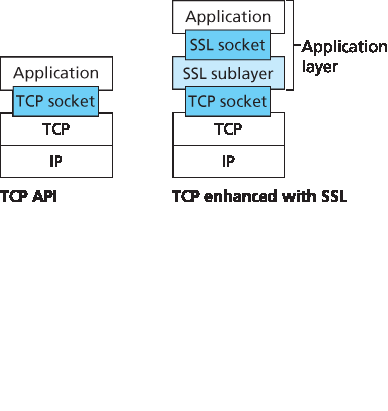
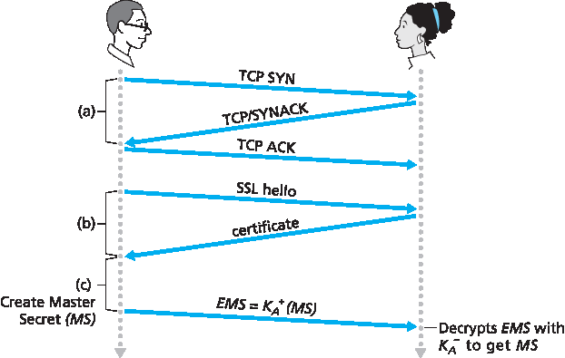
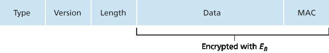

.. _c8.6:

8.6 保护 TCP 连接: SSL
==========================================================================
8.6 Securing TCP Connections: SSL

.. tab:: 中文

.. tab:: 英文

In the previous section, we saw how cryptographic techniques can provide confidentiality, data integrity, and end-point authentication to a specific application, namely, e-mail. In this section, we’ll drop down a layer in the protocol stack and examine how cryptography can enhance TCP with security services, including confidentiality, data integrity, and end-point authentication. This enhanced version of TCP is commonly known as **Secure Sockets Layer (SSL)**. A slightly modified version of SSL version 3, called **Transport Layer Security (TLS)**, has been standardized by the IETF [:rfc:`4346`].

The SSL protocol was originally designed by Netscape, but the basic ideas behind securing TCP had
predated Netscape’s work (for example, see Woo :ref:`[Woo 1994] <Woo 1994>`). Since its inception, SSL has enjoyed broad deployment. SSL is supported by all popular Web browsers and Web servers, and it is used by Gmail and essentially all Internet commerce sites (including Amazon, eBay, and TaoBao). Hundreds of billions of dollars are spent over SSL every year. In fact, if you have ever purchased anything over the Internet with your credit card, the communication between your browser and the server for this purchase almost certainly went over SSL. (You can identify that SSL is being used by your browser when the URL begins with https: rather than http.)

To understand the need for SSL, let’s walk through a typical Internet commerce scenario. Bob is surfing the Web and arrives at the Alice Incorporated site, which is selling perfume. The Alice Incorporated site displays a form in which Bob is supposed to enter the type of perfume and quantity desired, his address, and his payment card number. Bob enters this information, clicks on Submit, and expects to receive (via ordinary postal mail) the purchased perfumes; he also expects to receive a charge for his order in his next payment card statement. This all sounds good, but if no security measures are taken, Bob could be in for a few surprises. If no confidentiality (encryption) is used, an intruder could intercept Bob’s order and obtain his payment card information. The intruder could then make purchases at Bob’s expense.

- If no confidentiality (encryption) is used, an intruder could intercept Bob’s order and obtain his payment card information. The intruder could then make purchases at Bob’s expense.
- If no data integrity is used, an intruder could modify Bob’s order, having him purchase ten times more bottles of perfume than desired.
- Finally, if no server authentication is used, a server could display Alice Incorporated’s famous logo when in actuality the site maintained by Trudy, who is masquerading as Alice Incorporated. After receiving Bob’s order, Trudy could take Bob’s money and run. Or Trudy could carry out an identity theft by collecting Bob’s name, address, and credit card number.

SSL addresses these issues by enhancing TCP with confidentiality, data integrity, server authentication, and client authentication.

SSL is often used to provide security to transactions that take place over HTTP. However, because SSL secures TCP, it can be employed by any application that runs over TCP. SSL provides a simple Application Programmer Interface (API) with sockets, which is similar and analogous to TCP’s API. When an application wants to employ SSL, the application includes SSL classes/libraries. As shown in :ref:`Figure 8.24 <Figure 8.24>`, although SSL technically resides in the application layer, from the developer’s perspective it is a transport protocol that provides TCP’s services enhanced with security services.

.. _c8.6.1:

8.6.1 大局观
----------------------------------------------------------------------------------
8.6.1 The Big Picture

.. tab:: 中文

.. tab:: 英文

We begin by describing a simplified version of SSL, one that will allow us to get a big-picture understanding of the why and how of SSL. We will refer to this simplified version of SSL as “almost-SSL.” After describing almost-SSL, in the next subsection we’ll then describe the real SSL, filling in the details. Almost-SSL (and SSL) has three phases: handshake, key derivation, and data transfer. We now describe these three phases for a communication session between a client (Bob) and a server (Alice), with Alice having a private/public key pair and a certificate that binds her identity to her public key.

.. _Figure 8.24:

**Figure 8.24 Although SSL technically resides in the application layer, from the developer’s perspective it is a transport-layer ­protocol**

Handshake
~~~~~~~~~~~

During the handshake phase, Bob needs to (a) establish a TCP connection with Alice, (b) verify that Alice is really Alice, and (c) send Alice a master secret key, which will be used by both Alice and Bob to generate all the symmetric keys they need for the SSL session. These three steps are shown in :ref:`Figure 8.25 <Figure 8.25>`. Note that once the TCP connection is established, Bob sends Alice a hello message. Alice then responds with her certificate, which contains her public key. As discussed in :ref:`Section 8.3 <c8.3>`, because the certificate has been certified by a CA, Bob knows for sure that the public key in the certificate belongs to Alice. Bob then generates a Master Secret (MS) (which will only be used for this SSL session), encrypts the MS with Alice’s public key to create the Encrypted Master Secret (EMS), and sends the EMS to Alice. Alice decrypts the EMS with her private key to get the MS. After this phase, both Bob and Alice (and no one else) know the master secret for this SSL session.

.. _Figure 8.25:

**Figure 8.25 The almost-SSL handshake, beginning with a TCP ­connection**

Key Derivation
~~~~~~~~~~~~~~~~

In principle, the MS, now shared by Bob and Alice, could be used as the symmetric session key for all subsequent encryption and data integrity checking. It is, however, generally considered safer for Alice and Bob to each use different cryptographic keys, and also to use different keys for encryption and integrity checking. Thus, both Alice and Bob use the MS to generate four keys:

- EB= session encryption key for data sent from Bob to Alice
- MB= session MAC key for data sent from Bob to Alice 
- EA= session encryption key for data sent from Alice to Bob
- MA= session MAC key for data sent from Alice to Bob

Alice and Bob each generate the four keys from the MS. This could be done by simply slicing the MS into four keys. (But in real SSL it is a little more complicated, as we’ll see.) At the end of the key derivation phase, both Alice and Bob have all four keys. The two encryption keys will be used to encrypt data; the two MAC keys will be used to verify the integrity of the data.

Data Transfer
~~~~~~~~~~~~~~~~

Now that Alice and Bob share the same four session keys (EB, MB, EA, and MA), they can start to send secured data to each other over the TCP connection. Since TCP is a byte-stream protocol, a natural approach would be for SSL to encrypt application data on the fly and then pass the encrypted data on the fly to TCP. But if we were to do this, where would we put the MAC for the integrity check? We certainly do not want to wait until the end of the TCP session to verify the integrity of all of Bob’s data that was sent over the entire session! To address this issue, SSL breaks the data stream into records, appends a MAC to each record for integrity checking, and then encrypts the record +MAC. To create the MAC, Bob inputs the record data along with the key MB into a hash function, as discussed in :ref:`Section 8.3 <c8.3>`. To encrypt the package record +MAC, Bob uses his session encryption key EB. This encrypted package is then passed to TCP for transport over the Internet.

Although this approach goes a long way, it still isn’t bullet-proof when it comes to providing data integrity for the entire message stream. In particular, suppose Trudy is a woman-in-the-middle and has the ability to insert, delete, and replace segments in the stream of TCP segments sent between Alice and Bob. Trudy, for example, could capture two segments sent by Bob, reverse the order of the segments, adjust the TCP sequence numbers (which are not encrypted), and then send the two reverse-ordered segments to Alice. Assuming that each TCP segment encapsulates exactly one record, let’s now take a look at how Alice would process these segments.

1. TCP running in Alice would think everything is fine and pass the two records to the SSL sublayer.
2. SSL in Alice would decrypt the two records.
3. SSL in Alice would use the MAC in each record to verify the data integrity of the two records.
4. SSL would then pass the decrypted byte streams of the two records to the application layer; but the complete byte stream received by Alice would not be in the correct order due to reversal of the records!

You are encouraged to walk through similar scenarios for when Trudy removes segments or when Trudy replays segments.

The solution to this problem, as you probably guessed, is to use sequence numbers. SSL does this as follows. Bob maintains a sequence number counter, which begins at zero and is incremented for each SSL record he sends. Bob doesn’t actually include a sequence number in the record itself, but when he calculates the MAC, he includes the sequence number in the MAC calculation. Thus, the MAC is now a hash of the data plus the MAC key MB plus the current sequence number. Alice tracks Bob’s sequence numbers, allowing her to verify the data integrity of a record by including the appropriate sequence number in the MAC calculation. This use of SSL sequence numbers prevents Trudy from carrying out a woman-in-the-middle attack, such as reordering or replaying segments. (Why?)

SSL Record
~~~~~~~~~~~

The SSL record (as well as the almost-SSL record) is shown in :ref:`Figure 8.26 <Figure 8.26>`. The record consists of a type field, version field, length field, data field, and MAC field. Note that the first three fields are not encrypted. The type field indicates whether the record is a handshake message or a message that contains application data. It is also used to close the SSL connection, as discussed below. SSL at the receiving end uses the length field to extract the SSL records out of the incoming TCP byte stream. The version field is self-explanatory.

.. _c8.6.2:

8.6.2 更完整的画面
----------------------------------------------------------------------------------
8.6.2 A More Complete Picture

.. tab:: 中文

.. tab:: 英文

The previous subsection covered the almost-SSL protocol; it served to give us a basic understanding of the why and how of SSL. Now that we have a basic understanding of SSL, we can dig a little deeper and examine the essentials of the actual SSL protocol. In parallel to reading this description of the SSL protocol, you are encouraged to complete the Wireshark SSL lab, available at the textbook’s Web site.

.. _Figure 8.26:

**Figure 8.26 Record format for SSL**

SSL Handshake
~~~~~~~~~~~~~~~

SSL does not mandate that Alice and Bob use a specific symmetric key algorithm, a specific public-key algorithm, or a specific MAC. Instead, SSL allows Alice and Bob to agree on the cryptographic algorithms at the beginning of the SSL session, during the handshake phase. Additionally, during the handshake phase, Alice and Bob send nonces to each other, which are used in the creation of the session keys (EB, MB, EA, and MA). The steps of the real SSL handshake are as follows:

1. The client sends a list of cryptographic algorithms it supports, along with a ­client nonce.
2. From the list, the server chooses a symmetric algorithm (for example, AES), a public key algorithm (for example, RSA with a specific key length), and a MAC algorithm. It sends back to the client its choices, as well as a certificate and a server nonce.
3. The client verifies the certificate, extracts the server’s public key, generates a Pre-Master Secret (PMS), encrypts the PMS with the server’s public key, and sends the encrypted PMS to the server.
4. Using the same key derivation function (as specified by the SSL standard), the client and server independently compute the Master Secret (MS) from the PMS and nonces. The MS is then sliced up to generate the two encryption and two MAC keys. Furthermore, when the chosen symmetric cipher employs CBC (such as 3DES or AES), then two Initialization Vectors (IVs)— one for each side of the connection—are also obtained from the MS. Henceforth, all ­messages sent between client and server are encrypted and authenticated (with the MAC).
5. The client sends a MAC of all the handshake messages.
6. The server sends a MAC of all the handshake messages.

The last two steps protect the handshake from tampering. To see this, observe that in step 1, the client typically offers a list of algorithms—some strong, some weak. This list of algorithms is sent in cleartext, since the encryption algorithms and keys have not yet been agreed upon. Trudy, as a woman-in-the- middle, could delete the stronger algorithms from the list, forcing the client to select a weak algorithm. To prevent such a tampering attack, in step 5 the client sends a MAC of the concatenation of all the handshake messages it sent and received. The server can compare this MAC with the MAC of the handshake messages it received and sent. If there is an inconsistency, the server can terminate the connection. Similarly, the server sends a MAC of the handshake messages it has seen, allowing the client to check for inconsistencies.

You may be wondering why there are nonces in steps 1 and 2. Don’t sequence numbers suffice for preventing the segment replay attack? The answer is yes, but they don’t alone prevent the “connection replay attack.” Consider the following connection replay attack. Suppose Trudy sniffs all messages between Alice and Bob. The next day, Trudy masquerades as Bob and sends to Alice exactly the same sequence of messages that Bob sent to Alice on the previous day. If Alice doesn’t use nonces, she will respond with exactly the same sequence of messages she sent the previous day. Alice will not suspect any funny business, as each message she receives will pass the integrity check. If Alice is an e- commerce server, she will think that Bob is placing a second order (for exactly the same thing). On the other hand, by including a nonce in the protocol, Alice will send different nonces for each TCP session, causing the encryption keys to be different on the two days. Therefore, when Alice receives played-back SSL records from Trudy, the records will fail the integrity checks, and the bogus e-commerce transaction will not succeed. In summary, in SSL, nonces are used to defend against the “connection replay attack” and sequence numbers are used to defend against replaying individual packets during an ongoing session.

Connection Closure
~~~~~~~~~~~~~~~~~~~~

At some point, either Bob or Alice will want to end the SSL session. One approach would be to let Bob end the SSL session by simply terminating the underlying TCP connection—that is, by having Bob send a TCP FIN segment to Alice. But such a naive design sets the stage for the truncation attack whereby Trudy once again gets in the middle of an ongoing SSL session and ends the session early with a TCP FIN. If Trudy were to do this, Alice would think she received all of Bob’s data when ­actuality she only received a portion of it. The solution to this problem is to indicate in the type field whether the record serves to terminate the SSL session. (Although the SSL type is sent in the clear, it is authenticated at the receiver using the record’s MAC.) By including such a field, if Alice were to receive a TCP FIN before ­receiving a closure SSL record, she would know that something funny was going on.

This completes our introduction to SSL. We’ve seen that it uses many of the cryptography principles discussed in :ref:`Sections 8.2 <c8.2>` and :ref:`8.3 <c8.3>`. Readers who want to explore SSL on yet a deeper level can read Rescorla’s highly readable book on SSL :ref:`[Rescorla 2001] <Rescorla 2001>`.

