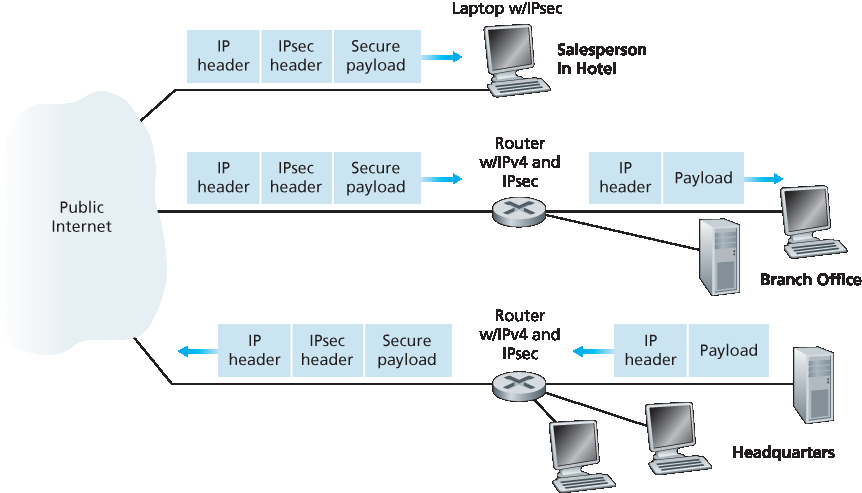
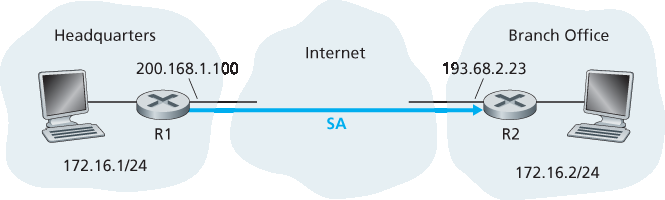
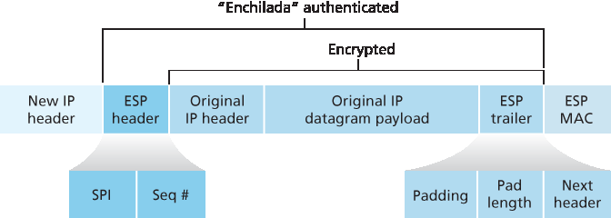

.. _c8.7:

8.7 网络层安全: IPsec 和虚拟专用网络
==========================================================================
8.7 Network-Layer Security: IPsec and Virtual Private Networks

8.7 网络层安全：IPsec 与虚拟专用网络

IP 安全协议，更常被称为 **IPsec**，提供网络层的安全。IPsec 保护任意两个网络层实体之间的 IP 数据报，包括主机和路由器。正如我们即将描述的，许多机构（公司、政府部门、非营利组织等）使用 IPsec 来创建运行于公共互联网之上的 **虚拟专用网络（VPN）**。

在深入 IPsec 细节之前，先退一步思考在网络层提供机密性的含义。网络层机密性是指网络中的两个实体（例如两个路由器、两个主机，或路由器与主机之间）间，发送方加密发送给接收方的所有数据报负载。被加密的负载可以是 TCP 段、UDP 段、ICMP 报文等等。如果存在这样的网络层服务，所有从一端发送到另一端的数据——包括电子邮件、网页、TCP 握手消息以及管理消息（如 ICMP 和 SNMP）——都会对任何监听网络的第三方隐藏。因此，网络层安全被称为提供“全面覆盖”。

除了机密性，网络层安全协议还可能提供其他安全服务。例如，它可以提供源身份认证，使接收方能验证数据报的来源。网络层安全协议还能提供数据完整性，允许接收方检查数据报在传输过程中是否被篡改。网络层安全服务也可以防止重放攻击，即让 Bob 能够检测攻击者可能插入的重复数据报。我们很快会看到，IPsec 确实为这些安全服务提供机制，即机密性、源认证、数据完整性和重放攻击防护。

.. toggle::

    The IP security protocol, more commonly known as **IPsec**, provides security at the network layer. IPsec secures IP datagrams between any two network-layer entities, including hosts and routers. As we will soon describe, many institutions (corporations, government branches, non-profit organizations, and so on) use IPsec to create **virtual private networks (VPNs)** that run over the public Internet.

    Before getting into the specifics of IPsec, let’s step back and consider what it means to provide confidentiality at the network layer. With network-layer confidentiality between a pair of network entities (for example, between two routers, between two hosts, or between a router and a host), the sending entity encrypts the payloads of all the datagrams it sends to the receiving entity. The encrypted payload could be a TCP segment, a UDP segment, an ICMP message, and so on. If such a network-layer service were in place, all data sent from one entity to the other—including e-mail, Web pages, TCP handshake messages, and management messages (such as ICMP and SNMP)—would be hidden from any third party that might be sniffing the network. For this reason, network-layer security is said to provide “blanket coverage.”

    In addition to confidentiality, a network-layer security protocol could potentially provide other security services. For example, it could provide source authentication, so that the receiving entity can verify the source of the secured datagram. A network-layer security protocol could provide data integrity, so that the receiving entity can check for any tampering of the datagram that may have occurred while the datagram was in transit. A network-layer security service could also provide replay-attack prevention, meaning that Bob could detect any duplicate datagrams that an attacker might insert. We will soon see that IPsec indeed provides mechanisms for all these security services, that is, for confidentiality, source authentication, data ­integrity, and replay-attack prevention.

.. _c8.7.1:

8.7.1 IPsec 和虚拟专用网络 (VPNs)
----------------------------------------------------------------------------------
8.7.1 IPsec and Virtual Private Networks (VPNs)

跨多个地理区域的机构通常希望拥有自己的 IP 网络，以便其主机和服务器能以安全和保密的方式相互传输数据。为了实现这一目标，该机构实际上可以部署一个独立的物理网络——包括路由器、链路和 DNS 基础设施——完全独立于公共互联网。这样一个专门为某机构服务的独立网络称为 **专用网络**。毫无意外，专用网络成本很高，因为机构需要购买、安装并维护自己的物理网络基础设施。

如今，许多机构不再部署和维护专用网络，而是在现有公共互联网之上创建 VPN。通过 VPN，机构内部办公间的通信流量通过公共互联网传输，而不是通过物理独立的网络传输。但为了提供机密性，办公间通信流量在进入公共互联网前会被加密。一个简单的 VPN 示例见 :ref:`图 8.27 <Figure 8.27>`。图中机构包含总部、分支机构和出差销售人员（图中仅示意一个销售人员）。在此 VPN 中，总部内部任意两台主机通信，或分支机构内部任意两台主机通信时，均使用传统的 IPv4（即不使用 IPsec 服务）。但当机构的两台主机通信路径经过公共互联网时，通信流量会在进入互联网前被加密。

.. _Figure 8.27:

**图 8.27 虚拟专用网络 (VPN)**

为了感受 VPN 的工作原理，让我们结合 :ref:`图 8.27 <Figure 8.27>` 通过一个简单例子说明。当总部内一台主机向在酒店的销售人员发送 IP 数据报时，总部的网关路由器会将传统 IPv4 数据报转换成 IPsec 数据报，然后将该 IPsec 数据报转发到互联网。该 IPsec 数据报实际上拥有传统的 IPv4 头部，因此公共互联网中的路由器会像处理普通 IPv4 数据报一样处理它——对它们而言，该数据报是完全普通的数据报。但如 :ref:`图 8.27 <Figure 8.27>` 所示，IPsec 数据报的负载部分包含 IPsec 头部，用于 IPsec 处理；此外，IPsec 数据报的负载是加密的。当 IPsec 数据报到达销售人员笔记本时，笔记本的操作系统会解密负载（并提供其他安全服务，如数据完整性验证），将未加密的负载传递给上层协议（例如 TCP 或 UDP）。

我们刚才对机构如何使用 IPsec 创建 VPN 做了一个高层次的概述。为了看清整体，我们忽略了许多重要细节。现在让我们更仔细地看看。

.. toggle::

    An institution that extends over multiple geographical regions often desires its own IP network, so that its hosts and servers can send data to each other in a secure and confidential manner. To achieve this goal, the institution could actually deploy a stand-alone physical network—including routers, links, and a DNS ­infrastructure—that is completely separate from the public Internet. Such a disjoint network, dedicated to a particular institution, is called a **private network**. Not surprisingly, a private network can be very costly, as the institution needs to purchase, install, and maintain its own physical network infrastructure.

    Instead of deploying and maintaining a private network, many institutions today create VPNs over the existing public Internet. With a VPN, the institution’s inter-office traffic is sent over the public Internet rather than over a physically independent network. But to provide confidentiality, the inter-office traffic is encrypted before it enters the public Internet. A simple example of a VPN is shown in :ref:`Figure 8.27 <Figure 8.27>`. Here the institution consists of a headquarters, a branch office, and traveling salespersons that typically access the Internet from their hotel rooms. (There is only one salesperson shown in the figure.) In this VPN, whenever two hosts within headquarters send IP datagrams to each other or whenever two hosts within the branch office want to communicate, they use good-old vanilla IPv4 (that is, without IPsec services). However, when two of the institution’s hosts communicate over a path that traverses the public Internet, the traffic is encrypted before it enters the Internet.

    .. figure:: ../img/706-0.png 
        :align: center 

    **Figure 8.27 Virtual private network (VPN)**

    To get a feel for how a VPN works, let’s walk through a simple example in the context of :ref:`Figure 8.27 <Figure 8.27>`. When a host in headquarters sends an IP datagram to a salesperson in a hotel, the gateway router in headquarters converts the vanilla IPv4 datagram into an IPsec datagram and then forwards this IPsec datagram into the Internet. This IPsec datagram actually has a traditional IPv4 header, so that the routers in the public Internet process the datagram as if it were an ordinary IPv4 datagram—to them, the datagram is a perfectly ordinary datagram. But, as shown :ref:`Figure 8.27 <Figure 8.27>`, the payload of the IPsec datagram includes an IPsec header, which is used for IPsec processing; furthermore, the payload of the IPsec datagram is encrypted. When the IPsec datagram arrives at the salesperson’s laptop, the OS in the laptop decrypts the payload (and provides other security services, such as verifying data integrity) and passes the unencrypted payload to the upper-layer protocol (for example, to TCP or UDP).

    We have just given a high-level overview of how an institution can employ IPsec to create a VPN. To see the forest through the trees, we have brushed aside many important details. Let’s now take a closer look.

.. _c8.7.2:

8.7.2 AH 和 ESP 协议
----------------------------------------------------------------------------------
8.7.2 The AH and ESP Protocols

IPsec 是一个相当复杂的体系——它在十几个 RFC 中有定义。其中两个重要的 RFC 是 :rfc:`4301`，描述了整体的 IP 安全架构，以及 RFC 6071，提供了 IPsec 协议套件的概述。本教材的目标和往常一样，不是简单地重复枯燥晦涩的 RFC，而是采取更具操作性和教学性的方式来描述这些协议。

在 IPsec 协议套件中，有两个主要协议： **认证头（Authentication Header，AH）** 协议和 **封装安全负载（Encapsulation Security Payload，ESP）** 协议。当源 IPsec 实体（通常是主机或路由器）向目标实体（也是主机或路由器）发送安全数据报时，采用的要么是 AH 协议，要么是 ESP 协议。AH 协议提供源认证和数据完整性，但不提供机密性。ESP 协议则提供源认证、数据完整性和机密性。由于机密性对于 VPN 和其他 IPsec 应用通常至关重要，ESP 协议的使用远比 AH 协议广泛。为了简化 IPsec 并避免复杂性，我们接下来将专注于 ESP 协议。想了解 AH 协议的读者，建议查阅相关 RFC 和其他在线资源。

.. toggle::

    IPsec is a rather complex animal—it is defined in more than a dozen RFCs. Two important RFCs are RFC 4301, which describes the overall IP security architecture, and RFC 6071, which provides an overview of the IPsec protocol suite. Our goal in this textbook, as usual, is not simply to re-hash the dry and arcane RFCs, but instead take a more operational and pedagogic approach to describing the protocols.

    In the IPsec protocol suite, there are two principal protocols: the **Authentication Header (AH)** protocol and the **Encapsulation Security Payload (ESP)** protocol. When a source IPsec entity (typically a host or a router) sends secure datagrams to a destination entity (also a host or a router), it does so with either the AH protocol or the ESP protocol. The AH protocol provides source authentication and data integrity but does not provide confidentiality. The ESP protocol provides source authentication, data integrity, and confidentiality. Because confidentiality is often critical for VPNs and other IPsec applications, the ESP protocol is much more widely used than the AH protocol. In order to de-mystify IPsec and avoid much of its complication, we will henceforth focus exclusively on the ESP protocol. Readers wanting to learn also about the AH protocol are encouraged to explore the RFCs and other online resources.

.. _c8.7.3:

8.7.3 安全关联
----------------------------------------------------------------------------------
8.7.3 Security Associations

IPsec 数据报在网络实体对之间传输，如两个主机之间、两个路由器之间或主机与路由器之间。在源实体向目标实体发送 IPsec 数据报之前，双方会创建一个网络层的逻辑连接。这个逻辑连接称为 **安全关联（Security Association，SA）**。SA 是单工逻辑连接，即单向从源到目标。如果双方都希望相互发送安全数据报，则需要建立两个 SA（即两条逻辑连接），分别对应两个方向。

例如，再次考虑 :ref:`图 8.27 <Figure 8.27>` 中的机构 VPN。该机构包含总部、分支机构和假设有 n 个出差销售人员。为便于说明，假设总部与分支机构之间有双向 IPsec 流量，总部与销售人员之间也有双向 IPsec 流量。那么此 VPN 中共有多少个 SA？回答这个问题时注意，总部网关路由器与分支机构网关路由器之间有两个 SA（一正一反）；对于每个销售人员的笔记本，总部网关路由器与该笔记本之间也有两个 SA（同样一正一反）。因此，总共是 (2 + 2n) 个 SA。但请记住，并非所有由网关路由器或笔记本发往互联网的流量都会使用 IPsec 保护。例如，总部内某主机可能想访问公共互联网中的 Web 服务器（如亚马逊或谷歌）。因此，网关路由器（及笔记本）同时发送普通 IPv4 数据报和加密的 IPsec 数据报。

.. _Figure 8.28:

**图 8.28 从 R1 到 R2 的安全关联（SA）**

现在我们来“深入”了解一个 SA。为了使讨论具体且直观，我们以 :ref:`图 8.28 <Figure 8.28>` 中路由器 R1 到路由器 R2 的 SA 为例。（你可以把路由器 R1 看作是 :ref:`图 8.27 <Figure 8.27>` 中的总部网关路由器，把路由器 R2 看作分支机构网关路由器。）路由器 R1 会维护该 SA 的状态信息，包括：

- SA 的 32 位标识符，称为 **安全参数索引（Security Parameter Index，SPI）**
- SA 的源接口（本例为 200.168.1.100）和目标接口（本例为 193.68.2.23）
- 使用的加密类型（例如，带 CBC 的 3DES）
- 加密密钥
- 使用的完整性校验类型（例如，带 MD5 的 HMAC）
- 认证密钥

每当路由器 R1 需要构造一个用于通过该 SA 转发的 IPsec 数据报时，它会访问这些状态信息，以确定如何认证和加密该数据报。同理，路由器 R2 也会维护该 SA 的相同状态信息，并用来认证和解密从该 SA 到达的任何 IPsec 数据报。

一个 IPsec 实体（路由器或主机）通常会维护多个 SA 的状态信息。例如，在 :ref:`图 8.27 <Figure 8.27>` 中有 n 个销售人员时，总部网关路由器会维护 (2 + 2n) 个 SA 的状态信息。IPsec 实体将其所有 SA 的状态信息存储在其操作系统内核中的 **安全关联数据库（Security Association Database，SAD）** 数据结构中。

.. toggle::

    IPsec datagrams are sent between pairs of network entities, such as between two hosts, between two routers, or between a host and router. Before sending IPsec datagrams from source entity to destination entity, the source and destination entities create a network-layer logical connection. This logical connection is called a **security association (SA)**. An SA is a simplex logical connection; that is, it is unidirectional from source to destination. If both entities want to send secure datagrams to each other, then two SAs (that is, two logical connections) need to be established, one in each direction.

    For example, consider once again the institutional VPN in :ref:`Figure 8.27 <Figure 8.27>`. This institution consists of a headquarters office, a branch office and, say, n traveling salespersons. For the sake of example, let’s suppose that there is bi-directional IPsec traffic between headquarters and the branch office and bi- directional IPsec traffic between headquarters and the salespersons. In this VPN, how many SAs are there? To answer this question, note that there are two SAs between the headquarters gateway router and the branch-office gateway router (one in each direction); for each salesperson’s laptop, there are two SAs between the headquarters gateway router and the laptop (again, one in each direction). So, in total, there are (2+2n) SAs. Keep in mind, however, that not all traffic sent into the Internet by the gateway routers or by the laptops will be IPsec secured. For example, a host in headquarters may want to access a Web server (such as Amazon or Google) in the public Internet. Thus, the gateway router (and the laptops) will emit into the Internet both vanilla IPv4 ­datagrams and secured IPsec datagrams.

    .. figure:: ../img/708-0.png 
        :align: center 

    **Figure 8.28 Security association (SA) from R1 to R2**

    Let’s now take a look “inside” an SA. To make the discussion tangible and ­concrete, let’s do this in the context of an SA from router R1 to router R2 in :ref:`Figure 8.28 <Figure 8.28>`. (You can think of Router R1 as the headquarters gateway router and Router R2 as the branch office gateway router from :ref:`Figure 8.27 <Figure 8.27>`.) Router R1 will maintain state information about this SA, which will include:

    - A 32-bit identifier for the SA, called the **Security Parameter Index (SPI)**
    - The origin interface of the SA (in this case 200.168.1.100) and the destination interface of the SA (in this case 193.68.2.23)
    - The type of encryption to be used (for example, 3DES with CBC) The encryption key
    - The type of integrity check (for example, HMAC with MD5)
    - The authentication key

    Whenever router R1 needs to construct an IPsec datagram for forwarding over this SA, it accesses this state information to determine how it should authenticate and encrypt the datagram. Similarly, router R2 will maintain the same state information for this SA and will use this information to authenticate and decrypt any IPsec datagram that arrives from the SA.

    An IPsec entity (router or host) often maintains state information for many SAs. For example, in the VPN example in :ref:`Figure 8.27 <Figure 8.27>` with n salespersons, the headquarters gateway router maintains state information for (2+2n) SAs. An IPsec entity stores the state information for all of its SAs in its **Security Association Database (SAD)**, which is a data structure in the entity’s OS kernel.

.. _c8.7.4:

8.7.4 IPsec 数据报
----------------------------------------------------------------------------------
8.7.4 The IPsec Datagram

现在我们已经描述了安全关联（SA），接下来可以描述实际的 IPsec 数据报。IPsec 有两种不同的数据包形式，一种是所谓的 **隧道模式（tunnel mode）**，另一种是所谓的**传输模式（transport mode）**。隧道模式更适合用于 VPN，因此部署得更广泛。为了进一步简化 IPsec 并避免其复杂性，接下来我们将专注于隧道模式。一旦你掌握了隧道模式，应该可以轻松学习传输模式。

.. _Figure 8.29:

**图 8.29 IPsec 数据报格式**

IPsec 数据报的包格式如 :ref:`图 8.29 <Figure 8.29>` 所示。你可能会觉得包格式枯燥无味，但我们很快会发现 IPsec 数据报实际上看起来和口味都像一种流行的墨西哥风味美食！让我们结合 :ref:`图 8.28 <Figure 8.28>` 来看看 IPsec 字段。假设路由器 R1 收到来自总部网络中主机 172.16.1.17 的普通 IPv4 数据报，目标是分支网络中的主机 172.16.2.48。路由器 R1 采用以下“配方”将该“原始 IPv4 数据报”转换为 IPsec 数据报：

- 在原始 IPv4 数据报（包括其原始头字段！）后面附加一个“ESP 尾部”字段
- 使用 SA 指定的算法和密钥对结果进行加密
- 在该加密数据前面附加一个称为“ESP 头部”的字段，生成的包被称为“enchilada（墨西哥卷饼）”
- 使用 SA 指定的算法和密钥对整个 enchilada 生成认证 MAC
- 将 MAC 附加在 enchilada 后面，形成负载
- 最后，创建一个全新的 IP 头部，包含所有传统 IPv4 头字段（通常长度为 20 字节），并将其附加在负载之前

注意，生成的 IPsec 数据报是真正的 IPv4 数据报，具有传统的 IPv4 头字段，后跟负载。但此时负载包含 ESP 头部、原始 IP 数据报、ESP 尾部和 ESP 认证字段（原始数据报和 ESP 尾部是加密的）。原始 IP 数据报的源 IP 地址是 172.16.1.17，目标 IP 地址是 172.16.2.48。由于 IPsec 数据报包含原始 IP 数据报，这些地址作为 IPsec 包负载的一部分被包含（并加密）。那么新 IP 头部中的源和目标 IP 地址呢？它们设置为隧道两端路由器接口的地址，即 200.168.1.100 和 193.68.2.23。此外，这个新的 IPv4 头部中的协议号字段不设置为 TCP、UDP 或 SMTP，而是设置为 50，表示这是使用 ESP 协议的 IPsec 数据报。

R1 将 IPsec 数据报发送到公共互联网后，它将经过许多路由器到达 R2。每个路由器都会像处理普通数据报一样处理该数据报——它们完全不知道该数据报携带的是 IPsec 加密数据。对这些公共互联网路由器来说，由于外层头部的目标 IP 地址是 R2，数据报的最终目的地就是 R2。

通过这个例子，我们了解了 IPsec 数据报是如何构造的，现在让我们仔细看看 enchilada 中的组成部分。 :ref:`图 8.29 <Figure 8.29>` 中显示 ESP 尾部由三个字段组成：填充、填充长度和下一个头部。回想一下，块密码要求被加密的消息必须是块长度的整数倍。填充（由无意义的字节组成）用于使原始数据报（连同填充长度和下一个头部字段）后，整个“消息”长度为块的整数倍。填充长度字段告诉接收方插入了多少填充（因此需要移除多少）。下一个头部标识负载数据字段中数据的类型（例如 UDP）。负载数据（通常是原始 IP 数据报）和 ESP 尾部被连接后加密。

在这个加密单元前附加的是 ESP 头部，该头部以明文发送，包含两个字段：SPI 和序列号。SPI 指示接收方该数据报属于哪个 SA，接收方可用 SPI 作为索引查找其 SAD 以确定合适的认证/解密算法和密钥。序列号字段用于防止重放攻击。

发送方还附加了认证 MAC。如前所述，发送方对整个 enchilada（ESP 头部、原始 IP 数据报和 ESP 尾部，数据报和尾部是加密的）计算 MAC。计算 MAC 时，发送方将秘密 MAC 密钥附加到 enchilada，然后计算固定长度的哈希值。

当 R2 收到 IPsec 数据报时，R2 看到数据报的目标 IP 地址就是自己，因此开始处理该数据报。因为最左边 IP 头部的协议字段是 50，R2 知道应该对该数据报应用 IPsec ESP 处理。首先，R2 通过 SPI 确定该数据报所属的 SA。其次，计算 enchilada 的 MAC 并验证其与 ESP MAC 字段中的值是否一致。如果一致，说明数据报确实来自 R1 且未被篡改。第三，检查序列号字段以确认数据报是新的（不是重放的）。第四，使用与 SA 相关的解密算法和密钥解密加密单元。第五，去除填充并提取出原始的普通 IP 数据报。最后，第六，转发原始数据报进入分支机构网络，朝最终目的地发送。哇，好复杂的“配方”啊！但没人说制作和拆解 enchilada 是容易的！

实际上还有另一个重要的细节需要说明。问题是：当 R1 从总部网络的主机接收一个（未加密的）数据报，而该数据报的目标 IP 地址是总部外的某个地址时，R1 如何判断该数据报是否需要转换成 IPsec 数据报？如果需要，R1 又如何知道应该使用其 SAD 中的哪一个 SA 来构造 IPsec 数据报？问题的解决办法如下。除了 SAD，IPsec 实体还维护另一个称为 **安全策略数据库（Security Policy Database，SPD）** 的数据结构。SPD 指示哪些类型的数据报（根据源 IP 地址、目标 IP 地址和协议类型）需要进行 IPsec 处理；对于需要 IPsec 处理的数据报，SPD 指明应使用哪个 SA。从某种意义上说，SPD 中的信息指示“要对到达的数据报做什么”；SAD 中的信息指示“如何做”。

.. toggle::

    Having now described SAs, we can now describe the actual IPsec datagram. IPsec has two different packet forms, one for the so-called **tunnel mode** and the other for the so-called **transport mode**. The *tunnel mode*, being more appropriate for VPNs, is more widely deployed than the transport mode. In order to further de-mystify IPsec and avoid much of its complication, we henceforth focus exclusively on the tunnel mode. Once you have a solid grip on the tunnel mode, you should be able to easily learn about the transport mode on your own. 

    .. figure:: ../img/709-0.png 
        :align: center 

    **Figure 8.29 IPsec datagram format**

    The packet format of the IPsec datagram is shown in :ref:`Figure 8.29 <Figure 8.29>`. You might think that packet formats are boring and insipid, but we will soon see that the IPsec datagram actually looks and tastes like a popular Tex-Mex delicacy! Let’s examine the IPsec fields in the context of :ref:`Figure 8.28 <Figure 8.28>`. Suppose router R1 receives an ordinary IPv4 datagram from host 172.16.1.17 (in the headquarters network) which is destined to host 172.16.2.48 (in the branch-office network). Router R1 uses the ­following recipe to convert this “original IPv4 datagram” into an IPsec datagram:

    - Appends to the back of the original IPv4 datagram (which includes the original header fields!) an “ESP trailer” field
    - Encrypts the result using the algorithm and key specified by the SA
    - Appends to the front of this encrypted quantity a field called “ESP header”; the resulting package is called the “enchilada”
    - Creates an authentication MAC over the whole enchilada using the algorithm and key specified in the SA
    - Appends the MAC to the back of the enchilada forming the payload
    - Finally, creates a brand new IP header with all the classic IPv4 header fields (together normally 20 bytes long), which it appends before the payload
    
    Note that the resulting IPsec datagram is a bona fide IPv4 datagram, with the traditional IPv4 header fields followed by a payload. But in this case, the payload contains an ESP header, the original IP datagram, an ESP trailer, and an ESP authentication field (with the original datagram and ESP trailer encrypted). The original IP datagram has 172.16.1.17 for the source IP address and 172.16.2.48 for the destination IP address. Because the IPsec datagram includes the original IP datagram, these addresses are included (and encrypted) as part of the payload of the IPsec packet. But what about the source and destination IP addresses that are in the new IP header, that is, in the left-most header of the IPsec datagram? As you might expect, they are set to the source and destination router interfaces at the two ends of the tunnels, namely, 200.168.1.100 and 193.68.2.23. Also, the protocol number in this new IPv4 header field is not set to that of TCP, UDP, or SMTP, but instead to 50, designating that this is an IPsec datagram using the ESP protocol.

    After R1 sends the IPsec datagram into the public Internet, it will pass through many routers before reaching R2. Each of these routers will process the datagram as if it were an ordinary datagram—they are completely oblivious to the fact that the datagram is carrying IPsec-encrypted data. For these public Internet routers, because the destination IP address in the outer header is R2, the ultimate destination of the datagram is R2.

    Having walked through an example of how an IPsec datagram is constructed, let’s now take a closer look at the ingredients in the enchilada. We see in :ref:`Figure 8.29 <Figure 8.29>` that the ESP trailer consists of three fields: padding; pad length; and next header. Recall that block ciphers require the message to be encrypted to be an integer multiple of the block length. Padding (consisting of meaningless bytes) is used so that when added to the original datagram (along with the pad length and next header fields), the resulting “message” is an integer number of blocks. The pad-length field indicates to the receiving entity how much padding was inserted (and thus needs to be removed). The next header identifies the type (e.g., UDP) of data contained in the payload-data field. The payload data (typically the original IP datagram) and the ESP trailer are concatenated and then encrypted.

    Appended to the front of this encrypted unit is the ESP header, which is sent in the clear and consists of two fields: the SPI and the sequence number field. The SPI indicates to the receiving entity the SA to which the datagram belongs; the receiving entity can then index its SAD with the SPI to determine the appropriate authentication/decryption algorithms and keys. The sequence number field is used to defend against replay attacks.

    The sending entity also appends an authentication MAC. As stated earlier, the sending entity calculates a MAC over the whole enchilada (consisting of the ESP header, the original IP datagram, and the ESP trailer—with the datagram and trailer being encrypted). Recall that to calculate a MAC, the sender appends a secret MAC key to the enchilada and then calculates a fixed-length hash of the result.

    When R2 receives the IPsec datagram, R2 observes that the destination IP address of the datagram is R2 itself. R2 therefore processes the datagram. Because the protocol field (in the left-most IP header) is 50, R2 sees that it should apply IPsec ESP processing to the datagram. First, peering into the enchilada, R2 uses the SPI to determine to which SA the datagram belongs. Second, it calculates the MAC of the enchilada and verifies that the MAC is consistent with the value in the ESP MAC field. If it is, it knows that the enchilada comes from R1 and has not been tampered with. Third, it checks the sequence-number field to verify that the datagram is fresh (and not a replayed datagram). Fourth, it decrypts the encrypted unit using the decryption algorithm and key associated with the SA. Fifth, it removes padding and extracts the original, vanilla IP datagram. And finally, sixth, it forwards the original datagram into the branch office network toward its ultimate destination. Whew, what a complicated recipe, huh? Well no one ever said that preparing and unraveling an enchilada was easy!

    There is actually another important subtlety that needs to be addressed. It centers on the following question: When R1 receives an (unsecured) datagram from a host in the headquarters network, and that datagram is destined to some destination IP address outside of headquarters, how does R1 know whether it should be converted to an IPsec datagram? And if it is to be processed by IPsec, how does R1 know which SA (of many SAs in its SAD) should be used to construct the IPsec datagram? The problem is solved as follows. Along with a SAD, the IPsec entity also maintains another data structure called the **Security Policy Database (SPD)**. The SPD indicates what types of datagrams (as a function of source IP address, destination IP address, and protocol type) are to be IPsec processed; and for those that are to be IPsec processed, which SA should be used. In a sense, the information in a SPD indicates “what” to do with an arriving datagram; the information in the SAD indicates “how” to do it.

IPsec 服务总结
~~~~~~~~~~~~~~~~~~~~~~~~~~~~
Summary of IPsec Services

那么，IPsec 到底提供了哪些服务？让我们从攻击者的角度来审视，比如坐在 :ref:`图 8.28 <Figure 8.28>` 中 R1 和 R2 之间路径上的中间人 Trudy。假设 Trudy 不知道 SA 使用的认证和加密密钥。Trudy 能做什么，不能做什么？首先，Trudy 看不到原始数据报。事实上，除了原始数据报中的数据被隐藏外，协议号、源 IP 地址和目标 IP 地址也被隐藏。通过 SA 发送的数据报，Trudy 只能知道数据报来自 172.16.1.0/24 网段中的某个主机，目标是 172.16.2.0/24 网段中的某个主机。她不知道数据报承载的是 TCP、UDP 还是 ICMP 数据；也不知道是否是 HTTP、SMTP 或其他应用数据。这种机密性远超 SSL。其次，假设 Trudy 试图通过翻转数据报的某些位来篡改数据报。当该篡改后的数据报到达 R2 时，它会因完整性校验（MAC）失败而被拦截，Trudy 的恶意行为再次失败。第三，假设 Trudy 试图冒充 R1，制造源地址为 200.168.1.100、目标地址为 193.68.2.23 的 IPsec 数据报。此攻击也会因 R2 处的完整性校验失败而告终。最后，由于 IPsec 包含序列号，Trudy 无法成功发动重放攻击。总之，如本节开头所述，IPsec 在网络层处理数据包的任意设备对之间提供了机密性、源认证、数据完整性和重放攻击防护。

.. toggle::

    So what services does IPsec provide, exactly? Let us examine these services from the perspective of an attacker, say Trudy, who is a woman-in-the-middle, sitting somewhere on the path between R1 and R2 in :ref:`Figure 8.28 <Figure 8.28>`. Assume throughout this ­discussion that Trudy does not know the authentication and encryption keys used by the SA. What can and cannot Trudy do? First, Trudy cannot see the original datagram. If fact, not only is the data in the original datagram hidden from Trudy, but so is the protocol number, the source IP address, and the destination IP address. For datagrams sent over the SA, Trudy only knows that the datagram originated from some host in 172.16.1.0/24 and is destined to some host in 172.16.2.0/24. She does not know if it is carrying TCP, UDP, or ICMP data; she does not know if it is carrying HTTP, SMTP, or some other type of application data. This confidentiality thus goes a lot farther than SSL. Second, suppose Trudy tries to tamper with a datagram in the SA by flipping some of its bits. When this tampered datagram arrives at R2, it will fail the integrity check (using the MAC), thwarting Trudy’s vicious attempts once again. Third, suppose Trudy tries to masquerade as R1, creating a IPsec datagram with source 200.168.1.100 and destination 193.68.2.23. Trudy’s attack will be futile, as this datagram will again fail the integrity check at R2. Finally, because IPsec includes sequence numbers, Trudy will not be able create a successful replay attack. In summary, as claimed at the beginning of this section, IPsec provides—between any pair of devices that process packets through the network layer— confidentiality, source authentication, data integrity, and replay-attack prevention.

.. _c8.7.5:

8.7.5 IKE：IPsec 中的密钥管理
----------------------------------------------------------------------------------
8.7.5 IKE: Key Management in IPsec

当 VPN 只有少量端点时（例如 :ref:`图 8.28 <Figure 8.28>` 中的两个路由器），网络管理员可以手动将 SA 信息（加密/认证算法和密钥，以及 SPI）输入到端点的 SAD 中。这种“手动密钥配置”显然不适合规模庞大的 VPN，后者可能包含数百甚至数千台 IPsec 路由器和主机。大规模、地理分布广泛的部署需要自动化机制来创建 SA。IPsec 使用 Internet 密钥交换（IKE）协议实现该功能，详见 RFC 5996。

IKE 在某些方面类似于 SSL 中的握手（参见 :ref:`第 8.6 节 <c8.6>`）。每个 IPsec 实体都有一个包含其公钥的证书。与 SSL 一样，IKE 协议要求双方交换证书，协商认证和加密算法，并安全地交换密钥材料以创建 IPsec SA 的会话密钥。不同的是，IKE 采用两个阶段来完成这些任务。

让我们结合 :ref:`图 8.28 <Figure 8.28>` 中的两个路由器 R1 和 R2 来研究这两个阶段。第一阶段包括两次消息对的交换：

- 在第一次消息交换中，双方使用 Diffie-Hellman（见作业题）创建双向的 **IKE SA**。为了让大家更混淆，这个双向 IKE SA 与 8.6.3 和 8.6.4 节中讨论的 IPsec SA 完全不同。IKE SA 提供了路由器间的认证和加密通道。在该消息对交换期间，建立用于 IKE SA 的加密和认证密钥。同时建立一个主密钥，后续第二阶段用来计算 IPsec SA 密钥。注意此阶段不使用 RSA 公私钥，R1 和 R2 都不通过私钥签名消息来证明身份。
- 在第二次消息交换中，双方通过签名消息相互验证身份。但由于消息通过已加密的 IKE SA 通道发送，被动监听者无法获知身份。此外，双方在此阶段协商 IPsec SA 使用的加密和认证算法。

在 IKE 的第二阶段，双方各自创建一个单向 SA。第二阶段结束时，双方为这两个 SA 建立了加密和认证会话密钥。随后双方可以使用这些 SA 发送安全数据报，如 :ref:`8.7.3 节 <c8.7.3>` 和 :ref:`8.7.4 节 <c8.7.4>` 所述。IKE 采用两个阶段的主要原因是计算开销——由于第二阶段不涉及公钥密码学，IKE 可以以较低的计算成本在两个 IPsec 实体间生成大量 SA。

.. toggle::

    When a VPN has a small number of end points (for example, just two routers as in :ref:`Figure 8.28 <Figure 8.28>`), the network administrator can manually enter the SA information (encryption/authentication algorithms and keys, and the SPIs) into the SADs of the endpoints. Such “manual keying” is clearly impractical for a large VPN, which may consist of hundreds or even thousands of IPsec routers and hosts. Large, geographically distributed deployments require an automated mechanism for creating the SAs. IPsec does this with the Internet Key Exchange (IKE) protocol, specified in RFC 5996.

    IKE has some similarities with the handshake in SSL (see :ref:`Section 8.6 <c8.6>`). Each IPsec entity has a certificate, which includes the entity’s public key. As with SSL, the IKE protocol has the two entities exchange certificates, negotiate authentication and encryption algorithms, and securely exchange key material for creating session keys in the IPsec SAs. Unlike SSL, IKE employs two phases to carry out these tasks.

    Let’s investigate these two phases in the context of two routers, R1 and R2, in :ref:`Figure 8.28 <Figure 8.28>`. The first phase consists of two exchanges of message pairs between R1 and R2:

    - During the first exchange of messages, the two sides use Diffie-Hellman (see Homework Problems) to create a bi-directional **IKE SA** between the routers. To keep us all confused, this bi-directional IKE SA is entirely different from the IPsec SAs discussed in Sections 8.6.3 and 8.6.4. The IKE SA provides an authenticated and encrypted channel between the two routers. During this first message-pair exchange, keys are established for encryption and authentication for the IKE SA. Also established is a master secret that will be used to compute IPSec SA keys later in phase 2. Observe that during this first step, RSA public and private keys are not used. In particular, neither R1 nor R2 reveals its identity by signing a message with its private key.
    - During the second exchange of messages, both sides reveal their identity to each other by signing their messages. However, the identities are not revealed to a passive sniffer, since the messages are sent over the secured IKE SA channel. Also during this phase, the two sides negotiate the IPsec encryption and authentication algorithms to be employed by the IPsec SAs.

    In phase 2 of IKE, the two sides create an SA in each direction. At the end of phase 2, the encryption and authentication session keys are established on both sides for the two SAs. The two sides can then use the SAs to send secured datagrams, as described in :ref:`Sections 8.7.3 <c8.7.3>` and :ref:`8.7.4 <c8.7.4>`. The primary motivation for having two phases in IKE is computational cost—since the second phase doesn’t involve any public-key cryptography, IKE can generate a large number of SAs between the two IPsec entities with relatively little computational cost.