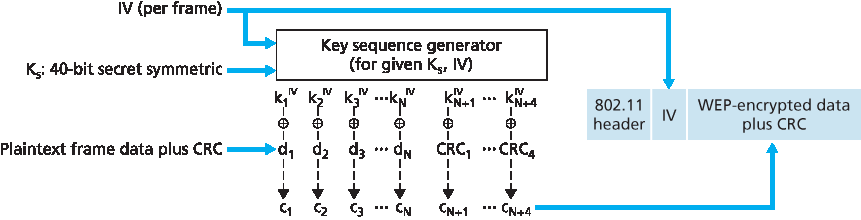
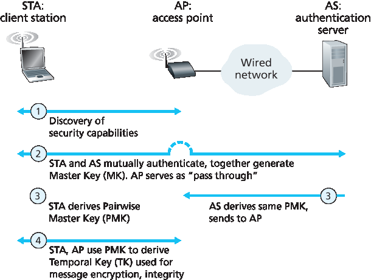

.. _c8.8:

8.8 保护无线局域网
==========================================================================
8.8 Securing Wireless LANs

.. tab:: 中文

.. tab:: 英文

Security is a particularly important concern in wireless networks, where radio waves carrying frames can propagate far beyond the building containing the wireless base station and hosts. In this section we present a brief introduction to wireless security. For a more in-depth treatment, see the highly readable
book by Edney and Arbaugh :ref:`[Edney 2003] <Edney 2003>`.

The issue of security in 802.11 has attracted considerable attention in both technical circles and in the media. While there has been considerable discussion, there has been little debate—there seems to be universal agreement that the original 802.11 specification contains a number of serious security flaws. Indeed, public domain software can now be downloaded that exploits these holes, making those who use the vanilla 802.11 security mechanisms as open to security attacks as users who use no security features at all.

In the following section, we discuss the security mechanisms initially standardized in the 802.11 specification, known collectively as **Wired Equivalent Privacy (WEP)**. As the name suggests, WEP is meant to provide a level of security similar to that found in wired networks. We’ll then discuss a few of the security holes in WEP and discuss the 802.11i standard, a fundamentally more secure version of 802.11 adopted in 2004.

.. _c8.8.1:

8.8.1 有线等效保密 (WEP)
----------------------------------------------------------------------------------
8.8.1 Wired Equivalent Privacy (WEP)

.. tab:: 中文

.. tab:: 英文

The IEEE 802.11 WEP protocol was designed in 1999 to provide authentication and data encryption between a host and a wireless access point (that is, base station) using a symmetric shared key approach. WEP does not specify a key management algorithm, so it is assumed that the host and wireless access point have somehow agreed on the key via an out-of-band method. Authentication is carried out as ­follows:

1. A wireless host requests authentication by an access point.
2. The access point responds to the authentication request with a 128-byte nonce value.
3. The wireless host encrypts the nonce using the symmetric key that it shares with the access point.
4. The access point decrypts the host-encrypted nonce.

If the decrypted nonce matches the nonce value originally sent to the host, then the host is authenticated by the access point.

.. _Figure 8.30:

**Figure 8.30 802.11 WEP protocol**

The WEP data encryption algorithm is illustrated in :ref:`Figure 8.30 <Figure 8.30>`. A secret 40-bit symmetric key, KS, is assumed to be known by both a host and the access point. In addition, a 24-bit Initialization Vector (IV) is appended to the 40-bit key to create a 64-bit key that will be used to encrypt a single frame. The IV will change from one frame to another, and hence each frame will be encrypted with a different 64-bit key. Encryption is performed as follows. First a 4-byte CRC value (see :ref:`Section 6.2 <c6.2>`) is computed for the data payload. The payload and the four CRC bytes are then encrypted using the RC4 stream cipher. We will not cover the details of RC4 here (see :ref:`[Schneier 1995] <Schneier 1995>` and :ref:`[Edney 2003] <Edney 2003>` for details). For our purposes, it is enough to know that when presented with a key value (in this case, the 64-bit (KS, IV) key), the RC4 algorithm produces a stream of key values, k1IV,k2IV,k3IV,... that are used to encrypt the data and CRC value in a frame. For practical purposes, we can think of these operations being performed a byte at a time. Encryption is performed by XOR-ing the ith byte of data, di, with the ith key, kiIV, in the stream of key values generated by the (KS, IV) pair to produce the ith byte of ciphertext, ci:

    ci=di⊕kiIV

The IV value changes from one frame to the next and is included in plaintext in the header of each WEP-encrypted 802.11 frame, as shown in :ref:`Figure 8.30 <Figure 8.30>`. The receiver takes the secret 40-bit symmetric key that it shares with the sender, appends the IV, and uses the resulting 64-bit key (which is identical to the key used by the sender to perform encryption) to decrypt the frame:

    di=ci⊕kiIV

Proper use of the RC4 algorithm requires that the same 64-bit key value never be used more than once. Recall that the WEP key changes on a frame-by-frame basis. For a given KS (which changes rarely, if ever), this means that there are only 224 unique keys. If these keys are chosen randomly, we can show :ref:`[Edney 2003] <Edney 2003>` that the probability of having chosen the same IV value (and hence used the same 64-bit key) is more than 99 percent after only 12,000 frames. With 1 Kbyte frame sizes and a data transmission rate of 11 Mbps, only a few seconds are needed before 12,000 frames are transmitted. Furthermore, since the IV is transmitted in plaintext in the frame, an eavesdropper will know whenever a duplicate IV value is used.

To see one of the several problems that occur when a duplicate key is used, consider the following chosen-plaintext attack taken by Trudy against Alice. Suppose that Trudy (possibly using IP spoofing) sends a request (for example, an HTTP or FTP request) to Alice to transmit a file with known content, d1, d2, d3, d4,.... Trudy also observes the encrypted data c1, c2, c3, c4,.... Since di=ci⊕kiIV, if we XOR ci with each side of this equality we have

    di⊕ci=kiIV

With this relationship, Trudy can use the known values of di and ci to compute kiIV. The next time Trudy sees the same value of IV being used, she will know the key sequence k1IV,k2IV,k3IV,... and will thus be able to decrypt the encrypted message.

There are several additional security concerns with WEP as well. :ref:`[Fluhrer 2001] <Fluhrer 2001>` described an attack exploiting a known weakness in RC4 when certain weak keys are chosen. :ref:`[Stubblefield 2002] <Stubblefield 2002>` discusses efficient ways to implement and exploit this attack. Another concern with WEP involves the CRC bits shown in :ref:`Figure 8.30 <Figure 8.30>` and transmitted in the 802.11 frame to detect altered bits in the payload. However, an attacker who changes the encrypted content (e.g., substituting gibberish for the original encrypted data), computes a CRC over the substituted gibberish, and places the CRC into a WEP frame can produce an 802.11 frame that will be accepted by the receiver. What is needed here are message integrity techniques such as those we studied in :ref:`Section 8.3 <c8.3>` to detect content tampering or substitution. For more details of WEP security, see [:ref:`Edney 2003 <Edney 2003>`; :ref:`Wright 2015 <Wright 2015>`] and the ­references therein.

.. _c8.8.2:

8.8.2 IEEE 802.11i
----------------------------------------------------------------------------------
8.8.2 IEEE 802.11i

.. tab:: 中文

.. tab:: 英文

Soon after the 1999 release of IEEE 802.11, work began on developing a new and improved version of 802.11 with stronger security mechanisms. The new standard, known as 802.11i, underwent final ratification in 2004. As we’ll see, while WEP provided relatively weak encryption, only a single way to perform authentication, and no key distribution mechanisms, IEEE 802.11i provides for much stronger forms of encryption, an extensible set of authentication mechanisms, and a key distribution mechanism. In the following, we present an overview of 802.11i; an excellent (streaming audio) technical overview of 802.11i is :ref:`[TechOnline 2012] <TechOnline 2012>`.

.. _Figure 8.31:

**Figure 8.31 802.11i: Four phases of operation**

:ref:`Figure 8.31 <Figure 8.31>` overviews the 802.11i framework. In addition to the wireless client and access point, 802.11i defines an authentication server with which the AP can communicate. Separating the authentication server from the AP allows one authentication server to serve many APs, centralizing the (often sensitive) decisions regarding authentication and access within the single server, and keeping AP costs and complexity low. 802.11i operates in four phases:

1. **Discovery**. In the discovery phase, the AP advertises its presence and the forms of authentication and encryption that can be provided to the wireless client node. The client then requests the specific forms of authentication and encryption that it desires. Although the client and AP are already exchanging messages, the client has not yet been authenticated nor does it have an encryption key, and so several more steps will be required before the client can communicate with an arbitrary remote host over the wireless channel.
2. **Mutual authentication and Master Key (MK) generation**. Authentication takes place between the wireless client and the authentication server. In this phase, the access point acts essentially as a relay, forwarding messages between the client and the authentication server. The **Extensible Authentication Protocol (EAP)** [:rfc:`3748`] defines the end-to-end message formats used in a simple request/response mode of interaction between the client and authentication server. As shown in :ref:`Figure 8.32 <Figure 8.32>`, EAP messages are encapsulated using **EAPoL** (EAP over LAN, :ref:`[IEEE 802.1X] <IEEE 802.1X>`) and sent over the 802.11 wireless link. These EAP messages are then decapsulated at the access point, and then re-encapsulated using the **RADIUS** protocol for transmission over UDP/IP to the authentication server. While the RADIUS server and protocol [:rfc:`2865`] are not required by the 802.11i protocol, they are de facto standard components for 802.11i. The recently standardized **DIAMETER** protocol [:rfc:`3588`] is likely to replace **RADIUS** in the near future.

   .. figure:: ../img/718-0.png 
       :align: center 
   
   .. _Figure 8.32:
   
   **Figure 8.32 EAP is an end-to-end protocol. EAP messages are encapsulated using EAPoL over the wireless link between the ­client and the access point, and using RADIUS over UDP/IP between the access point and the authentication server**

   With EAP, the authentication server can choose one of a number of ways to perform authentication. While 802.11i does not mandate a particular authentication method, the EAP- TLS authentication scheme [:rfc:`5216`] is often used. EAP-TLS uses public key techniques (including nonce encryption and message digests) similar to those we studied in :ref:`Section 8.3 <c8.3>` to allow the client and the authentication server to mutually authenticate each other, and to derive a Master Key (MK) that is known to both parties.

3. **Pairwise Master Key (PMK) generation**. The MK is a shared secret known only to the client and the authentication server, which they each use to generate a second key, the Pairwise Master Key (PMK). The authentication server then sends the PMK to the AP. This is where we wanted to be! The client and AP now have a shared key (recall that in WEP, the problem of key distribution was not addressed at all) and have mutually authenticated each other. They’re just about ready to get down to business.
4. **Temporal Key (TK) generation**. With the PMK, the wireless client and AP can now generate additional keys that will be used for communication. Of ­particular interest is the Temporal Key (TK), which will be used to perform the link-level encryption of data sent over the wireless link and to an arbitrary remote host.

802.11i provides several forms of encryption, including an AES-based encryption scheme and a strengthened version of WEP encryption.