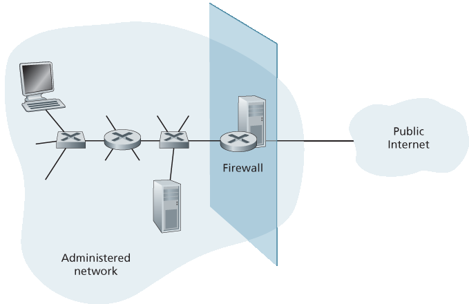
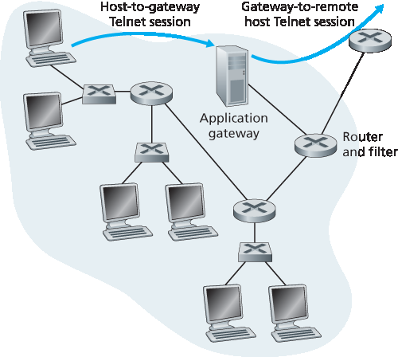
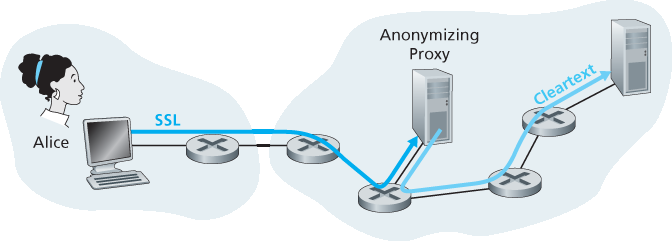
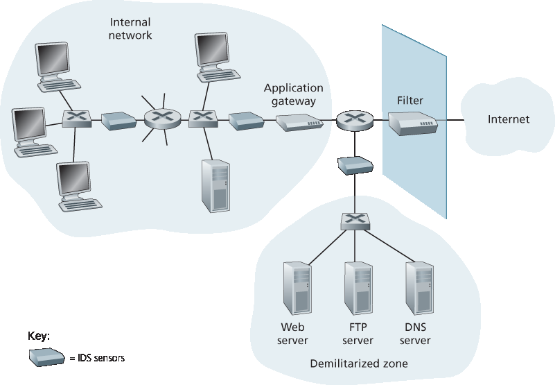

.. _c8.9:

8.9 操作安全：防火墙和入侵检测系统
==========================================================================
8.9 Operational Security: Firewalls and Intrusion Detection Systems

.. tab:: 中文

.. tab:: 英文

We’ve seen throughout this chapter that the Internet is not a very safe place—bad guys are out there, wreaking all sorts of havoc. Given the hostile nature of the Internet, let’s now consider an organization’s network and the network administrator who administers it. From a network administrator’s point of view, the world divides quite neatly into two camps—the good guys (who belong to the organization’s network, and who should be able to access resources inside the organization’s network in a relatively unconstrained manner) and the bad guys (everyone else, whose access to network resources must be carefully scrutinized). In many organizations, ranging from medieval castles to modern corporate office buildings, there is a single point of entry/exit where both good guys and bad guys entering and leaving the organization are security-checked. In a castle, this was done at a gate at one end of the drawbridge; in a corporate building, this is done at the security desk. In a computer network, when traffic entering/leaving a network is security-checked, logged, dropped, or forwarded, it is done by operational devices known as firewalls, intrusion detection systems (IDSs), and intrusion prevention systems (IPSs).

.. _c8.9.1:

8.9.1 防火墙
----------------------------------------------------------------------------------
8.9.1 Firewalls

.. tab:: 中文

.. tab:: 英文

A firewall is a combination of hardware and software that isolates an organization’s internal network from the Internet at large, allowing some packets to pass and blocking others. A firewall allows a network administrator to control access between the outside world and resources within the administered network by managing the traffic flow to and from these resources. A firewall has three goals:

- **All traffic from outside to inside, and vice versa, passes through the firewall**. :ref:`Figure 8.33 <Figure 8.33>` shows a firewall, sitting squarely at the boundary between the administered network and the rest of the Internet. While large organizations may use multiple levels of firewalls or distributed firewalls
:ref:`[Skoudis 2006] <Skoudis 2006>`, locating a firewall at a single access point to the network, as shown in :ref:`Figure 8.33 <Figure 8.33>`, makes it easier to manage and enforce a security-access policy.
- **Only authorized traffic, as defined by the local security policy, will be allowed to pass**. With all traffic entering and leaving the institutional network passing through the firewall, the firewall can restrict access to authorized traffic.
- **The firewall itself is immune to penetration**. The firewall itself is a device connected to the network. If not designed or installed properly, it can be compromised, in which case it provides only a false sense of security (which is worse than no firewall at all!).

.. _Figure 8.33:

**Figure 8.33 Firewall placement between the administered network and the outside world**

Cisco and Check Point are two of the leading firewall vendors today. You can also easily create a firewall (packet filter) from a Linux box using iptables (public-domain software that is normally shipped with Linux). Furthermore, as discussed in :ref:`Chapters 4 <c4>` and :ref:`5 <c5>`, firewalls are now frequently implemented in routers and controlled remotely using SDNs.

Firewalls can be classified in three categories: **traditional packet filters, stateful filters**, and **application gateways**. We’ll cover each of these in turn in the following subsections.

Traditional Packet Filters
~~~~~~~~~~~~~~~~~~~~~~~~~~~~~

As shown in :ref:`Figure 8.33 <Figure 8.33>`, an organization typically has a gateway router connecting its internal network to its ISP (and hence to the larger public Internet). All traffic leaving and entering the internal network passes through this router, and it is at this router where **packet filtering** occurs. A packet filter examines each datagram in isolation, determining whether the datagram should be allowed to pass or should be dropped based on administrator-specific rules. Filtering decisions are typically based on:

- IP source or destination address
- Protocol type in IP datagram field: TCP, UDP, ICMP, OSPF, and so on 
- TCP or UDP source and destination port

  .. _Table 8.5:
  
  **Table 8.5 Policies and corresponding filtering rules for an organization’s network 130.207/16 with Web server at 130.207.244.203**

  .. list-table::
     
     * - **Policy** 
       - **Firewall Setting** 
     * - No outside Web access. 
       - Drop all outgoing packets to any IP address, port 80.
     * - No incoming TCP connections, except those for organization’s public Web server only. 
       - Drop all incoming TCP SYN packets to any IP except 130.207.244.203, port 80. 
     * - Prevent Web-radios from eating up the available bandwidth. 
       - Drop all incoming UDP packets—except DNS packets. 
     * - Prevent your network from being used for a smurf DoS attack. 
       - Drop all ICMP ping packets going to a “broadcast” address (eg 130.207.255.255). 
     * - Prevent your network from being tracerouted. 
       - Drop all outgoing ICMP TTL expired traffic. 

- TCP flag bits: SYN, ACK, and so on
- ICMP message type
- Different rules for datagrams leaving and entering the network 
- Different rules for the different router interfaces

A network administrator configures the firewall based on the policy of the organization. The policy may take user productivity and bandwidth usage into account as well as the security concerns of an organization. :ref:`Table 8.5 <Table 8.5>` lists a number of possible polices an organization may have, and how they would be addressed with a packet filter. For example, if the organization doesn’t want any incoming TCP connections except those for its public Web server, it can block all incoming TCP SYN segments except TCP SYN segments with destination port 80 and the destination IP address corresponding to the Web server. If the organization doesn’t want its users to monopolize access bandwidth with Internet radio applications, it can block all not-critical UDP traffic (since Internet radio is often sent over UDP). If the organization doesn’t want its internal network to be mapped (tracerouted) by an outsider, it can block all ICMP TTL expired messages leaving the organization’s network.

A filtering policy can be based on a combination of addresses and port numbers. For example, a filtering router could forward all Telnet datagrams (those with a port number of 23) except those going to and coming from a list of specific IP addresses. This policy permits Telnet connections to and from hosts on the allowed list. Unfortunately, basing the policy on external addresses provides no protection against datagrams that have had their source addresses spoofed.

Filtering can also be based on whether or not the TCP ACK bit is set. This trick is quite useful if an organization wants to let its internal clients connect to external servers but wants to prevent external clients from connecting to internal servers.

.. _Table 8.6:

**Table 8.6 An access control list for a router interface**

.. list-table::
    
    * - **action** 
      - **source address** 
      - **dest address** 
      - **protocol** 
      - **source port** 
      - **dest port** 
      - **flag bit** 
    * - allow
      - 222.22/16
      - outside of 222.22/16
      - TCP
      - > 1023
      - 80
      - any
    * - allow
      - outside of 222.22/16
      - 222.22/16
      - TCP
      - 80
      - > 1023
      - ACK
    * - allow
      - 222.22/16
      - outside of 222.22/16
      - UDP
      - > 1023
      - 53
      - —
    * - allow
      - outside of 222.22/16
      - 222.22/16
      - UDP
      - 53
      - > 1023
      - —
    * - deny
      - all
      - all
      - all
      - all
      - all
      - all

Recall from Section 3.5 that the first segment in every TCP connection has the ACK bit set to 0, whereas all the other segments in the connection have the ACK bit set to 1. Thus, if an organization wants to prevent external clients from initiating connections to internal servers, it simply filters all incoming segments with the ACK bit set to 0. This policy kills all TCP connections originating from the outside, but permits connections originating internally.

Firewall rules are implemented in routers with access control lists, with each router interface having its own list. An example of an access control list for an organization 222.22/16 is shown in :ref:`Table 8.6 <Table 8.6>`. This access control list is for an interface that connects the router to the organization’s external ISPs. Rules are applied to each datagram that passes through the interface from top to bottom. The first two rules together allow internal users to surf the Web: The first rule allows any TCP packet with destination port 80 to leave the organization’s network; the second rule allows any TCP packet with source port 80 and the ACK bit set to enter the organization’s network. Note that if an external source attempts to establish a TCP connection with an internal host, the connection will be blocked, even if the source or destination port is 80. The second two rules together allow DNS packets to enter and leave the organization’s network. In summary, this rather restrictive access control list blocks all traffic except Web traffic initiated from within the organization and DNS traffic. :ref:`[CERT Filtering 2012] <CERT Filtering 2012>` provides a list of recommended port/protocol packet filterings to avoid a number of well-known security holes in existing network
applications.

Stateful Packet Filters
~~~~~~~~~~~~~~~~~~~~~~~~~~

In a traditional packet filter, filtering decisions are made on each packet in isolation. Stateful filters actually track TCP connections, and use this knowledge to make ­filtering decisions.

.. _Table 8.7:

**Table 8.7 Connection table for stateful filter**

.. list-table::
    
    * - **source address** 
      - **dest address** 
      - **source port** 
      - **dest port** 
    * - 222.22.1.7
      - 37.96.87.123
      - 12699
      - 80
    * - 222.22.93.2
      - 199.1.205.23
      - 37654
      - 80
    * - 222.22.65.143
      - 203.77.240.43
      - 48712
      - 80

To understand stateful filters, let’s reexamine the access control list in :ref:`Table 8.6 <Table 8.6>`. Although rather restrictive, the access control list in :ref:`Table 8.6 <Table 8.6>` nevertheless allows any packet arriving from the outside with ACK = 1 and source port 80 to get through the filter. Such packets could be used by attackers in attempts to crash internal systems with malformed packets, carry out denial-of-service attacks, or map the internal network. The naive solution is to block TCP ACK packets as well, but such an approach would prevent the organization’s internal users from surfing the Web.

Stateful filters solve this problem by tracking all ongoing TCP connections in a connection table. This is possible because the firewall can observe the beginning of a new connection by observing a three-way handshake (SYN, SYNACK, and ACK); and it can observe the end of a connection when it sees a FIN packet for the connection. The firewall can also (conservatively) assume that the connection is over when it hasn’t seen any activity over the connection for, say, 60 seconds. An example connection table for a firewall is shown in :ref:`Table 8.7 <Table 8.7>`. This connection table indicates that there are currently three ongoing TCP connections, all of which have been initiated from within the organization. Additionally, the stateful filter includes a new column, “check connection,” in its access control list, as shown in :ref:`Table 8.8 <Table 8.8>`. Note that :ref:`Table 8.8 <Table 8.8>` is identical to the access control list in Table 8.6, except now it indicates that the connection should be checked for two of the rules.

Let’s walk through some examples to see how the connection table and the extended access control list work hand-in-hand. Suppose an attacker attempts to send a malformed packet into the organization’s network by sending a datagram with TCP source port 80 and with the ACK flag set. Further suppose that this packet has source port number 12543 and source IP address 150.23.23.155. When this packet reaches the firewall, the firewall checks the access control list in :ref:`Table 8.7 <Table 8.7>`, which indicates that the connection table must also be checked before permitting this packet to enter the organization’s network. The firewall duly checks the connection table, sees that this packet is not part of an ongoing TCP connection, and rejects the packet. As a second example, suppose that an internal user wants to surf an external Web site. Because this user first sends a TCP SYN segment, the user’s TCP connection gets recorded in the connection table. When the Web server sends back packets (with the ACK bit necessarily set), the firewall checks the table and sees that a corresponding connection is in progress. The firewall will thus let these packets pass, thereby not interfering with the internal user’s Web surfing activity.

.. _Table 8.8:

**Table 8.8 Access control list for stateful filter**

.. list-table::
    
    * - **action** 
      - **source port** 
      - **dest port** 
      - **protocol** 
      - **source port** 
      - **dest port** 
      - **flag bit** 
      - **check conxion** 
    * - allow
      - 222.22/16
      - outside of 222.22/16
      - TCP
      - > 1023
      - 80
      - any
      - 
    * - allow
      - outside of 222.22/16
      - 222.22/16
      - TCP
      - 80
      - > 1023
      - ACK
      - X
    * - allow
      - 222.22/16
      - outside of 222.22/16
      - UDP
      - > 1023
      - 53
      - —
      - 
    * - allow
      - outside of 222.22/16
      - 222.22/16
      - UDP
      - 53
      - > 1023
      - —
      - X
    * - deny
      - all
      - all
      - all
      - all
      - all
      - all
      - 

Application Gateway
~~~~~~~~~~~~~~~~~~~~

In the examples above, we have seen that packet-level filtering allows an organization to perform coarse-grain filtering on the basis of the contents of IP and TCP/UDP headers, including IP addresses, port numbers, and acknowledgment bits. But what if an organization wants to provide a Telnet service to a restricted set of internal users (as opposed to IP addresses)? And what if the organization wants such privileged users to authenticate themselves first before being allowed to create Telnet sessions to the outside world? Such tasks are beyond the capabilities of traditional and stateful filters. Indeed, information about the identity of the internal users is application-layer data and is not included in the IP/TCP/UDP headers.

To have finer-level security, firewalls must combine packet filters with application gateways. Application gateways look beyond the IP/TCP/UDP headers and make policy decisions based on application data. An **application gateway** is an application-specific server through which all application data (inbound and outbound) must pass. Multiple application gateways can run on the same host, but each gateway is a separate server with its own processes.

.. _Figure 8.34:

**Figure 8.34 Firewall consisting of an application gateway and a filter**

To get some insight into application gateways, let’s design a firewall that allows only a restricted set of internal users to Telnet outside and prevents all external clients from Telneting inside. Such a policy can be accomplished by implementing a combination of a packet filter (in a router) and a Telnet application gateway, as shown in :ref:`Figure 8.34 <Figure 8.34>`. The router’s filter is configured to block all Telnet connections except those that originate from the IP
address of the application gateway. Such a filter configuration forces all outbound Telnet connections to pass through the application gateway. Consider now an internal user who wants to Telnet to the outside world. The user must first set up a Telnet session with the application gateway. An application running in the gateway, which listens for incoming Telnet sessions, prompts the user for a user ID and password. When the user supplies this information, the application gateway checks to see if the user has permission to Telnet to the outside world. If not, the Telnet connection from the internal user to the gateway is terminated by the gateway. If the user has permission, then the gateway (1) prompts the user for the host name of the external host to which the user wants to connect, (2) sets up a Telnet session between the gateway and the external host, and (3) relays to the external host all data arriving from the user, and relays to the user all data arriving from the external host. Thus, the Telnet application gateway not only performs user authorization but also acts as a Telnet server and a Telnet client, relaying information between the user and the remote Telnet server. Note that the filter will permit step 2 because the gateway initiates the Telnet connection to the outside world.

.. admonition:: CASE HISTORY

    **ANONYMITY AND PRIVACY**

    Suppose you want to visit a controversial Web site (for example, a political activist site) and you (1) don’t want to reveal your IP address to the Web site, (2) don’t want your local ISP (which may be your home or office ISP) to know that you are visiting the site, and (3) don’t want your local ISP to see the data you are exchanging with the site. If you use the traditional approach of connecting directly to the Web site without any encryption, you fail on all three counts. Even if you use SSL, you fail on the first two counts: Your source IP address is presented to the Web site in every datagram you send; and the destination address of every packet you send can easily be sniffed by your local ISP.

    To obtain privacy and anonymity, you can instead use a combination of a trusted proxy server and SSL, as shown in :ref:`Figure 8.35 <Figure 8.35>`. With this approach, you first make an SSL connection to the trusted proxy. You then send, into this SSL connection, an HTTP request for a page at the desired site. When the proxy receives the SSL-encrypted HTTP request, it decrypts the request and forwards the cleartext HTTP request to the Web site. The Web site then responds to the proxy, which in turn forwards the response to you over SSL. Because the Web site only sees the IP address of the proxy, and not of your client’s address, you are indeed obtaining anonymous access to the Web site. And because all traffic between you and the proxy is encrypted, your local ISP cannot invade your privacy by logging the site you visited or recording the data you are exchanging. Many companies today (such as proxify .com) make available such proxy services.

    Of course, in this solution, your proxy knows everything: It knows your IP address and the IP address of the site you’re surfing; and it can see all the traffic in ­cleartext exchanged between you and the Web site. Such a solution, therefore, is only as good as the trustworthiness of the proxy. A more robust approach, taken by the TOR anonymizing and privacy service, is to route your traffic through a series of non-­colluding proxy servers :ref:`[TOR 2016] <TOR 2016>`. In particular, TOR allows independent ­individuals to contribute proxies to its proxy pool. When a user connects to a server using TOR, TOR randomly chooses (from its proxy pool) a chain of three proxies and routes all traffic between client and server over the chain. In this manner, assuming the proxies do not collude, no one knows that communication took place between your IP address and the target Web site. Furthermore, although cleartext is sent between the last proxy and the server, the last proxy doesn’t know what IP address is sending and receiving the cleartext.

.. _Figure 8.35:

**Figure 8.35 Providing anonymity and privacy with a proxy**

Internal networks often have multiple application gateways, for example, gateways for Telnet, HTTP, FTP, and e-mail. In fact, an organization’s mail server (see :ref:`Section 2.3 <c2.3>`) and Web cache are application gateways.

Application gateways do not come without their disadvantages. First, a different application gateway is needed for each application. Second, there is a performance penalty to be paid, since all data will be relayed via the gateway. This becomes a concern particularly when multiple users or applications are using the same gateway machine. Finally, the client software must know how to contact the gateway when the user makes a request, and must know how to tell the application gateway what external server to connect to.

.. _c8.9.2:

8.9.2 入侵检测系统
----------------------------------------------------------------------------------
8.9.2 Intrusion Detection Systems

.. tab:: 中文

.. tab:: 英文

We’ve just seen that a packet filter (traditional and stateful) inspects IP, TCP, UDP, and ICMP header fields when deciding which packets to let pass through the firewall. However, to detect many attack types, we need to perform **deep packet inspection**, that is, look beyond the header fields and into the
actual application data that the packets carry. As we saw in :ref:`Section 8.9.1 <c8.9.1>`, application gateways often do deep packet inspection. But an application gateway only does this for a specific application.

Clearly, there is a niche for yet another device—a device that not only examines the headers of all packets passing through it (like a packet filter), but also performs deep packet inspection (unlike a packet filter). When such a device observes a suspicious packet, or a suspicious series of packets, it could prevent those packets from entering the organizational network. Or, because the activity is only
 
deemed as suspicious, the device could let the packets pass, but send alerts to a network administrator, who can then take a closer look at the traffic and take appropriate actions. A device that generates alerts when it observes potentially malicious traffic is called an **intrusion detection system (IDS)**. A device that filters out suspicious traffic is called an **intrusion prevention system (IPS)**. In this section we study both systems—IDS and IPS—together, since the most interesting technical aspect of these systems is how they detect suspicious traffic (and not whether they send alerts or drop packets). We will henceforth collectively refer to IDS systems and IPS systems as IDS systems.

An IDS can be used to detect a wide range of attacks, including network mapping (emanating, for example, from nmap), port scans, TCP stack scans, DoS bandwidth-flooding attacks, worms and viruses, OS vulnerability attacks, and application vulnerability attacks. (See :ref:`Section 1.6 <c1.6>` for a survey of network attacks.) Today, thousands of organizations employ IDS systems. Many of these deployed systems are proprietary, marketed by Cisco, Check Point, and other security equipment vendors. But many of the deployed IDS systems are public-domain systems, such as the immensely popular Snort IDS system (which we’ll discuss shortly).

.. _Figure 8.36:

**Figure 8.36 An organization deploying a filter, an application gateway, and IDS sensors**

An organization may deploy one or more IDS sensors in its organizational network. :ref:`Figure 8.36 <Figure 8.36>` shows an organization that has three IDS sensors. When multiple sensors are deployed, they typically work in concert, sending information about suspicious traffic activity to a central IDS processor, which collects and integrates the information and sends alarms to network administrators when deemed appropriate. In :ref:`Figure 8.36 <Figure 8.36>`, the organization has partitioned its network into two regions: a high-security region, protected by a packet filter and an application gateway and monitored by IDS sensors; and a lower-security region—referred to as the **demilitarized zone (DMZ)**—which is protected only by the packet filter, but also monitored by IDS sensors. Note that the DMZ includes the organization’s servers that need to communicate with the outside world, such as its public Web server and its authoritative DNS server.

You may be wondering at this stage, why multiple IDS sensors? Why not just place one IDS sensor just
behind the packet filter (or even integrated with the packet filter) in :ref:`Figure 8.36 <Figure 8.36>`? We will soon see that an IDS not only needs to do deep packet inspection, but must also compare each passing packet with tens of thousands of “signatures”; this can be a significant amount of processing, particularly if the organization receives gigabits/sec of traffic from the Internet. By placing the IDS sensors further downstream, each sensor sees only a fraction of the organization’s traffic, and can more easily keep up. Nevertheless, high-performance IDS and IPS systems are available today, and many organizations can actually get by with just one sensor located near its access router.

IDS systems are broadly classified as either **signature-based systems** or **­anomaly-based systems**. A signature-based IDS maintains an extensive database of attack signatures. Each signature is a set of rules pertaining to an intrusion activity. A signature may simply be a list of characteristics about a single packet (e.g., source and destination port numbers, protocol type, and a specific string of bits in the packet payload), or may relate to a series of packets. The signatures are normally created by skilled network security engineers who research known attacks. An organization’s network administrator can customize the signatures or add its own to the database.

Operationally, a signature-based IDS sniffs every packet passing by it, comparing each sniffed packet with the signatures in its database. If a packet (or series of packets) matches a signature in the database, the IDS generates an alert. The alert could be sent to the network administrator in an e-mail message, could be sent to the network management system, or could simply be logged for future inspection.

Signature-based IDS systems, although widely deployed, have a number of limitations. Most importantly, they require previous knowledge of the attack to generate an accurate signature. In other words, a signature-based IDS is completely blind to new attacks that have yet to be recorded. Another disadvantage is that even if a signature is matched, it may not be the result of an attack, so that a false alarm is generated. Finally, because every packet must be compared with an extensive collection of signatures, the IDS can become overwhelmed with processing and actually fail to detect many malicious packets.

An anomaly-based IDS creates a traffic profile as it observes traffic in normal operation. It then looks for packet streams that are statistically unusual, for example, an inordinate percentage of ICMP packets or a sudden exponential growth in port scans and ping sweeps. The great thing about anomaly-based IDS systems is that they don’t rely on previous knowledge about existing attacks—that is, they can potentially detect new, undocumented attacks. On the other hand, it is an extremely challenging problem to distinguish between normal traffic and statistically unusual traffic. To date, most IDS deployments are primarily signature-based, although some include some anomaly-based features.

Snort
~~~~~~~~

Snort is a public-domain, open source IDS with hundreds of thousands of existing deployments [:ref:`Snort 2012 <Snort 2012>`; :ref:`Koziol 2003 <Koziol 2003>`]. It can run on Linux, UNIX, and Windows platforms. It uses the generic sniffing interface libpcap, which is also used by Wireshark and many other packet sniffers. It can easily handle 100 Mbps of traffic; for installations with gibabit/sec traffic rates, multiple Snort sensors may be needed.

To gain some insight into Snort, let’s take a look at an example of a Snort signature:

.. code:: text 

    alert icmp $EXTERNAL_NET any -> $HOME_NET any
    (msg:”ICMP PING NMAP”; dsize: 0; itype: 8;)

This signature is matched by any ICMP packet that enters the organization’s network (``$HOME_NET``) from the outside (``$EXTERNAL_NET``), is of type 8 (ICMP ping), and has an empty payload (dsize = 0). Since nmap (see :ref:`Section 1.6 <c1.6>`) generates ping packets with these specific characteristics, this signature is designed to detect nmap ping sweeps. When a packet matches this signature, Snort generates an alert that includes the message “ICMP PING NMAP”.

Perhaps what is most impressive about Snort is the vast community of users and security experts that maintain its signature database. Typically within a few hours of a new attack, the Snort community writes and releases an attack signature, which is then downloaded by the hundreds of thousands of Snort deployments distributed around the world. Moreover, using the Snort signature syntax, network administrators can tailor the signatures to their own organization’s needs by either modifying existing signatures or creating entirely new ones.
