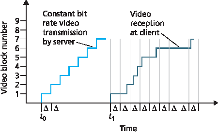
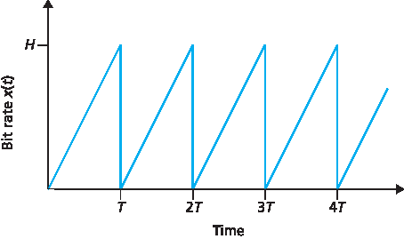
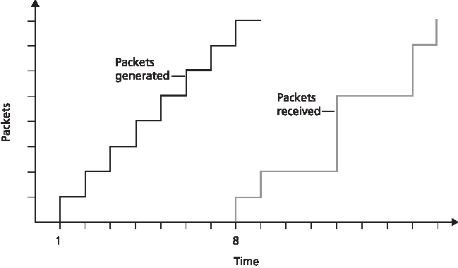

家庭作业问题和疑问
========================================

Homework Problems and Questions

.. tab:: 中文

.. tab:: 英文

SECTION 9.1
    R1. Reconstruct :ref:`Table 9.1 <Table 9.1>` for when Victor Video is watching a 4 Mbps video, Facebook Frank is looking at a new 100 Kbyte image every 20 seconds, and Martha Music is listening to 200 kbps audio stream.

    R2. There are two types of redundancy in video. Describe them, and discuss how they can be exploited for efficient compression.

    R3. Suppose an analog audio signal is sampled 16,000 times per second, and each sample is quantized into one of 1024 levels. What would be the resulting bit rate of the PCM digital audio signal?

    R4. Multimedia applications can be classified into three categories. Name and describe each category.

SECTION 9.2
    R5. Streaming video systems can be classified into three categories. Name and briefly describe each of these categories.

    R6. List three disadvantages of UDP streaming.

    R7. With HTTP streaming, are the TCP receive buffer and the client’s application buffer the same thing? If not, how do they interact?

    R8. Consider the simple model for HTTP streaming. Suppose the server sends bits at a constant rate of 2 Mbps and playback begins when 8 million bits have been received. What is the initial buffering delay tp? 

SECTION 9.3
    R9. What is the difference between end-to-end delay and packet jitter? What are the causes of packet jitter?

    R10. Why is a packet that is received after its scheduled playout time considered lost?

    R11. :ref:`Section 9.3 <c9.3>` describes two FEC schemes. Briefly summarize them. Both schemes increase the transmission rate of the stream by adding overhead. Does interleaving also increase the transmission rate?

SECTION 9.4
    R12. How are different RTP streams in different sessions identified by a receiver? How are different streams from within the same session identified?

    R13. What is the role of a SIP registrar? How is the role of an SIP registrar different from that of a home agent in Mobile IP?

Problems
~~~~~~~~~~~~~

P1. Consider the figure below. Similar to our discussion of :ref:`Figure 9.1 <Figure 9.1>` , suppose that video is encoded at a fixed bit rate, and thus each video block contains video frames that are to be played out over the same fixed amount of time, Δ. The server transmits the first video block at t0, the second block at t0+Δ, the third block at t0+2Δ, and so on. Once the client begins playout, each block should be played out Δ time units after the previous block.

a. Suppose that the client begins playout as soon as the first block arrives at t1. In the figure below, how many blocks of video (including the first block) will have arrived at the client in time for their playout? Explain how you arrived at your answer.
b. Suppose that the client begins playout now at t1+Δ. How many blocks of video (including the first block) will have arrived at the client in time for their playout? Explain how you arrived at your answer.
c. In the same scenario at (b) above, what is the largest number of blocks that is ever stored in the client buffer, awaiting playout? Explain how you arrived at your answer.
d. What is the smallest playout delay at the client, such that every video block has arrived in time for its playout? Explain how you arrived at your answer.

P2. Recall the simple model for HTTP streaming shown in :ref:`Figure 9.3 <Figure 9.3>` . Recall that B denotes the size of the client’s application buffer, and Q denotes the number of bits that must be buffered before the client application begins playout. Also r denotes the video consumption rate. Assume that the server sends bits at a constant rate x whenever the client buffer is not full.

a. Suppose that x<r. As discussed in the text, in this case playout will alternate between periods of continuous playout and periods of freezing. Determine the length of each continuous playout and freezing period as a function of Q, r, and x.
b. Now suppose that x>r. At what time t=tf does the client application buffer become full?

P3. Recall the simple model for HTTP streaming shown in :ref:`Figure 9.3 <Figure 9.3>` . Suppose the buffer size is infinite but the server sends bits at variable rate x(t). Specifically, suppose x(t) has the following saw-tooth shape. The rate is initially zero at time t=0 and linearly climbs to H at time t=T. It then repeats this pattern again and again, as shown in the figure below.

a. What is the server’s average send rate?
b. Suppose that Q=0, so that the client starts playback as soon as it receives a video frame. What will happen?
c. Now suppose Q>0 and HT/2≥Q. Determine as a function of Q, H, and T the time at which playback first begins.
d. Suppose H>2r and Q=HT/2. Prove there will be no freezing after the initial playout delay.
e. Suppose H>2r. Find the smallest value of Q such that there will be no freezing after the initial playback delay.
f. Now suppose that the buffer size B is finite. Suppose H>2r. As a function of Q, B, T, and H, determine the time t=tf when the client application buffer first becomes full.

P4. Recall the simple model for HTTP streaming shown in :ref:`Figure 9.3 <Figure 9.3>` . Suppose the client application buffer is infinite, the server sends at the constant rate x, and the video consumption r<x. rate is r with Also suppose playback begins immediately. Suppose that the user terminates the video early at time t=E. At the time of termination, the server stops sending bits (if it hasn’t already sent all the bits in the video).

a. Suppose the video is infinitely long. How many bits are wasted (that is, sent but not viewed)?
b. Suppose the video is T seconds long with T>E. How many bits are wasted (that is, sent but not viewed)?

P5. Consider a DASH system (as discussed in :ref:`Section 2.6 <c2.6>` ) for which there are N video versions (at N different rates and qualities) and N audio versions (at N different rates and qualities). Suppose we want to allow the player to choose at any time any of the N video versions and any of the N audio versions.
a. If we create files so that the audio is mixed in with the video, so server sends only one media stream at given time, how many files will the server need to store (each a different URL)?
b. If the server instead sends the audio and video streams separately and has the client synchronize the streams, how many files will the server need to store?

P6. In the VoIP example in :ref:`Section 9.3 <c9.3>` , let h be the total number of header bytes added to each chunk, including UDP and IP header.

a. Assuming an IP datagram is emitted every 20 msecs, find the transmission rate in bits per second for the datagrams generated by one side of this application.
b. What is a typical value of h when RTP is used?

P7. Consider the procedure described in :ref:`Section 9.3 <c9.3>` for estimating average delay di. Suppose that u=0.1. Let r1−t1 be the most recent sample delay, let r2−t2 be the next most recent sample delay, and so on.

a. For a given audio application suppose four packets have arrived at the receiver with
sample delays r4−t4, r3−t3, r2−t2, and r1−t1. Express the estimate of delay d in terms of the four samples.
b. Generalize your formula for n sample delays.
c. For the formula in part (b), let n approach infinity and give the resulting formula.

   Comment on why this averaging procedure is called an exponential moving average.

P8. Repeat parts (a) and (b) in Question P7 for the estimate of average delay deviation.

P9. For the VoIP example in :ref:`Section 9.3 <c9.3>` , we introduced an online procedure (exponential moving average) for estimating delay. In this problem we will examine an alternative procedure.

Let ti be the timestamp of the ith packet received; let ri be the time at which the ith packet is
received. Let dn be our estimate of average delay after receiving the nth packet. After the first packet is received, we set the delay estimate equal to d1=r1−t1.
 
a. Suppose that we would like dn=(r1−t1+r2−t2+⋯+rn−tn)/n for all n. Give a recursive formula for dn in terms of dn−1, rn, and tn.
b. Describe why for Internet telephony, the delay estimate described in :ref:`Section 9.3 <c9.3>` is more appropriate than the delay estimate outlined in part (a).

P10. Compare the procedure described in :ref:`Section 9.3 <c9.3>` for estimating average delay with the procedure in :ref:`Section 3.5 <c3.5>` for estimating round-trip time. What do the procedures have in common? How are they different?

P11. Consider the figure below (which is similar to :ref:`Figure 9.3 <Figure 9.3>` ). A sender begins sending packetized audio periodically at t=1. The first packet arrives at the receiver at t=8.

a. What are the delays (from sender to receiver, ignoring any playout delays) of packets 2 through 8? Note that each vertical and horizontal line segment in the figure has a length of 1, 2, or 3 time units.
b. If audio playout begins as soon as the first packet arrives at the receiver at t=8, which of the first eight packets sent will not arrive in time for playout?
c. If audio playout begins at t=9, which of the first eight packets sent will not arrive in time for playout?
d. What is the minimum playout delay at the receiver that results in all of the first eight packets arriving in time for their playout?

P12. Consider again the figure in P11, showing packet audio transmission and reception times. 

a. Compute the estimated delay for packets 2 through 8, using the formula for di from :ref:`Section 9.3.2 <c9.3.2>` . Use a value of u=0.1.
b. Compute the estimated deviation of the delay from the estimated average for packets 2 through 8, using the formula for vi from :ref:`Section 9.3.2 <c9.3.2>` . Use a value of u=0.1.

P13. Recall the two FEC schemes for VoIP described in :ref:`Section 9.3 <c9.3>` . Suppose the first scheme generates a redundant chunk for every four original chunks. Suppose the second scheme uses a low-bit rate encoding whose transmission rate is 25 percent of the transmission rate of the nominal stream.

a. How much additional bandwidth does each scheme require? How much playback delay does each scheme add?
b. How do the two schemes perform if the first packet is lost in every group of five packets? Which scheme will have better audio quality?
c. How do the two schemes perform if the first packet is lost in every group of two packets? Which scheme will have better audio quality?

P14.

a. Consider an audio conference call in Skype with N>2 participants. Suppose each participant generates a constant stream of rate r bps. How many bits per second will the call initiator need to send? How many bits per second will each of the other N−1 participants need to send? What is the total send rate, aggregated over all participants?
b. Repeat part (a) for a Skype video conference call using a central server.
c. Repeat part (b), but now for when each peer sends a copy of its video stream to each of the N−1 other peers.

P15.

a. Suppose we send into the Internet two IP datagrams, each carrying a different UDP segment. The first datagram has source IP address A1, destination IP address B, source port P1, and destination port T. The second datagram has source IP address A2, destination IP address B, source port P2, and destination port T. Suppose that A1 is different from A2 and that P1 is different from P2. Assuming that both datagrams reach their final destination, will the two UDP datagrams be received by the same socket? Why or why not?
b. Suppose Alice, Bob, and Claire want to have an audio conference call using SIP and RTP. For Alice to send and receive RTP packets to and from Bob and Claire, is only one UDP socket sufficient (in addition to the socket needed for the SIP messages)? If yes, then how does Alice’s SIP client distinguish between the RTP packets received from Bob and Claire?

P16. True or false:

a. If stored video is streamed directly from a Web server to a media player, then the application is using TCP as the underlying transport protocol.
b. When using RTP, it is possible for a sender to change encoding in the middle of a session.
c. All applications that use RTP must use port 87.
d. If an RTP session has a separate audio and video stream for each sender, then the audio and video streams use the same SSRC.
e. In differentiated services, while per-hop behavior defines differences in performance among classes, it does not mandate any particular mechanism for achieving these performances.

   .. figure:: ../img/809-0.png 
      :align: center

f. Suppose Alice wants to establish an SIP session with Bob. In her INVITE message she includes the line: m=audio 48753 RTP/AVP 3 (AVP 3 denotes GSM audio). Alice has therefore indicated in this message that she wishes to send GSM audio.
g. Referring to the preceding statement, Alice has indicated in her INVITE message that she will send audio to port 48753.
h. SIP messages are typically sent between SIP entities using a default SIP port number.
i. In order to maintain registration, SIP clients must periodically send REGISTER messages.
j. SIP mandates that all SIP clients support G.711 audio encoding.

P17. Consider the figure below, which shows a leaky bucket policer being fed by a stream of packets. The token buffer can hold at most two tokens, and is initially full at t=0. New tokens arrive at a rate of one token per slot. The output link speed is such that if two packets obtain tokens at the beginning of a time slot, they can both go to the output link in the same slot. The timing details of the system are as follows:

A. Packets (if any) arrive at the beginning of the slot. Thus in the figure, packets 1, 2, and 3 arrive in slot 0. If there are already packets in the queue, then the arriving packets join the end of the queue. Packets proceed towards the front of the queue in a FIFO manner.
B. After the arrivals have been added to the queue, if there are any queued packets, one or two of those packets (depending on the number of available tokens) will each remove a token from the token buffer and go to the output link during that slot. Thus, packets 1 and 2 each remove a token from the buffer (since there are initially two tokens) and go to the output link during slot 0.
C. A new token is added to the token buffer if it is not full, since the token generation rate is r = 1 token/slot.
D. Time then advances to the next time slot, and these steps repeat.

Answer the following questions:

a. For each time slot, identify the packets that are in the queue and the number of tokens in the bucket, immediately after the arrivals have been processed (step 1 above) but before any of the packets have passed through the queue and removed a token. Thus, for the t=0 time slot in the example above, packets 1, 2, and 3 are in the queue, and there are two tokens in the buffer.
b. For each time slot indicate which packets appear on the output after the token(s) have been removed from the queue. Thus, for the t=0 time slot in the example above, packets 1 and 2 appear on the output link from the leaky buffer during slot 0.

P18. Repeat P17 but assume that r=2. Assume again that the bucket is initially full.

P19. Consider P18 and suppose now that r=3 and that b=2 as before. Will your answer to the question above change?

P20. Consider the leaky bucket policer that polices the average rate and burst size of a packet flow. We now want to police the peak rate, p, as well. Show how the output of this leaky bucket policer can be fed into a second leaky bucket policer so that the two leaky buckets in series police the average rate, peak rate, and burst size. Be sure to give the bucket size and token generation rate for the second policer.

P21. A packet flow is said to conform to a leaky bucket specification (r, b) with burst size b and average rate r if the number of packets that arrive to the leaky bucket is less than rt+b packets in every interval of time of length t for all t. Will a packet flow that conforms to a leaky bucket specification (r, b) ever have to wait at a leaky bucket policer with parameters r and b? Justify your answer.

P22. Show that as long as r1<Rw1/(∑ wj), then dmax is indeed the maximum delay that any packet in flow 1 will ever experience in the WFQ queue.

Programming Assignment
--------------------------

In this lab, you will implement a streaming video server and client. The client will use the real-time streaming protocol (RTSP) to control the actions of the server. The server will use the real-time protocol (RTP) to packetize the video for transport over UDP. You will be given Python code that partially implements RTSP and RTP at the client and server. Your job will be to complete both the client and server code. When you are finished, you will have created a client-server application that does the following:

- The client sends SETUP, PLAY, PAUSE, and TEARDOWN RTSP commands, and the server responds to the commands.
- When the server is in the playing state, it periodically grabs a stored JPEG frame, packetizes the frame with RTP, and sends the RTP packet into a UDP socket.
- The client receives the RTP packets, removes the JPEG frames, decompresses the frames, and renders the frames on the client’s monitor.

The code you will be given implements the RTSP protocol in the server and the RTP depacketization in the client. The code also takes care of displaying the transmitted video. You will need to implement RTSP in the client and RTP server. This programming assignment will significantly enhance the student’s understanding of RTP, RTSP, and streaming video. It is highly recommended. The assignment also suggests a number of optional exercises, including implementing the RTSP DESCRIBE command at both client and server. You can find full details of the assignment, as well as an overview of the RTSP protocol, at the Web site www.pearsonhighered.com/cs-resources.