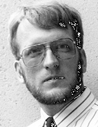

采访: Henning Schulzrinne
===================================

Interview: Henning Schulzrinne

.. tab:: 中文

.. tab:: 英文

Henning Schulzrinne is a professor, chair of the Department of Computer Science, and head of the Internet Real-Time Laboratory at Columbia University. He is the co-author of RTP, RTSP, SIP, and GIST—key protocols for audio and video communications over the Internet. Henning received his BS in electrical and industrial engineering at TU Darmstadt in Germany, his MS in electrical and computer engineering at the University of Cincinnati, and his PhD in electrical engineering at the University of Massachusetts, Amherst.

What made you decide to specialize in multimedia networking?
-------------------------------------------------------------

This happened almost by accident. As a PhD student, I got involved with DARTnet, an experimental network spanning the United States with T1 lines. DARTnet was used as a proving ground for multicast and Internet real-time tools. That led me to write my first audio tool, NeVoT. Through some of the DARTnet participants, I became involved in the IETF, in the then-nascent Audio Video Transport working group. This group later ended up standardizing RTP.

What was your first job in the computer industry? What did it entail?
------------------------------------------------------------------------

My first job in the computer industry was soldering together an Altair computer kit when I was a high school student in Livermore, California. Back in Germany, I started a little consulting company that devised an address management program for a travel agency—storing data on cassette tapes for our TRS-80 and using an IBM Selectric typewriter with a home-brew hardware interface as a printer.

My first real job was with AT&T Bell Laboratories, developing a network emulator for constructing experimental networks in a lab environment.

What are the goals of the Internet Real-Time Lab?
-------------------------------------------------------

Our goal is to provide components and building blocks for the Internet as the single future communications infrastructure. This includes developing new protocols, such as GIST (for network-layer signaling) and LoST (for finding resources by location), or enhancing protocols that we have worked on earlier, such as SIP, through work on rich presence, peer-to-peer systems, next-generation emergency calling, and service creation tools. Recently, we have also looked extensively at wireless systems for VoIP, as 802.11b and 802.11n networks and maybe WiMax networks are likely to become important last-mile technologies for telephony. We are also trying to greatly improve the ability of users to diagnose faults in the complicated tangle of providers and equipment, using a peer-to-peer fault diagnosis system called DYSWIS (Do You See What I See).

We try to do practically relevant work, by building prototypes and open source systems, by measuring performance of real systems, and by contributing to IETF standards.

What is your vision for the future of multimedia networking?
-------------------------------------------------------------

We are now in a transition phase; just a few years shy of when IP will be the universal platform for multimedia services, from IPTV to VoIP. We expect radio, telephone, and TV to be available even during snowstorms and earthquakes, so when the Internet takes over the role of these dedicated networks, users will expect the same level of reliability.

We will have to learn to design network technologies for an ecosystem of competing carriers, service and content providers, serving lots of technically untrained users and defending them against a small, but destructive, set of malicious and criminal users. Changing protocols is becoming increasingly hard. They are also becoming more complex, as they need to take into account competing business interests, security, privacy, and the lack of transparency of networks caused by firewalls and network address translators.

Since multimedia networking is becoming the foundation for almost all of consumer entertainment, there will be an emphasis on managing very large networks, at low cost. Users will expect ease of use, such as finding the same content on all of their devices.

Why does SIP have a promising future?
------------------------------------------

As the current wireless network upgrade to 3G networks proceeds, there is the hope of a single multimedia signaling mechanism spanning all types of networks, from cable modems, to corporate telephone networks and public wireless networks. Together with software radios, this will make it possible in the future that a single device can be used on a home network, as a cordless BlueTooth phone, in a corporate network via 802.11 and in the wide area via 3G networks. Even before we have such a single universal wireless device, the personal mobility mechanisms make it possible to hide the differences between networks. One identifier becomes the universal means of reaching a person, rather than remembering or passing around half a dozen technology- or location-specific telephone numbers.

SIP also breaks apart the provision of voice (bit) transport from voice services. It now becomes technically possible to break apart the local telephone monopoly, where one company provides neutral bit transport, while others provide IP “dial tone” and the classical telephone services, such as gateways, call forwarding, and caller ID.

Beyond multimedia signaling, SIP offers a new service that has been missing in the Internet: event notification. We have approximated such services with HTTP kludges and e-mail, but this was never very satisfactory. Since events are a common abstraction for distributed systems, this may simplify the construction of new services.

Do you have any advice for students entering the networking field?
------------------------------------------------------------------------

Networking bridges disciplines. It draws from electrical engineering, all aspects of computer science, operations research, statistics, economics, and other disciplines. Thus, networking researchers have to be familiar with subjects well beyond protocols and routing algorithms. Given that networks are becoming such an important part of everyday life, students wanting to make a difference in the field should think of the new resource constraints in networks: human time and effort, rather than just bandwidth or storage.

Work in networking research can be immensely satisfying since it is about allowing people to communicate and exchange ideas, one of the essentials of being human. The Internet has become the third major global infrastructure, next to the transportation system and energy distribution. Almost no part of the economy can work without high-performance networks, so there should be plenty of opportunities for the foreseeable future.