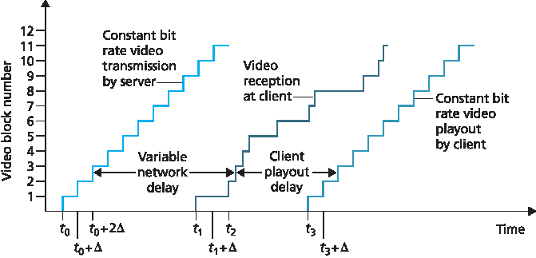
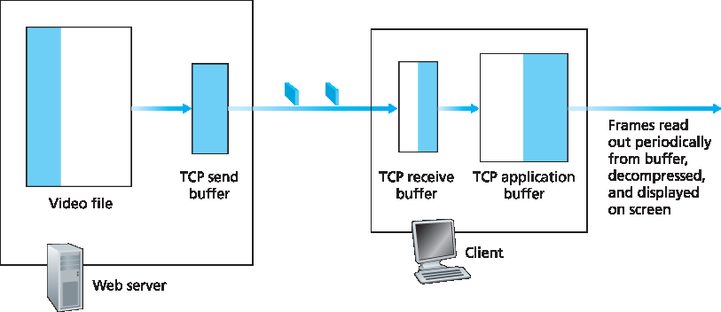
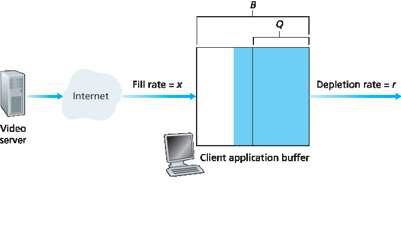

.. _c9.2:

9.2 流式传输存储的视频
=============================================================
9.2 Streaming Stored Video

.. tab:: 中文

.. tab:: 英文

For streaming video applications, prerecorded videos are placed on servers, and users send requests to these servers to view the videos on demand. The user may watch the video from beginning to end without interruption, may stop watching the video well before it ends, or interact with the video by pausing or repositioning to a future or past scene. Streaming video systems can be classified into three categories: **UDP streaming**, **HTTP streaming**, and **adaptive HTTP streaming** (see :ref:`Section 2.6 <c2.6>`). Although all three types of systems are used in practice, the majority of today’s systems employ HTTP streaming and adaptive HTTP streaming.

A common characteristic of all three forms of video streaming is the extensive use of client-side application buffering to mitigate the effects of varying end-to-end delays and varying amounts of available bandwidth between server and client. For streaming video (both stored and live), users generally can tolerate a small several-second initial delay between when the client requests a video and when video playout begins at the client. Consequently, when the video starts to arrive at the client, the client need not immediately begin playout, but can instead build up a reserve of video in an application buffer. Once the client has built up a reserve of several seconds of buffered-but-not-yet-played video, the client can then begin video playout. There are two important advantages provided by such **client buffering**. First, client-side buffering can absorb variations in server-to-client delay. If a particular piece of video data is delayed, as long as it arrives before the reserve of received-but-not-yet-played video is exhausted, this long delay will not be noticed. Second, if the server-to-client bandwidth briefly drops below the video consumption rate, a user can continue to enjoy continuous playback, again as long as the client application buffer does not become completely drained.

:ref:`Figure 9.1 <Figure 9.1>` illustrates client-side buffering. In this simple example, suppose that video is encoded at a fixed bit rate, and thus each video block contains video frames that are to be played out over the same fixed amount of time, Δ. The server transmits the first video block at t0, the second block at t0+Δ, the third block at t0+2Δ, and so on. Once the client begins playout, each block should be played out Δ time units after the previous block in order to reproduce the timing of the original recorded video. Because of the variable end-to-end network delays, different video blocks experience different delays. The first video block arrives at the client at t1 and the second block arrives at t2. The network delay for the ith block is the horizontal distance between the time the block was transmitted by the server and the time it is received at the client; note that the network delay varies from one video block to another. In this example, if the client were to begin playout as soon as the first block arrived at t1, then the second block would not have arrived in time to be played out at out at t1+Δ. In this case, video playout would either have to stall (waiting for block 2 to arrive) or block 2 could be skipped—both resulting in undesirable playout impairments. Instead, if the client were to delay the start of playout until t3, when blocks 1 through 6 have all arrived, periodic playout can proceed with all blocks having been received before their playout time.

.. _Figure 9.1:

**Figure 9.1 Client playout delay in video streaming**

.. _c9.2.1:

9.2.1 UDP 流
------------------------------------------------------------
9.2.1 UDP Streaming

.. tab:: 中文

.. tab:: 英文

We only briefly discuss UDP streaming here, referring the reader to more in-depth discussions of the protocols behind these systems where appropriate. With UDP streaming, the server transmits video at a rate that matches the client’s video consumption rate by clocking out the video chunks over UDP at a steady rate. For example, if the video consumption rate is 2 Mbps and each UDP packet carries 8,000 bits of video, then the server would transmit one UDP packet into its socket every
(8000 bits)/(2 Mbps)=4 msec. As we learned in :ref:`Chapter 3 <c3>`, because UDP does not employ a congestion-control mechanism, the server can push packets into the network at the consumption rate of the video without the rate-control restrictions of TCP. UDP streaming typically uses a small client-side buffer, big enough to hold less than a second of video.

Before passing the video chunks to UDP, the server will encapsulate the video chunks within transport packets specially designed for transporting audio and video, using the Real-Time Transport Protocol (RTP) [:rfc:`3550`] or a similar (possibly proprietary) scheme. We delay our coverage of RTP until :ref:`Section 9.3 <c9.3>`, where we discuss RTP in the context of conversational voice and video systems.

Another distinguishing property of UDP streaming is that in addition to the server-to-client video stream, the client and server also maintain, in parallel, a separate control connection over which the client sends commands regarding session state changes (such as pause, resume, reposition, and so on). The Real-Time Streaming Protocol (RTSP) [:rfc:`2326`], explained in some detail in the Web site for this textbook, is a popular open protocol for such a control connection.

Although UDP streaming has been employed in many open-source systems and proprietary products, it suffers from three significant drawbacks. First, due to the unpredictable and varying amount of available bandwidth between server and client, constant-rate UDP streaming can fail to provide continuous playout. For example, consider the scenario where the video consumption rate is 1 Mbps and the server-to-client available bandwidth is usually more than 1 Mbps, but every few minutes the available bandwidth drops below 1 Mbps for several seconds. In such a scenario, a UDP streaming system that transmits video at a constant rate of 1 Mbps over RTP/UDP would likely provide a poor user experience, with freezing or skipped frames soon after the available bandwidth falls below 1 Mbps. The second drawback of UDP streaming is that it requires a media control server, such as an RTSP server, to process client-to-server interactivity requests and to track client state (e.g., the client’s playout point in the video, whether the video is being paused or played, and so on) for each ongoing client session. This increases the overall cost and complexity of deploying a large-scale video-on-demand system. The third drawback is that many firewalls are configured to block UDP traffic, preventing the users behind these firewalls from receiving UDP video.

.. _c9.2.2:

9.2.2 HTTP 流
------------------------------------------------------------
9.2.2 HTTP Streaming

.. tab:: 中文

.. tab:: 英文

In HTTP streaming, the video is simply stored in an HTTP server as an ordinary file with a specific URL. When a user wants to see the video, the client establishes a TCP connection with the server and issues an HTTP GET request for that URL. The server then sends the video file, within an HTTP response message, as quickly as possible, that is, as quickly as TCP congestion control and flow control will allow. On the client side, the bytes are collected in a client application buffer. Once the number of bytes in this buffer exceeds a predetermined threshold, the client application begins playback—specifically, it periodically grabs video frames from the client application buffer, decompresses the frames, and displays them on the user’s screen.

We learned in :ref:`Chapter 3 <c3>` that when transferring a file over TCP, the server-to-client transmission rate can vary significantly due to TCP’s congestion control mechanism. In particular, it is not uncommon for the transmission rate to vary in a “saw-tooth” manner associated with TCP congestion control. Furthermore, packets can also be significantly delayed due to TCP’s retransmission mechanism. Because of these characteristics of TCP, the conventional wisdom in the 1990s was that video streaming would never work well over TCP. Over time, however, designers of streaming video systems learned that TCP’s congestion control and reliable-data transfer mechanisms do not necessarily preclude continuous playout when client buffering and prefetching (discussed in the next section) are used.

The use of HTTP over TCP also allows the video to traverse firewalls and NATs more easily (which are often configured to block most UDP traffic but to allow most HTTP traffic). Streaming over HTTP also obviates the need for a media control server, such as an RTSP server, reducing the cost of a large- scale deployment over the Internet. Due to all of these advantages, most video streaming applications today—including YouTube and Netflix—use HTTP streaming (over TCP) as its underlying streaming protocol.

Prefetching Video
~~~~~~~~~~~~~~~~~~~~

As we just learned, client-side buffering can be used to mitigate the effects of varying end-to-end delays and varying available bandwidth. In our earlier example in :ref:`Figure 9.1 <c9.1>`, the server transmits video at the rate at which the video is to be played out. However, for streaming stored video, the client can attempt to download the video at a rate higher than the consumption rate, thereby **prefetching** video frames that are to be consumed in the future. This prefetched video is naturally stored in the client application buffer.

Such prefetching occurs naturally with TCP streaming, since TCP’s congestion avoidance mechanism will attempt to use all of the available bandwidth between server and client. To gain some insight into prefetching, let’s take a look at a simple example. Suppose the video consumption rate is 1 Mbps but the network is capable of delivering the video from server to client at a constant rate of 1.5 Mbps. Then the client will not only be able to play out the video with a very small playout delay, but will also be able to increase the amount of buffered video data by 500 Kbits every second. In this manner, if in the future the client receives data at a rate of less than 1 Mbps for a brief period of time, the client will be able to continue to provide continuous playback due to the reserve in its buffer. :ref:`[Wang 2008] <Wang 2008>` shows that when the average TCP throughput is roughly twice the media bit rate, streaming over TCP results in minimal starvation and low buffering delays.

Client Application Buffer and TCP Buffers
~~~~~~~~~~~~~~~~~~~~~~~~~~~~~~~~~~~~~~~~~~~~

:ref:`Figure 9.2 <c9.2>` illustrates the interaction between client and server for HTTP streaming. At the server side, the portion of the video file in white has already been sent into the server’s socket, while the darkened portion is what remains to be sent. After “passing through the socket door,” the bytes are placed in the
TCP send buffer before being transmitted into the Internet, as described in :ref:`Chapter 3 <c3>`. In :ref:`Figure 9.2 <Figure 9.2>`, because the TCP send buffer at the server side is shown to be full, the server is momentarily prevented from sending more bytes from the video file into the socket. On the client side, the client application (media player) reads bytes from the TCP receive buffer (through its client socket) and places the bytes into the client application buffer. At the same time, the client application periodically grabs video frames from the client application buffer, decompresses the frames, and displays them on the user’s screen. Note that if the client application buffer is larger than the video file, then the whole process of moving bytes from the server’s storage to the client’s application buffer is equivalent to an ordinary file download over HTTP—the client simply pulls the video off the server as fast as TCP will allow!

.. _Figure 9.2:

**Figure 9.2 Streaming stored video over HTTP/TCP**

Consider now what happens when the user pauses the video during the streaming process. During the pause period, bits are not removed from the client application buffer, even though bits continue to enter the buffer from the server. If the client application buffer is finite, it may eventually become full, which will cause “back pressure” all the way back to the server. Specifically, once the client application buffer becomes full, bytes can no longer be removed from the client TCP receive buffer, so it too becomes full. Once the client receive TCP buffer becomes full, bytes can no longer be removed from the server TCP send buffer, so it also becomes full. Once the TCP becomes full, the server cannot send any more bytes into the socket. Thus, if the user pauses the video, the server may be forced to stop transmitting, in which case the server will be blocked until the user resumes the video.

In fact, even during regular playback (that is, without pausing), if the client application buffer becomes full, back pressure will cause the TCP buffers to become full, which will force the server to reduce its rate. To determine the resulting rate, note that when the client application removes f bits, it creates room for f bits in the client application buffer, which in turn allows the server to send f additional bits. Thus, the server send rate can be no higher than the video consumption rate at the client. Therefore, a full client application buffer indirectly imposes a limit on the rate that video can be sent from server to client when streaming over HTTP.

Analysis of Video Streaming
~~~~~~~~~~~~~~~~~~~~~~~~~~~~~

Some simple modeling will provide more insight into initial playout delay and freezing due to application buffer depletion. As shown in :ref:`Figure 9.3 <Figure 9.3>`, let B denote the size (in bits) of the client’s application buffer, and let Q denote the number of bits that must be buffered before the client application begins playout. (Of course, Q<B.) Let r denote the video consumption rate—the rate at which the client draws bits out of the client application buffer during playback. So, for example, if the video’s frame rate is 30 frames/sec, and each (compressed) frame is 100,000 bits, then r=3 Mbps. To see the forest through the trees, we’ll ignore TCP’s send and receive buffers.

.. _Figure 9.3:

**Figure 9.3 Streaming stored video over HTTP/TCP**

Let’s assume that the server sends bits at a constant rate x whenever the client buffer is not full. (This is a gross simplification, since TCP’s send rate varies due to congestion control; we’ll examine more realistic time-dependent rates x(t) in the problems at the end of this chapter.) Suppose at time t=0, the application buffer is empty and video begins arriving to the client application buffer. We now ask at what time t=tp does playout begin? And while we are at it, at what time t=tf does the client application buffer become full?

First, let’s determine tp, the time when Q bits have entered the application buffer and playout begins. Recall that bits arrive to the client application buffer at rate x and no bits are removed from this buffer before playout begins. Thus, the amount of time required to build up Q bits (the initial buffering delay) is tp=Q/x.

Now let’s determine tf, the point in time when the client application buffer becomes full. We first observe that if x<r (that is, if the server send rate is less than the video consumption rate), then the client buffer will never become full! Indeed, starting at time tp, the buffer will be depleted at rate r and will only be filled at rate x<r. Eventually the client buffer will empty out entirely, at which time the video will freeze on the screen while the client buffer waits another tp seconds to build up Q bits of video. Thus, when the available rate in the network is less than the video rate, playout will alternate between periods of continuous playout and periods of freezing. In a homework problem, you will be asked to determine the length of each continuous playout and freezing period as a function of Q, r, and x. Now let’s determine tf for when x>r. In this case, starting at time tp, the buffer increases from Q to B at rate x−r since bits are being depleted at rate r but are arriving at rate x, as shown in :ref:`Figure 9.3 <Figure 9.3>`. Given these hints, you will be asked in a homework problem to determine tf, the time the client buffer becomes full. Note that when the available rate in the network is more than the video rate, after the initial buffering delay, the user will enjoy continuous playout until the video ends.

Early Termination and Repositioning the Video
~~~~~~~~~~~~~~~~~~~~~~~~~~~~~~~~~~~~~~~~~~~~~~~

HTTP streaming systems often make use of the **HTTP byte-range header** in the HTTP GET request message, which specifies the specific range of bytes the client currently wants to retrieve from the desired video. This is particularly useful when the user wants to reposition (that is, jump) to a future point in time in the video. When the user repositions to a new position, the client sends a new HTTP request, indicating with the byte-range header from which byte in the file should the server send data. When the server receives the new HTTP request, it can forget about any earlier request and instead send bytes beginning with the byte indicated in the byte-range request.

While we are on the subject of repositioning, we briefly mention that when a user repositions to a future point in the video or terminates the video early, some prefetched-but-not-yet-viewed data transmitted by the server will go unwatched—a waste of network bandwidth and server resources. For example, suppose that the client buffer is full with B bits at some time t0 into the video, and at this time the user repositions to some instant t>t0+B/r into the video, and then watches the video to completion from that point on. In this case, all B bits in the buffer will be unwatched and the bandwidth and server resources that were used to transmit those B bits have been completely wasted. There is significant wasted bandwidth in the Internet due to early termination, which can be quite costly, particularly for wireless links :ref:`[Ihm 2011] <Ihm 2011>`. For this reason, many streaming systems use only a moderate-size client application buffer, or will limit the amount of prefetched video using the byte-range header in HTTP requests :ref:`[Rao 2011] <Rao 2011>`.

Repositioning and early termination are analogous to cooking a large meal, eating only a portion of it, and throwing the rest away, thereby wasting food. So the next time your parents criticize you for wasting food by not eating all your dinner, you can quickly retort by saying they are wasting bandwidth and server resources when they reposition while watching movies over the Internet! But, of course, two wrongs do not make a right—both food and bandwidth are not to be wasted!

In :ref:`Sections 9.2.1 <c9.2.1>` and :ref:`9.2.2 <c9.2.2>`, we covered UDP streaming and HTTP streaming, respectively. A third type of streaming is Dynamic Adaptive Streaming over HTTP (DASH), which uses multiple versions of the video, each compressed at a different rate. DASH is discussed in detail in :ref:`Section 2.6.2 <c2.6.2>`. CDNs are often used to distribute stored and live video. CDNs are discussed in detail in :ref:`Section 2.6.3 <c2.6.3>`.