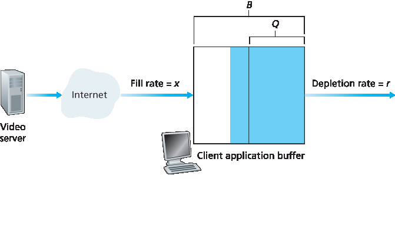

.. _c9.3:

9.3 IP 语音
=============================================================
9.3 Voice-over-IP

.. tab:: 中文

.. tab:: 英文

Real-time conversational voice over the Internet is often referred to as **Internet telephony**, since, from the user’s perspective, it is similar to the traditional circuit-switched telephone service. It is also commonly called **Voice-over-IP (VoIP)**. In this section we describe the principles and protocols underlying VoIP. Conversational video is similar in many respects to VoIP, except that it includes the video of the participants as well as their voices. To keep the discussion focused and concrete, we focus here only on voice in this section rather than combined voice and video.

.. _c9.3.1:

9.3.1 尽力而为 IP 服务的限制
------------------------------------------------------------
9.3.1 Limitations of the Best-Effort IP Service

.. tab:: 中文

.. tab:: 英文

The Internet’s network-layer protocol, IP, provides best-effort service. That is to say the service makes its best effort to move each datagram from source to destination as quickly as possible but makes no promises whatsoever about getting the packet to the destination within some delay bound or about a limit on the percentage of packets lost. The lack of such guarantees poses significant challenges to the design of real-time conversational applications, which are acutely sensitive to packet delay, jitter, and loss.

In this section, we’ll cover several ways in which the performance of VoIP over a best-effort network can be enhanced. Our focus will be on application-layer techniques, that is, approaches that do not require any changes in the network core or even in the transport layer at the end hosts. To keep the discussion concrete, we’ll discuss the limitations of best-effort IP service in the context of a specific VoIP example. The sender generates bytes at a rate of 8,000 bytes per second; every 20 msecs the sender gathers these bytes into a chunk. A chunk and a special header (discussed below) are encapsulated in a UDP segment, via a call to the socket interface. Thus, the number of bytes in a chunk is (20 msecs)⋅(8,000 bytes/sec)=160 bytes, and a UDP segment is sent every 20 msecs.

If each packet makes it to the receiver with a constant end-to-end delay, then packets arrive at the receiver periodically every 20 msecs. In these ideal conditions, the receiver can simply play back each chunk as soon as it arrives. But unfortunately, some packets can be lost and most packets will not have the same end-to-end delay, even in a lightly congested Internet. For this reason, the receiver must take more care in determining (1) when to play back a chunk, and (2) what to do with a missing chunk.

Packet Loss
~~~~~~~~~~~~~

Consider one of the UDP segments generated by our VoIP application. The UDP segment is encapsulated in an IP datagram. As the datagram wanders through the network, it passes through router buffers (that is, queues) while waiting for transmission on outbound links. It is possible that one or more of the buffers in the path from sender to receiver is full, in which case the arriving IP datagram may be discarded, never to arrive at the receiving application.

Loss could be eliminated by sending the packets over TCP (which provides for reliable data transfer) rather than over UDP. However, retransmission mechanisms are often considered unacceptable for conversational real-time audio applications such as VoIP, because they increase end-to-end delay :ref:`[Bolot 1996] <Bolot 1996>`. Furthermore, due to TCP congestion control, packet loss may result in a reduction of the TCP sender’s transmission rate to a rate that is lower than the receiver’s drain rate, possibly leading to buffer starvation. This can have a severe impact on voice intelligibility at the receiver. For these reasons, most existing VoIP applications run over UDP by default. :ref:`[Baset 2006] <Baset 2006>` reports that UDP is used by Skype unless a user is behind a NAT or firewall that blocks UDP segments (in which case TCP is used).

But losing packets is not necessarily as disastrous as one might think. Indeed, packet loss rates between 1 and 20 percent can be tolerated, depending on how voice is encoded and transmitted, and on how the loss is concealed at the receiver. For example, forward error correction (FEC) can help conceal packet loss. We’ll see below that with FEC, redundant information is transmitted along with the original information so that some of the lost original data can be recovered from the redundant information. Nevertheless, if one or more of the links between sender and receiver is severely congested, and packet loss exceeds 10 to 20 percent (for example, on a wireless link), then there is really nothing that can be done to achieve acceptable audio quality. Clearly, best-effort service has its limitations.

End-to-End Delay
~~~~~~~~~~~~~~~~~

**End-to-end delay** is the accumulation of transmission, processing, and queuing delays in routers; propagation delays in links; and end-system processing delays. For real-time conversational applications, such as VoIP, end-to-end delays smaller than 150 msecs are not perceived by a human listener; delays between 150 and 400 msecs can be acceptable but are not ideal; and delays exceeding 400 msecs can seriously hinder the interactivity in voice conversations. The receiving side of a VoIP application will typically disregard any packets that are delayed more than a certain threshold, for example, more than 400 msecs. Thus, packets that are delayed by more than the threshold are effectively lost.

Packet Jitter
~~~~~~~~~~~~~~

A crucial component of end-to-end delay is the varying queuing delays that a packet experiences in the network’s routers. Because of these varying delays, the time from when a packet is generated at the source until it is received at the receiver can fluctuate from packet to packet, as shown in :ref:`Figure 9.1 <Figure 9.1>`. This phenomenon is called **jitter**. As an example, consider two consecutive packets in our VoIP application. The sender sends the second packet 20 msecs after sending the first packet. But at the receiver, the spacing between these packets can become greater than 20 msecs. To see this, suppose the first packet arrives at a nearly empty queue at a router, but just before the second packet arrives at the queue a large number of packets from other sources arrive at the same queue. Because the first packet experiences a small queuing delay and the second packet suffers a large queuing delay at this router, the first and second packets become spaced by more than 20 msecs. The spacing between consecutive packets can also become less than 20 msecs. To see this, again consider two consecutive packets. Suppose the first packet joins the end of a queue with a large number of packets, and the second packet arrives at the queue before this first packet is transmitted and before any packets from other sources arrive at the queue. In this case, our two packets find themselves one right after the other in the queue. If the time it takes to transmit a packet on the router’s outbound link is less than 20 msecs, then the spacing between first and second packets becomes less than 20 msecs.

The situation is analogous to driving cars on roads. Suppose you and your friend are each driving in your own cars from San Diego to Phoenix. Suppose you and your friend have similar driving styles, and that you both drive at 100 km/hour, traffic permitting. If your friend starts out one hour before you, depending on intervening traffic, you may arrive at Phoenix more or less than one hour after your friend.

If the receiver ignores the presence of jitter and plays out chunks as soon as they arrive, then the resulting audio quality can easily become unintelligible at the receiver. Fortunately, jitter can often be removed by using **sequence numbers**, **timestamps**, and a **playout delay**, as discussed below.

.. _c9.3.2:

9.3.2 消除音频接收器的抖动
------------------------------------------------------------
9.3.2 Removing Jitter at the Receiver for Audio

.. tab:: 中文

.. tab:: 英文

For our VoIP application, where packets are being generated periodically, the receiver should attempt to provide periodic playout of voice chunks in the presence of random network jitter. This is typically done by combining the following two mechanisms:

- **Prepending each chunk with a timestamp**. The sender stamps each chunk with the time at which the chunk was generated.
- **Delaying playout of chunks at the receiver**. As we saw in our earlier discussion of Figure 9.1, the playout delay of the received audio chunks must be long enough so that most of the packets are received before their scheduled playout times. This playout delay can either be fixed throughout the duration of the audio session or vary adaptively during the audio session lifetime.

We now discuss how these three mechanisms, when combined, can alleviate or even eliminate the effects of jitter. We examine two playback strategies: fixed playout delay and adaptive playout delay.

Fixed Playout Delay
~~~~~~~~~~~~~~~~~~~~~~~

With the fixed-delay strategy, the receiver attempts to play out each chunk exactly q msecs after the chunk is generated. So if a chunk is timestamped at the sender at time t, the receiver plays out the chunk at time t+q, assuming the chunk has arrived by that time. Packets that arrive after their scheduled playout times are discarded and considered lost.

What is a good choice for q? VoIP can support delays up to about 400 msecs, although a more satisfying conversational experience is achieved with smaller values of q. On the other hand, if q is made much smaller than 400 msecs, then many packets may miss their scheduled playback times due to the network-induced packet jitter. Roughly speaking, if large variations in end-to-end delay are typical, it is preferable to use a large q; on the other hand, if delay is small and variations in delay are also small, it is preferable to use a small q, perhaps less than 150 msecs.

The trade-off between the playback delay and packet loss is illustrated in Figure 9.4. The figure shows the times at which packets are generated and played out for a single talk spurt. Two distinct initial playout delays are considered. As shown by the leftmost staircase, the sender generates packets at regular intervals—say, every 20 msecs. The first packet in this talk spurt is received at time r. As shown in the figure, the arrivals of subsequent packets are not evenly spaced due to the network jitter.

.. _Figure 9.4:

**Figure 9.4 Packet loss for different fixed playout delays**

For the first playout schedule, the fixed initial playout delay is set to p−r. With this schedule, the fourth packet does not arrive by its scheduled playout time, and the receiver considers it lost. For the second playout schedule, the fixed initial playout delay is set to p′−r. For this schedule, all packets arrive before their scheduled playout times, and there is therefore no loss.

Adaptive Playout Delay
~~~~~~~~~~~~~~~~~~~~~~~~~~~

The previous example demonstrates an important delay-loss trade-off that arises when designing a playout strategy with fixed playout delays. By making the initial playout delay large, most packets will make their deadlines and there will therefore be negligible loss; however, for conversational services such as VoIP, long delays can become bothersome if not intolerable. Ideally, we would like the playout delay to be minimized subject to the constraint that the loss be below a few percent.

The natural way to deal with this trade-off is to estimate the network delay and the variance of the network delay, and to adjust the playout delay accordingly at the beginning of each talk spurt. This adaptive adjustment of playout delays at the beginning of the talk spurts will cause the sender’s silent periods to be compressed and elongated; however, compression and elongation of silence by a small amount is not noticeable in speech.

Following :ref:`[Ramjee 1994] <Ramjee 1994>`, we now describe a generic algorithm that the receiver can use to adaptively adjust its playout delays. To this end, let

ti= the timestamp of the ith packet = the time the packet was generated by the sender

ri= the time packet i is received by receiver

pi= the time packet i is played at receiver

The end-to-end network delay of the ith packet is ri−ti. Due to network jitter, this delay will vary from packet to packet. Let di denote an estimate of the average network delay upon reception of the ith packet. This estimate is constructed from the timestamps as follows:

    di=(1−u)di−1+u(ri−ti)

where u is a fixed constant (for example, u=0.01). Thus di is a smoothed average of the observed network delays r1−t1,...,ri−ti. The estimate places more weight on the recently observed network delays than on the observed network delays of the distant past. This form of estimate should not be completely unfamiliar; a similar idea is used to estimate round-trip times in TCP, as discussed in :ref:`Chapter 3 <c3>`. Let vi denote an estimate of the average deviation of the delay from the estimated average delay. This estimate is also constructed from the timestamps:

    vi=(1−u)vi−1+u| ri−ti−di|

The estimates di and vi are calculated for every packet received, although they are used only to determine the playout point for the first packet in any talk spurt.

Once having calculated these estimates, the receiver employs the following algorithm for the playout of packets. If packet i is the first packet of a talk spurt, its playout time, pi, is computed as:

    pi=ti+di+Kvi

where K is a positive constant (for example, K=4). The purpose of the Kvi term is to set the playout time far enough into the future so that only a small fraction of the arriving packets in the talk spurt will be lost due to late arrivals. The playout point for any subsequent packet in a talk spurt is computed as an offset from the point in time when the first packet in the talk spurt was played out. In particular, let

    qi=pi−ti

be the length of time from when the first packet in the talk spurt is generated until it is played out. If packet j also belongs to this talk spurt, it is played out at time 

    pj=tj+qi

The algorithm just described makes perfect sense assuming that the receiver can tell whether a packet is the first packet in the talk spurt. This can be done by examining the signal energy in each received packet.

.. _c9.3.3:

9.3.3 从数据包丢失中恢复
------------------------------------------------------------
9.3.3 Recovering from Packet Loss

.. tab:: 中文

.. tab:: 英文

We have discussed in some detail how a VoIP application can deal with packet jitter. We now briefly describe several schemes that attempt to preserve acceptable audio quality in the presence of packet loss. Such schemes are called **loss recovery schemes**. Here we define packet loss in a broad sense: A packet is lost either if it never arrives at the receiver or if it arrives after its scheduled playout time. Our VoIP example will again serve as a context for describing loss recovery schemes.

As mentioned at the beginning of this section, retransmitting lost packets may not be feasible in a real- time conversational application such as VoIP. Indeed, retransmitting a packet that has missed its playout deadline serves absolutely no purpose. And retransmitting a packet that overflowed a router queue cannot normally be accomplished quickly enough. Because of these considerations, VoIP applications often use some type of loss anticipation scheme. Two types of loss anticipation schemes are **forward error correction (FEC) and interleaving**.

Forward Error Correction (FEC)
~~~~~~~~~~~~~~~~~~~~~~~~~~~~~~~

The basic idea of FEC is to add redundant information to the original packet stream. For the cost of marginally increasing the transmission rate, the redundant information can be used to reconstruct approximations or exact versions of some of the lost packets. Following :ref:`[Bolot 1996] <Bolot 1996>` and :ref:`[Perkins 1998] <Perkins 1998>`, we now outline two simple FEC mechanisms. The first mechanism sends a redundant encoded chunk after every n chunks. The redundant chunk is obtained by exclusive OR-ing the n original chunks :ref:`[Shacham 1990] <Shacham 1990>`. In this manner if any one packet of the group of n+1 packets is lost, the receiver can fully reconstruct the lost packet. But if two or more packets in a group are lost, the receiver cannot reconstruct the lost packets. By keeping n+1, the group size, small, a large fraction of the lost packets can be recovered when loss is not excessive. However, the smaller the group size, the greater the relative increase of the transmission rate. In particular, the transmission rate increases by a factor of 1/n, so that, if n=3, then the transmission rate increases by 33 percent. Furthermore, this simple scheme increases the playout delay, as the receiver must wait to receive the entire group of packets before it can begin playout. For more practical details about how FEC works for multimedia transport see [:rfc:`5109`].

The second FEC mechanism is to send a lower-resolution audio stream as the redundant information. For example, the sender might create a nominal audio stream and a corresponding low-resolution, low- bit rate audio stream. (The nominal stream could be a PCM encoding at 64 kbps, and the lower-quality stream could be a GSM encoding at 13 kbps.) The low-bit rate stream is referred to as the redundant stream. As shown in :ref:`Figure 9.5 <Figure 9.5>`, the sender constructs the nth packet by taking the nth chunk from the nominal stream and appending to it the (n−1)st chunk from the redundant stream. In this manner, whenever there is nonconsecutive packet loss, the receiver can conceal the loss by playing out the low- bit rate encoded chunk that arrives with the subsequent packet. Of course, low-bit rate chunks give lower quality than the nominal chunks. However, a stream of mostly high-quality chunks, occasional low- quality chunks, and no missing chunks gives good overall audio quality. Note that in this scheme, the receiver only has to receive two packets before playback, so that the increased playout delay is small. Furthermore, if the low-bit rate encoding is much less than the nominal encoding, then the marginal increase in the transmission rate will be small.

In order to cope with consecutive loss, we can use a simple variation. Instead of appending just the (n−1)st low-bit rate chunk to the nth nominal chunk, the sender can append the (n−1)st and (n−2)nd low- bit rate chunk, or append the (n−1)st and (n−3)rd low-bit rate chunk, and so on. By appending more low- bit rate chunks to each nominal chunk, the audio quality at the receiver becomes acceptable for a wider variety of harsh best-effort environments. On the other hand, the additional chunks increase the transmission bandwidth and the playout delay.

.. figure:: ../img/769-0.png 
   :align: center 

.. _Figure 9.5:

**Figure 9.5 Piggybacking lower-quality redundant information**

Interleaving
~~~~~~~~~~~~~~~

As an alternative to redundant transmission, a VoIP application can send interleaved audio. As shown in :ref:`Figure 9.6 <Figure 9.6>`, the sender resequences units of audio data before transmission, so that originally adjacent units are separated by a certain distance in the transmitted stream. Interleaving can mitigate the effect of packet losses. If, for example, units are 5 msecs in length and chunks are 20 msecs (that is, four units per chunk), then the first chunk could contain units 1, 5, 9, and 13; the second chunk could contain units 2, 6, 10, and 14; and so on. :ref:`Figure 9.6 <Figure 9.6>` shows that the loss of a single packet from an interleaved stream results in multiple small gaps in the reconstructed stream, as opposed to the single large gap that would occur in a noninterleaved stream.

Interleaving can significantly improve the perceived quality of an audio stream :ref:`[Perkins 1998] <Perkins 1998>`. It also has low overhead. The obvious disadvantage of interleaving is that it increases latency. This limits its use for conversational applications such as VoIP, although it can perform well for streaming stored audio. A major advantage of interleaving is that it does not increase the bandwidth requirements of a stream.

Error Concealment
~~~~~~~~~~~~~~~~~~~~

Error concealment schemes attempt to produce a replacement for a lost packet that is similar to the original. As discussed in :ref:`[Perkins 1998] <Perkins 1998>`, this is possible since audio signals, and in particular speech, exhibit large amounts of short-term self-similarity. As such, these techniques work for relatively small loss rates (less than 15 percent), and for small packets (4–40 msecs). When the loss length approaches the length of a phoneme (5–100 msecs) these techniques break down, since whole phonemes may be missed by the listener.

.. figure:: ../img/770-0.png 
   :align: center 

.. _Figure 9.6:

**Figure 9.6 Sending interleaved audio**

Perhaps the simplest form of receiver-based recovery is packet repetition. Packet repetition replaces lost packets with copies of the packets that arrived immediately before the loss. It has low computational complexity and performs reasonably well. Another form of receiver-based recovery is interpolation, which uses audio before and after the loss to interpolate a suitable packet to cover the loss. Interpolation performs somewhat better than packet repetition but is significantly more computationally intensive :ref:`[Perkins 1998] <Perkins 1998>`.

.. _c9.3.4:

9.3.4 案例研究：使用 Skype 的 VoIP
------------------------------------------------------------
9.3.4 Case Study: VoIP with Skype

.. tab:: 中文

.. tab:: 英文

Skype is an immensely popular VoIP application with over 50 million accounts active on a daily basis. In addition to providing host-to-host VoIP service, Skype offers host-to-phone services, phone-to-host services, and multi-party host-to-host video conferencing services. (Here, a host is again any Internet connected IP device, including PCs, tablets, and smartphones.) Skype was acquired by Microsoft in 2011.

Because the Skype protocol is proprietary, and because all Skype’s control and media packets are encrypted, it is difficult to precisely determine how Skype operates. Nevertheless, from the Skype Web site and several measurement studies, researchers have learned how Skype generally works [:ref:`Baset 2006 <Baset 2006>`; :ref:`Guha 2006 <Guha 2006>`; :ref:`Chen 2006 <Chen 2006>`; :ref:`Suh 2006 <Suh 2006>`; :ref:`Ren 2006 <Ren 2006>`; :ref:`Zhang X 2012 <Zhang X 2012>`]. For both voice and video, the Skype clients have at their disposal many different codecs, which are capable of encoding the media at a wide range of rates and qualities. For example, video rates for Skype have been measured to be as low as 30 kbps for a low-quality session up to almost 1 Mbps for a high quality session :ref:`[Zhang X 2012] <Zhang X 2012>`. Typically, Skype’s audio quality is better than the “POTS” (Plain Old Telephone Service) quality provided by the wire-line phone system. (Skype codecs typically sample voice at 16,000 samples/sec or higher, which provides richer tones than POTS, which samples at 8,000/sec.) By default, Skype sends audio and video packets over UDP. However, control packets are sent over TCP, and media packets are also sent over TCP when firewalls block UDP streams. Skype uses FEC for loss recovery for both voice and video streams sent over UDP. The Skype client also adapts the audio and video streams it sends to current network conditions, by changing video quality and FEC overhead [Zhang X 2012].

Skype uses P2P techniques in a number of innovative ways, nicely illustrating how P2P can be used in applications that go beyond content distribution and file sharing. As with instant messaging, host-to-host Internet telephony is inherently P2P since, at the heart of the application, pairs of users (that is, peers) communicate with each other in real time. But Skype also employs P2P techniques for two other important functions, namely, for user location and for NAT traversal.

.. figure:: ../img/771-0.png 
   :align: center 

.. _Figure 9.7:

**Figure 9.7 Skype peers**

As shown in :ref:`Figure 9.7 <Figure 9.7>`, the peers (hosts) in Skype are organized into a hierarchical overlay network, with each peer classified as a super peer or an ordinary peer. Skype maintains an index that maps Skype usernames to current IP addresses (and port numbers). This index is distributed over the super peers. When Alice wants to call Bob, her Skype client searches the distributed index to determine Bob’s current IP address. Because the Skype protocol is proprietary, it is currently not known how the index mappings are organized across the super peers, although some form of DHT organization is very possible.

P2P techniques are also used in Skype **relays**, which are useful for establishing calls between hosts in home networks. Many home network configurations provide access to the Internet through NATs, as discussed in :ref:`Chapter 4 <c4>`. Recall that a NAT prevents a host from outside the home network from initiating a connection to a host within the home network. If both Skype callers have NATs, then there is a problem—neither can accept a call initiated by the other, making a call seemingly impossible. The clever use of super peers and relays nicely solves this problem. Suppose that when Alice signs in, she is assigned to a non-NATed super peer and initiates a session to that super peer. (Since Alice is initiating the session, her NAT permits this session.) This session allows Alice and her super peer to exchange control messages. The same happens for Bob when he signs in. Now, when Alice wants to call Bob, she informs her super peer, who in turn informs Bob’s super peer, who in turn informs Bob of Alice’s incoming call. If Bob accepts the call, the two super peers select a third non-NATed super peer—the relay peer—whose job will be to relay data between Alice and Bob. Alice’s and Bob’s super peers then instruct Alice and Bob respectively to initiate a session with the relay. As shown in :ref:`Figure 9.7 <Figure 9.7>`, Alice then sends voice packets to the relay over the Alice-to-relay connection (which was initiated by Alice), and the relay then forwards these packets over the relay-to-Bob connection (which was initiated by Bob); packets from Bob to Alice flow over these same two relay connections in reverse. And voila!—Bob and Alice have an end-to-end connection even though neither can accept a session originating from outside.

Up to now, our discussion on Skype has focused on calls involving two persons. Now let’s examine multi-party audio conference calls. With N>2 participants, if each user were to send a copy of its audio stream to each of the N−1 other users, then a total of N(N−1) audio streams would need to be sent into the network to support the audio conference. To reduce this bandwidth usage, Skype employs a clever distribution technique. Specifically, each user sends its audio stream to the conference initiator. The conference initiator combines the audio streams into one stream (basically by adding all the audio signals together) and then sends a copy of each combined stream to each of the other N−1 participants. In this manner, the number of streams is reduced to 2(N−1). For ordinary two-person video conversations, Skype routes the call peer-to-peer, unless NAT traversal is required, in which case the call is relayed through a non-NATed peer, as described earlier. For a video conference call involving N>2 participants, due to the nature of the video medium, Skype does not combine the call into one stream at one location and then redistribute the stream to all the participants, as it does for voice calls. Instead, each participant’s video stream is routed to a server cluster (located in Estonia as of 2011), which in turn relays to each participant the N−1 streams of the N−1 other participants [Zhang X 2012]. You may be wondering why each participant sends a copy to a server rather than directly sending a copy of its video stream to each of the other N−1 participants? Indeed, for both approaches, N(N−1) video streams are being collectively received by the N participants in the conference. The reason is, because upstream link bandwidths are significantly lower than downstream link bandwidths in most access links, the upstream links may not be able to support the N−1 streams with the P2P approach.

VoIP systems such as Skype, WeChat, and Google Talk introduce new privacy concerns. Specifically, when Alice and Bob communicate over VoIP, Alice can sniff Bob’s IP address and then use geo-location services [:ref:`MaxMind 2016 <MaxMind 2016>`; :ref:`Quova 2016 <Quova 2016>`] to determine Bob’s current location and ISP (for example, his work or home ISP). In fact, with Skype it is possible for Alice to block the transmission of certain packets during call establishment so that she obtains Bob’s current IP address, say every hour, without Bob knowing that he is being tracked and without being on Bob’s contact list. Furthermore, the IP address discovered from Skype can be correlated with IP addresses found in BitTorrent, so that Alice can determine the files that Bob is downloading :ref:`[LeBlond 2011] <LeBlond 2011>`. Moreover, it is possible to partially decrypt a Skype call by doing a traffic analysis of the packet sizes in a stream :ref:`[White 2011] <White 2011>`.

