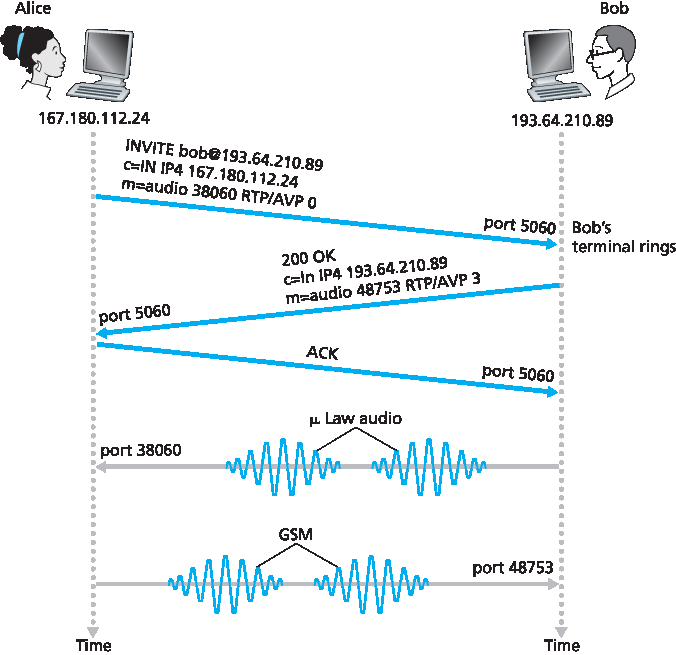
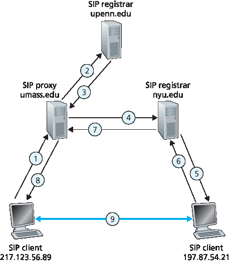

.. _c9.4:

9.4 实时对话应用的协议
=============================================================
9.4 Protocols for Real-Time Conversational Applications

实时对话应用，包括 VoIP 和视频会议，非常有吸引力且广受欢迎。因此，标准组织如 IETF 和 ITU 多年来（并将继续）致力于制定这类应用的标准也就不足为奇了。有了适当的实时对话应用标准，独立公司能够创造相互兼容的新产品。本节我们考察用于实时对话应用的 RTP 和 SIP。这两个标准在工业产品中得到广泛实现。

.. toggle::

    Real-time conversational applications, including VoIP and video conferencing, are compelling and very popular. It is therefore not surprising that standards bodies, such as the IETF and ITU, have been busy for many years (and continue to be busy!) at hammering out standards for this class of applications. With the appropriate standards in place for real-time conversational applications, independent companies are creating new products that interoperate with each other. In this section we examine RTP and SIP for real-time conversational applications. Both standards are enjoying widespread implementation in industry products.

.. _c9.4.1:

9.4.1 RTP
------------------------------------------------------------

在前一节中，我们了解到 VoIP 应用的发送端在将音频块传递给传输层之前，会附加头字段。这些头字段包括序列号和时间戳。由于大多数多媒体网络应用可以使用序列号和时间戳，拥有一个包含音视频数据、序列号和时间戳等字段的标准化包结构非常方便。RTP（定义于 RFC 3550）就是这样的标准。RTP 可用于传输常见格式，如 PCM、ACC、MP3（音频）和 MPEG、H.263（视频）。它也可用于传输专有的音视频格式。如今，RTP 在许多产品和研究原型中得到广泛应用。它还与其他重要的实时交互协议（如 SIP）互补。

本节介绍 RTP。我们也鼓励您访问 Henning Schulzrinne 的 RTP 站点 :ref:`[Schulzrinne-RTP 2012] <Schulzrinne-RTP 2012>`，该站点提供大量相关信息。此外，您可能想访问 RAT 站点 [RAT 2012]，该站点记录了使用 RTP 的 VoIP 应用。

.. toggle::

    In the previous section, we learned that the sender side of a VoIP application appends header fields to the audio chunks before passing them to the transport layer. These header fields include sequence numbers and timestamps. Since most multimedia networking applications can make use of sequence numbers and timestamps, it is convenient to have a standardized packet structure that includes fields for audio/video data, sequence number, and timestamp, as well as other potentially useful fields. RTP, defined in RFC 3550, is such a standard. RTP can be used for transporting common formats such as PCM, ACC, and MP3 for sound and MPEG and H.263 for video. It can also be used for transporting proprietary sound and video formats. Today, RTP enjoys widespread implementation in many products and research prototypes. It is also complementary to other important real-time interactive protocols, such as SIP.

    In this section, we provide an introduction to RTP. We also encourage you to visit Henning Schulzrinne’s RTP site :ref:`[Schulzrinne-RTP 2012] <Schulzrinne-RTP 2012>`, which provides a wealth of information on the subject. Also, you may want to visit the RAT site [RAT 2012], which documents VoIP application that uses RTP.

RTP 基础
~~~~~~~~~~~~
RTP Basics

RTP 通常运行于 UDP 之上。发送端将媒体块封装在 RTP 包中，再将该包封装在 UDP 段中，最后交给 IP。接收端从 UDP 段中提取 RTP 包，再从 RTP 包中提取媒体块，然后将其传递给媒体播放器进行解码和播放。

举例说明，考虑使用 RTP 传输语音。假设语音源为 PCM 编码（即采样、量化和数字化）且速率为 64 kbps。假设应用以 20 毫秒为单位收集编码数据，即每块 160 字节。发送端在每块音频数据前附加一个 **RTP 头**，其中包括音频编码类型、序列号和时间戳。RTP 头通常为 12 字节。音频块与 RTP 头构成 RTP 包。该包随后发送到 UDP 套接字接口。接收端从套接字接口接收 **RTP 包**，提取音频块并利用 RTP 包头字段正确解码并回放音频块。

如果应用采用 RTP，而非专有方案提供有效载荷类型、序列号或时间戳，应用间的互操作性将更好。例如，若两家公司开发的 VoIP 软件均采用 RTP，则用户使用其中一个产品时，有望与使用另一个产品的用户通信。在 :ref:`第 9.4.2 节 <c9.4.2>` 中，我们将看到 RTP 常与 SIP 结合使用，SIP 是互联网电话的重要标准。

应强调，RTP 不提供任何保证数据及时传输或其他服务质量（QoS）的机制；甚至不保证数据包送达或防止乱序。实际上，RTP 封装仅在端系统可见，路由器不区分携带 RTP 包的 IP 数据报与不携带的。

RTP 允许每个源（如摄像头或麦克风）拥有独立的 RTP 包流。例如，两人视频会议可开启四个 RTP 流——两个用于音频（双向各一）和两个用于视频（同样双向各一）。但许多流行编码技术（如 MPEG 1 和 MPEG 2）在编码时将音视频合成单一流。当编码器合成音视频时，每个方向仅生成一个 RTP 流。

RTP 包不限于单播应用，也可通过一对多和多对多的多播树发送。对于多对多多播会话，所有发送者和源通常使用相同多播组发送 RTP 流。属于同一多播会话的 RTP 流（如视频会议中多发送者的音视频流）称为 **RTP 会话**。

.. _Figure 9.8:

**图 9.8 RTP 头字段**

.. toggle::

    RTP typically runs on top of UDP. The sending side encapsulates a media chunk within an RTP packet, then encapsulates the packet in a UDP segment, and then hands the segment to IP. The receiving side extracts the RTP packet from the UDP segment, then extracts the media chunk from the RTP packet, and then passes the chunk to the media player for decoding and rendering.

    As an example, consider the use of RTP to transport voice. Suppose the voice source is PCM-encoded (that is, sampled, quantized, and digitized) at 64 kbps. Further suppose that the application collects the encoded data in 20-msec chunks, that is, 160 bytes in a chunk. The sending side precedes each chunk of the audio data with an **RTP header** that includes the type of audio encoding, a sequence number, and a timestamp. The RTP header is normally 12 bytes. The audio chunk along with the RTP header form the RTP packet. The RTP packet is then sent into the UDP socket interface. At the receiver side, the application receives the **RTP packet** from its socket interface. The application extracts the audio chunk from the RTP packet and uses the header fields of the RTP packet to properly decode and play back the audio chunk.

    If an application incorporates RTP—instead of a proprietary scheme to provide payload type, sequence numbers, or timestamps—then the application will more easily interoperate with other networked multimedia applications. For example, if two different companies develop VoIP software and they both incorporate RTP into their product, there may be some hope that a user using one of the VoIP products will be able to communicate with a user using the other VoIP product. In :ref:`Section 9.4.2 <c9.4.2>`, we’ll see that RTP is often used in conjunction with SIP, an important standard for Internet telephony.

    It should be emphasized that RTP does not provide any mechanism to ensure timely delivery of data or provide other quality-of-service (QoS) guarantees; it does not even guarantee delivery of packets or prevent out-of-order delivery of packets. Indeed, RTP encapsulation is seen only at the end systems. Routers do not distinguish between IP datagrams that carry RTP packets and IP datagrams that don’t.

    RTP allows each source (for example, a camera or a microphone) to be assigned its own independent RTP stream of packets. For example, for a video conference between two participants, four RTP streams could be opened—two streams for transmitting the audio (one in each direction) and two streams for transmitting the video (again, one in each direction). However, many popular encoding techniques—including MPEG 1 and MPEG 2—bundle the audio and video into a single stream during the encoding process. When the audio and video are bundled by the encoder, then only one RTP stream is generated in each direction.

    RTP packets are not limited to unicast applications. They can also be sent over one-to-many and many- to-many multicast trees. For a many-to-many multicast session, all of the session’s senders and sources typically use the same multicast group for sending their RTP streams. RTP multicast streams belonging together, such as audio and video streams emanating from multiple senders in a video conference application, belong to an **RTP session**.

    .. figure:: ../img/775-0.png 
      :align: center 

    **Figure 9.8 RTP header fields**

RTP 包头字段
~~~~~~~~~~~~~~~~~~~~~~~~~~~
RTP Packet Header Fields

如 :ref:`图 9.8 <Figure 9.8>` 所示，四个主要 RTP 包头字段是有效载荷类型、序列号、时间戳和源标识符。

RTP 包中有效载荷类型字段长 7 位。对于音频流，该字段指示音频编码类型（如 PCM、自适应三角调制、线性预测编码）。发送端若在会话中途改变编码，可通过该字段通知接收端。发送端可能为提升音质或降低 RTP 流比特率而改变编码。:ref:`表 9.2 <Table 9.2>` 列出了 RTP 当前支持的一些音频有效载荷类型。

对于视频流，有效载荷类型用于指示视频编码类型（如运动 JPEG、MPEG 1、MPEG 2、H.261）。同样，发送端可在会话中动态更改视频编码。:ref:`表 9.3 <Table 9.3>` 列出 RTP 支持的一些视频有效载荷类型。其他重要字段包括：

- **序列号字段**。长度为 16 位。每发送一个 RTP 包，序列号加一，接收端可用其检测丢包并恢复包序。例如，若接收端收到序列号间断从 86 跳到 89，则知道 87 和 88 包丢失，接收端可尝试掩盖丢失数据。
- **时间戳字段**。长度为 32 位。反映 RTP 数据包中第一个字节的采样时刻。如前节所述，接收端利用时间戳消除网络引入的抖动，实现同步播放。时间戳由发送端采样时钟产生。举例，音频时间戳时钟以采样周期递增（例如，8 kHz 采样时为每 125 微秒递增 1）；若音频应用生成 160 个编码采样的块，则时间戳在源活动时每个 RTP 包递增 160。即使源不活动，时间戳时钟也持续以恒定速率增加。
- **同步源标识符（SSRC）**。长度 32 位。标识 RTP 流的来源。通常，RTP 会话中每个流拥有独特的 SSRC。SSRC 不是发送者的 IP 地址，而是源在新流开始时随机分配的编号。两个流分配相同 SSRC 的概率极小，若发生，两个源将重新选取新的 SSRC。

.. _Table 9.2:

**表 9.2 RTP 支持的音频有效载荷类型**

.. list-table::

    * - 载荷类型编号
      - 音频格式 
      - 采样率 
      - 码率
    * - 0 
      - PCM μ-law 
      - 8 kHz 
      - 64 kbps
    * - 1
      - 1016
      - 8 kHz 
      - 4.8 kbps
    * - 3 
      - GSM
      - 8 kHz 
      - 13 kbps
    * - 7 
      - LPC
      - 8 kHz 
      - 2.4 kbps
    * - 9 
      - G.722
      - 16 kHz 
      - 48 - 64 kbps
    * - 14 
      - MPEG 音频
      - 90 kHz 
      - --
    * - 15
      - G.728
      - 8 kHz 
      - 16 kbps

.. _Table 9.3:

**表 9.3 RTP 支持的一些视频有效载荷类型**

.. list-table::

    * - 载荷类型编号
      - 视频格式 
    * - 26
      - 运动 JPEG
    * - 31
      - H.261
    * - 32
      - MPEG 1 视频
    * - 33
      - MPEG 2 视频

.. toggle::

    As shown in :ref:`Figure 9.8 <Figure 9.8>`, the four main RTP packet header fields are the payload type, sequence number, timestamp, and source identifier fields.

    The payload type field in the RTP packet is 7 bits long. For an audio stream, the payload type field is used to indicate the type of audio encoding (for example, PCM, adaptive delta modulation, linear predictive encoding) that is being used. If a sender decides to change the encoding in the middle of a session, the sender can inform the receiver of the change through this payload type field. The sender may want to change the encoding in order to increase the audio quality or to decrease the RTP stream bit rate. :ref:`Table 9.2 <Table 9.2>` lists some of the audio payload types currently supported by RTP.

    For a video stream, the payload type is used to indicate the type of video encoding (for example, motion JPEG, MPEG 1, MPEG 2, H.261). Again, the sender can change video encoding on the fly during a session. :ref:`Table 9.3 <Table 9.3>` lists some of the video payload types currently supported by RTP. The other important fields are the following:

    - **Sequence number field**. The sequence number field is 16 bits long. The sequence number increments by one for each RTP packet sent, and may be used by the receiver to detect packet loss and to restore packet sequence. For example, if the receiver side of the application receives a stream of RTP packets with a gap between sequence numbers 86 and 89, then the receiver knows that packets 87 and 88 are missing. The receiver can then attempt to conceal the lost data.
    - **Timestamp field**. The timestamp field is 32 bits long. It reflects the sampling instant of the first byte in the RTP data packet. As we saw in the preceding section, the receiver can use timestamps to remove packet jitter introduced in the network and to provide synchronous playout at the receiver. The timestamp is derived from a sampling clock at the sender. As an example, for audio the timestamp clock increments by one for each sampling period (for example, each 125 μsec for an 8 kHz sampling clock); if the audio application generates chunks consisting of 160 encoded samples, then the timestamp increases by 160 for each RTP packet when the source is active. The timestamp clock continues to increase at a constant rate even if the source is inactive.
    - **Synchronization source identifier (SSRC)**. The SSRC field is 32 bits long. It identifies the source of the RTP stream. Typically, each stream in an RTP session has a distinct SSRC. The SSRC is not the IP address of the sender, but instead is a number that the source assigns randomly when the new stream is started. The probability that two streams get assigned the same SSRC is very small. Should this happen, the two sources pick a new SSRC value.

    **Table 9.2 Audio payload types supported by RTP**

    .. list-table::

        * - Payload-Type Number
          - Audio Format 
          - Sampling Rate 
          - Rate
        * - 0 
          - PCM μ-law 
          - 8 kHz 
          - 64 kbps
        * - 1
          - 1016
          - 8 kHz 
          - 4.8 kbps
        * - 3 
          - GSM
          - 8 kHz 
          - 13 kbps
        * - 7 
          - LPC
          - 8 kHz 
          - 2.4 kbps
        * - 9 
          - G.722
          - 16 kHz 
          - 48 - 64 kbps
        * - 14 
          - MPEG Audio
          - 90 kHz 
          - --
        * - 15
          - G.728
          - 8 kHz 
          - 16 kbps

    **Table 9.3 Some video payload types supported by RTP**

    .. list-table::

        * - Payload-Type Number
          - Video Format 
        * - 26
          - Motion JPEG
        * - 31
          - H.261
        * - 32
          - MPEG 1 video
        * - 33
          - MPEG 2 video

.. _c9.4.2:

9.4.2 SIP
------------------------------------------------------------

会话发起协议（SIP），定义于 [:rfc:`3261`; :rfc:`5411`]，是一个开放且轻量级的协议，具备以下功能：

- 提供在 IP 网络上建立呼叫的机制，使呼叫者能通知被呼叫者希望开始通话。允许参与者就媒体编码达成一致。也允许参与者结束呼叫。
- 提供机制使呼叫者确定被呼叫者当前 IP 地址。用户没有单一固定 IP 地址，因为地址可能动态分配（通过 DHCP），且用户可能拥有多个 IP 设备，每个有不同 IP。
- 提供呼叫管理机制，如通话中添加新媒体流、更改编码、邀请新参与者、呼叫转接和呼叫保持。

.. toggle::

    The Session Initiation Protocol (SIP), defined in [:rfc:`3261`; :rfc:`5411`], is an open and lightweight protocol that does the following:

    - It provides mechanisms for establishing calls between a caller and a callee over an IP network. It allows the caller to notify the callee that it wants to start a call. It allows the participants to agree on media encodings. It also allows participants to end calls.
    - It provides mechanisms for the caller to determine the current IP address of the callee. Users do not have a single, fixed IP address because they may be assigned addresses dynamically (using DHCP) and because they may have multiple IP devices, each with a different IP address.
    - It provides mechanisms for call management, such as adding new media streams during the call, changing the encoding during the call, inviting new participants during the call, call transfer, and call holding.

已知 IP 地址呼叫建立
~~~~~~~~~~~~~~~~~~~~~~~~~~~~~~~~~~~~~~~~~~
Setting Up a Call to a Known IP Address

为理解 SIP 的本质，最好看具体示例。例中，Alice 在其电脑上，想呼叫同样在电脑工作的 Bob。Alice 和 Bob 的电脑均装有基于 SIP 的电话软件用于发起和接听电话。此初步示例假设 Alice 知道 Bob 电脑的 IP 地址。:ref:`图 9.9 <Figure 9.9>` 展示 SIP 呼叫建立过程。

如 :ref:`图 9.9 <Figure 9.9>` 所示，SIP 会话始于 Alice 向 Bob 发送 INVITE 消息，类似 HTTP 请求。该消息通过 UDP 发送到 SIP 端口 5060。（SIP 消息也可通过 TCP 发送。）INVITE 消息包含 Bob 的标识（bob@193.64.210.89）、Alice 当前 IP 地址、Alice 希望接收音频（编码格式为 AVP 0，即 PCM μ-law 编码，封装于 RTP 中）、及她希望在端口 38060 接收 RTP 包的说明。Bob 收到 INVITE 后发送 SIP 响应，类似 HTTP 响应，也发送至 SIP 端口 5060。Bob 的响应包括 200 OK，及其 IP 地址、期望的编码和封包格式，以及接收音频包的端口号。注意本例中 Alice 和 Bob 使用不同的音频编码：Alice 被要求使用 GSM 编码，而 Bob 被要求使用 PCM μ-law。收到 Bob 响应后，Alice 向 Bob 发送 SIP 确认消息。此 SIP 事务完成后，Bob 和 Alice 可通话。（为视觉方便，:ref:`图 9.9` 显示 Alice 在 Bob 后通话，但实际上他们通常同时通话。）Bob 会按请求编码和封包音频，发送至 IP 167.180.112.24 的端口 38060；Alice 也按请求编码和封包，发送至 IP 193.64.210.89 的端口 48753。

.. _Figure 9.9:

**图 9.9 Alice 知道 Bob IP 地址时的 SIP 呼叫建立**

通过该简单示例，我们了解到 SIP 的几个关键特性。第一，SIP 是带外协议：SIP 消息在与媒体数据发送接收不同的套接字中发送接收。第二，SIP 消息本身为 ASCII 可读，类似 HTTP 消息。第三，SIP 要求所有消息需确认，因此可运行于 UDP 或 TCP。

假设 Bob 没有 PCM μ-law 编码器，无法编码音频，则不会回应 200 OK，而可能返回 606 Not Acceptable，并列出所有可用编码器。Alice 可选择其中编码器，重新发送包含选定编码的 INVITE 消息。Bob 也可直接拒绝呼叫，发送多种拒绝码（如忙、离开、需付款、禁止等）。

.. toggle::

    To understand the essence of SIP, it is best to take a look at a concrete example. In this example, Alice is at her PC and she wants to call Bob, who is also working at his PC. Alice’s and Bob’s PCs are both equipped with SIP-based software for making and receiving phone calls. In this initial example, we’ll
    assume that Alice knows the IP address of Bob’s PC. :ref:`Figure 9.9 <Figure 9.9>` illustrates the SIP call-establishment process.

    In :ref:`Figure 9.9 <Figure 9.9>`, we see that an SIP session begins when Alice sends Bob an INVITE message, which resembles an HTTP request message. This INVITE message is sent over UDP to the well-known port 5060 for SIP. (SIP messages can also be sent over TCP.) The INVITE message includes an identifier for Bob (bob@193.64.210.89), an indication of Alice’s current IP address, an indication that Alice desires to receive audio, which is to be encoded in format AVP 0 (PCM encoded μ-law) and encapsulated in RTP, and an indication that she wants to receive the RTP packets on port 38060. After receiving Alice’s INVITE message, Bob sends an SIP response message, which resembles an HTTP response message. This response SIP message is also sent to the SIP port 5060. Bob’s response includes a 200 OK as well as an indication of his IP address, his desired encoding and packetization for reception, and his port number to which the audio packets should be sent. Note that in this example Alice and Bob are going to use different audio-encoding mechanisms: Alice is asked to encode her audio with GSM whereas Bob is asked to encode his audio with PCM μ-law. After receiving Bob’s response, Alice sends Bob an SIP acknowledgment message. After this SIP transaction, Bob and Alice can talk. (For visual convenience, :ref:`Figure 9.9 ,Figure 9.9` shows Alice talking after Bob, but in truth they would normally talk at the same time.) Bob will encode and packetize the audio as requested and send the audio packets to port number 38060 at IP address 167.180.112.24. Alice will also encode and packetize the audio as requested and send the audio packets to port number 48753 at IP address 193.64.210.89.

    .. figure:: ../img/778-0.png 
      :align: center 

    **Figure 9.9 SIP call establishment when Alice knows Bob’s IP address**

    From this simple example, we have learned a number of key characteristics of SIP. First, SIP is an out- of-band protocol: The SIP messages are sent and received in sockets that are different from those used for sending and receiving the media data. Second, the SIP messages themselves are ASCII-readable and resemble HTTP messages. Third, SIP requires all messages to be acknowledged, so it can run over UDP or TCP.

    In this example, let’s consider what would happen if Bob does not have a PCM μ-law codec for encoding audio. In this case, instead of responding with 200 OK, Bob would likely respond with a 606 Not Acceptable and list in the message all the codecs he can use. Alice would then choose one of the listed codecs and send another INVITE message, this time advertising the chosen codec. Bob could also simply reject the call by sending one of many possible rejection reply codes. (There are many such codes, including “busy,” “gone,” “payment required,” and “forbidden.”)

SIP 地址
~~~~~~~~~~~~~~~
SIP Addresses

前例中，Bob 的 SIP 地址为 sip:bob@193.64.210.89。但预计多数 SIP 地址类似电邮地址。例如，Bob 的地址可能是 sip:bob@domain.com。Alice 的 SIP 设备发送 INVITE 时包含此类地址，SIP 基础设施将消息路由至 Bob 当前使用的 IP 设备（如下文所述）。SIP 地址也可能是 Bob 的传统电话号码或其唯一的姓名。

SIP 地址的有趣特性是可嵌入网页，就像邮件地址用 mailto URL 嵌入网页一样。例如，Bob 有个人主页，想让访客能呼叫他，可简单包含 URL sip:bob@domain.com。访客点击时，其设备上的 SIP 应用启动，发送 INVITE 消息给 Bob。

.. toggle::

    In the previous example, Bob’s SIP address is sip:bob@193.64.210.89. However, we expect many—if not most—SIP addresses to resemble e-mail addresses. For example, Bob’s address might be sip:bob@domain.com. When Alice’s SIP device sends an INVITE message, the message would include this e-mail-like address; the SIP infrastructure would then route the message to the IP device that Bob is currently using (as we’ll discuss below). Other possible forms for the SIP address could be Bob’s legacy phone number or simply Bob’s first/middle/last name (assuming it is unique).

    An interesting feature of SIP addresses is that they can be included in Web pages, just as people’s e- mail addresses are included in Web pages with the mailto URL. For example, suppose Bob has a personal homepage, and he wants to provide a means for visitors to the homepage to call him. He could then simply include the URL sip:bob@domain.com. When the visitor clicks on the URL, the SIP application in the visitor’s device is launched and an INVITE message is sent to Bob.

SIP 消息
~~~~~~~~~~~~~~~
SIP Messages

本简短介绍不涵盖所有 SIP 消息类型和头。我们简要看 SIP INVITE 消息及几个常见头行。假设 Alice 想发起 VoIP 通话给 Bob，这次 Alice 只知道 Bob 的 SIP 地址 bob@domain.com，不知道其设备 IP。消息可能如下：

.. code:: text

    INVITE sip:bob@domain.com SIP/2.0 
    Via: SIP/2.0/UDP 167.180.112.24 
    From: sip:alice@hereway.com
    To: sip:bob@domain.com
    Call-ID: a2e3a@pigeon.hereway.com 
    Content-Type: application/sdp 
    Content-Length: 885

    c=IN IP4 167.180.112.24
    m=audio 38060 RTP/AVP 0

INVITE 行包含 SIP 版本，类似 HTTP 请求。SIP 消息经过每个设备时，会附加 Via 头，指示设备 IP。（稍后我们会看到 INVITE 消息经由多个 SIP 设备到达被呼叫端。）类似邮件，消息包含 From 和 To 头。消息包含唯一标识通话的 Call-ID（类似邮件的 message-ID）。包含 Content-Type 头，定义消息内容格式。包含 Content-Length 头，指明内容长度（字节）。最后内容行包含 Alice 的 IP 及其音频接收偏好。

.. toggle::

    In this short introduction to SIP, we’ll not cover all SIP message types and headers. Instead, we’ll take a brief look at the SIP INVITE message, along with a few common header lines. Let us again suppose that Alice wants to initiate a VoIP call to Bob, and this time Alice knows only Bob’s SIP address, bob@domain.com, and does not know the IP address of the device that Bob is currently using. Then her message might look something like this:

    .. code:: text

        INVITE sip:bob@domain.com SIP/2.0 
        Via: SIP/2.0/UDP 167.180.112.24 
        From: sip:alice@hereway.com
        To: sip:bob@domain.com
        Call-ID: a2e3a@pigeon.hereway.com 
        Content-Type: application/sdp 
        Content-Length: 885

        c=IN IP4 167.180.112.24
        m=audio 38060 RTP/AVP 0

    The INVITE line includes the SIP version, as does an HTTP request message. Whenever an SIP message passes through an SIP device (including the device that originates the message), it attaches a Via header, which indicates the IP address of the device. (We’ll see soon that the typical INVITE message passes through many SIP devices before reaching the callee’s SIP application.) Similar to an e-mail message, the SIP message includes a From header line and a To header line. The message includes a Call-ID, which uniquely identifies the call (similar to the message-ID in e-mail). It includes a Content-Type header line, which defines the format used to describe the content contained in the SIP message. It also includes a Content-Length header line, which provides the length in bytes of the content in the message. Finally, after a carriage return and line feed, the message contains the content. In this case, the content provides information about Alice’s IP address and how Alice wants to receive the audio.

名称转换和用户定位
~~~~~~~~~~~~~~~~~~~~~~~~~~~~~~~~~~~~
Name Translation and User Location

在 :ref:`图 9.9 <Figure 9.9>` 示例中，假设 Alice 的 SIP 设备知道 Bob 可联系的 IP 地址。但该假设不现实，因 IP 地址常通过 DHCP 动态分配，且 Bob 可能有多个设备（如家中、工作、车内设备）。现在假设 Alice 只知道 Bob 的电邮地址 bob@domain.com，该地址用于基于 SIP 的呼叫。此时，Alice 需获得 bob@domain.com 当前使用设备的 IP 地址。为此，Alice 生成 INVITE 消息，格式为 INVITE bob@domain.com SIP/2.0，并将其发送到 **SIP 代理**。代理会回复 SIP 应答，可能包含 bob@domain.com 当前设备的 IP 地址。或者应答包含 Bob 的语音邮箱 IP，或包含网页 URL（如“Bob 正在睡觉，别打扰！”）。此外，代理返回结果可能依呼叫者不同而异：若呼叫来自 Bob 的妻子，他可能接听并提供 IP；若来自岳母，可能回复指向“我在睡觉”网页的 URL！

你可能好奇，代理服务器如何确定 bob@domain.com 的当前 IP 地址？这里需介绍另一 SIP 设备——**SIP 注册服务器**。每个 SIP 用户有对应的注册服务器。用户在设备启动 SIP 应用时，应用向注册服务器发送 SIP 注册消息，通知当前 IP。例如，Bob 在 PDA 上启动 SIP 应用时，会发送如下消息：

.. code:: text

    REGISTER sip:domain.com SIP/2.0 
    Via: SIP/2.0/UDP 193.64.210.89 
    From: sip:bob@domain.com
    To: sip:bob@domain.com
    Expires: 3600

Bob 的注册服务器记录其当前 IP 地址。Bob 切换新设备时，新设备发送新注册消息，更新 IP 地址。若 Bob 长时间使用同一设备，设备会定期发送刷新注册消息，表明最近 IP 仍有效。（上述示例中，每 3600 秒需发送一次刷新消息以维护注册。）注册服务器类似 DNS 权威名称服务器：DNS 解析固定主机名到固定 IP，SIP 注册服务器解析固定人类标识（如 bob@domain.com）到动态 IP。通常 SIP 注册服务器和代理运行于同一主机。

接着看 Alice 的 SIP 代理如何获取 Bob 当前 IP。从前述可知，代理只需将 Alice 的 INVITE 转发给 Bob 的注册服务器或代理，后者再转发给 Bob 当前 SIP 设备。Bob 收到 INVITE 后，会向 Alice 发送 SIP 响应。

举例见 :ref:`图 9.10 <Figure 9.10>`，其中 jim@umass.edu 当前 IP 为 217.123.56.89，欲与 keith@upenn.edu（IP 197.87.54.21）建立 VoIP 会话。步骤如下：

.. _Figure 9.10:

**图 9.10 会话发起，涉及 SIP 代理和注册服务器**

(1) Jim 向 umass SIP 代理发送 INVITE 消息。(2) 代理执行 upenn.edu SIP 注册服务器的 DNS 查询（图中未示），并转发消息至注册服务器。(3) 因 keith@upenn.edu 不再在 upenn 注册，upenn 注册服务器发送重定向响应，指向 keith@nyu.edu。(4) umass 代理向 NYU SIP 注册服务器发送 INVITE。(5) NYU 注册服务器知晓 keith@upenn.edu 的 IP，转发 INVITE 至 IP 197.87.54.21，运行 Keith 的 SIP 客户端。(6–8) SIP 响应经注册服务器/代理回传至 IP 217.123.56.89 上的 SIP 客户端。(9) 两客户端直接发送媒体。（还有 SIP 确认消息，图中未示。）

我们对 SIP 的讨论侧重于语音呼叫的发起。SIP 作为一种用于一般呼叫发起和结束的信令协议，也可用于视频会议和基于文本的会话。事实上，SIP 已成为许多即时消息应用的基础组件。希望深入了解 SIP 的读者，建议访问 Henning Schulzrinne 的 SIP 网站 :ref:`[Schulzrinne-SIP 2016] <Schulzrinne-SIP 2016>`。特别地，网站提供 SIP 客户端和服务器的开源软件 :ref:`[SIP Software 2016] <SIP Software 2016>`。

.. toggle::

    In the example in :ref:`Figure 9.9 <Figure 9.9>`, we assumed that Alice’s SIP device knew the IP address where Bob could be contacted. But this assumption is quite unrealistic, not only because IP addresses are often dynamically assigned with DHCP, but also because Bob may have multiple IP devices (for example, different devices for his home, work, and car). So now let us suppose that Alice knows only Bob’s e-mail address, bob@domain.com, and that this same address is used for SIP-based calls. In this case, Alice needs to obtain the IP address of the device that the user bob@domain.com is currently using. To find this out, Alice creates an INVITE message that begins with INVITE bob@domain.com SIP/2.0 and sends this message to an **SIP proxy**. The proxy will respond with an SIP reply that might include the IP address of the device that bob@domain.com is currently using. Alternatively, the reply might include the IP address of Bob’s voicemail box, or it might include a URL of a Web page (that says “Bob is sleeping. Leave me alone!”). Also, the result returned by the proxy might depend on the caller: If the call is from Bob’s wife, he might accept the call and supply his IP address; if the call is from Bob’s mother-in- law, he might respond with the URL that points to the I-am-sleeping Web page!

    Now, you are probably wondering, how can the proxy server determine the current IP address for bob@domain.com? To answer this question, we need to say a few words about another SIP device, the **SIP registrar**. Every SIP user has an associated registrar. Whenever a user launches an SIP application on a device, the application sends an SIP register message to the registrar, informing the registrar of its current IP address. For example, when Bob launches his SIP application on his PDA, the application would send a message along the lines of:

    .. code:: text

        REGISTER sip:domain.com SIP/2.0 
        Via: SIP/2.0/UDP 193.64.210.89 
        From: sip:bob@domain.com
        To: sip:bob@domain.com
        Expires: 3600

    Bob’s registrar keeps track of Bob’s current IP address. Whenever Bob switches to a new SIP device, the new device sends a new register message, indicating the new IP address. Also, if Bob remains at the same device for an extended period of time, the device will send refresh register messages, indicating that the most recently sent IP address is still valid. (In the example above, refresh messages need to be sent every 3600 seconds to maintain the address at the registrar server.) It is worth noting that the registrar is analogous to a DNS authoritative name server: The DNS server translates fixed host names to fixed IP addresses; the SIP registrar translates fixed human identifiers (for example, bob@domain.com) to dynamic IP addresses. Often SIP registrars and SIP proxies are run on the same host.

    Now let’s examine how Alice’s SIP proxy server obtains Bob’s current IP address. From the preceding discussion we see that the proxy server simply needs to forward Alice’s INVITE message to Bob’s registrar/proxy. The registrar/proxy could then forward the message to Bob’s current SIP device. Finally, Bob, having now received Alice’s INVITE message, could send an SIP response to Alice.

    As an example, consider :ref:`Figure 9.10 <Figure 9.10>`, in which jim@umass.edu, currently working on 217.123.56.89, wants to initiate a Voice-over-IP (VoIP) session with keith@upenn.edu, currently working on 197.87.54.21. The following steps are taken:

    .. figure:: ../img/782-0.png 
       :align: center 

    **Figure 9.10 Session initiation, involving SIP proxies and registrars**

    (1) Jim sends an INVITE message to the umass SIP proxy. (2) The proxy does a DNS lookup on the SIP registrar upenn.edu (not shown in diagram) and then forwards the message to the registrar server. (3) Because keith@upenn.edu is no longer registered at the upenn registrar, the upenn registrar sends a redirect response, indicating that it should try keith@nyu.edu. (4) The umass proxy sends an INVITE message to the NYU SIP registrar. (5) The NYU registrar knows the IP address of keith@upenn.edu and forwards the INVITE message to the host 197.87.54.21, which is running Keith’s SIP client. (6–8) An SIP response is sent back through registrars/proxies to the SIP client on 217.123.56.89. (9) Media is sent directly between the two clients. (There is also an SIP acknowledgment message, which is not shown.)

    Our discussion of SIP has focused on call initiation for voice calls. SIP, being a signaling protocol for initiating and ending calls in general, can be used for video conference calls as well as for text-based sessions. In fact, SIP has become a fundamental component in many instant messaging applications. Readers desiring to learn more about SIP are encouraged to visit Henning Schulzrinne’s SIP Web site :ref:`[Schulzrinne-SIP 2016] <Schulzrinne-SIP 2016>`. In particular, on this site you will find open source software for SIP clients and servers :ref:`[SIP Software 2016] <SIP Software 2016>`.
