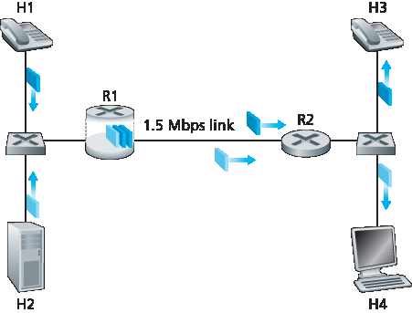
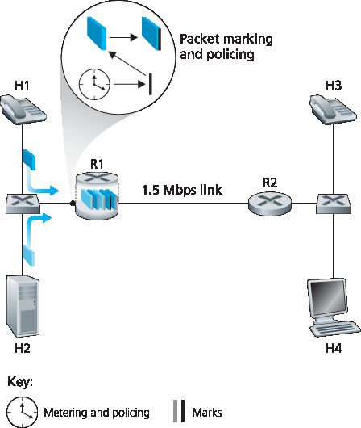
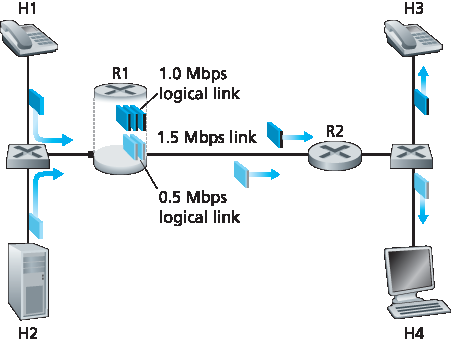
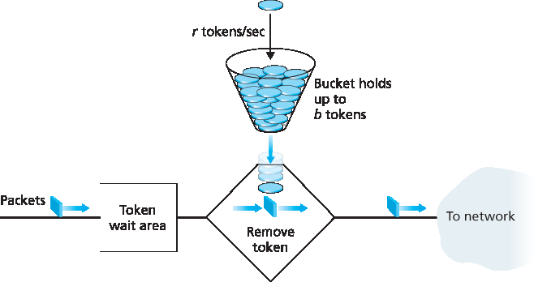
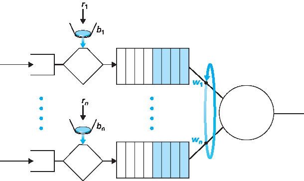
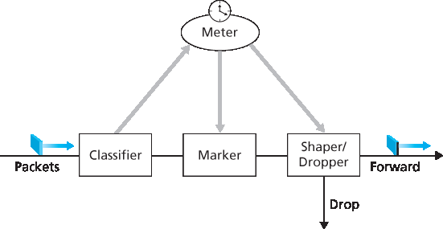
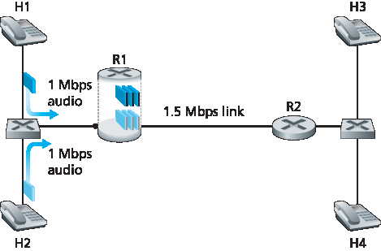

.. _c9.5:

9.5 多媒体的网络支持
=============================================================
9.5 Network Support for Multimedia

在 :ref:`第9.2节 <c9.2>` 到 :ref:`第9.4节 <c9.4>` 中，我们学习了如何利用应用层机制，如客户端缓冲、预取、根据可用带宽调整媒体质量、自适应播放和丢包缓解技术，多媒体应用以提升其性能。我们还了解了如何使用内容分发网络（CDN）和点对点覆盖网络（P2P Overlay Network）来提供一种系统级的方法以传递多媒体内容。这些技术和方法都是设计用于现有的尽力而为（best-effort）互联网。实际上，它们之所以被使用，正是因为互联网只提供一种尽力而为的服务等级。但作为计算机网络的设计者，我们不禁要问：网络本身（而非仅仅是应用或应用层基础设施）是否能提供支持多媒体内容传送的机制？正如我们稍后将看到的，答案当然是“是”！但我们也会看到，许多新的网络层机制尚未被广泛部署。这可能是由于它们的复杂性，以及应用层技术配合尽力而为服务和合理配置的网络资源（例如带宽）实际上能够提供“足够好”的（尽管并非总是完美）端到端多媒体传输服务。

:ref:`表9.4 <Table 9.4>` 总结了三种支持多媒体应用的网络层广义方法。

- **充分利用尽力而为服务**。我们在第9.2至9.4节学习的应用层机制和基础设施能够在合理配置的网络中成功使用，在此类网络中，数据包丢失和过度的端到端延迟很少发生。当预见需求增长时，ISP会部署额外的带宽和交换能力，以继续保证满意的延迟和丢包性能 :ref:`[Huang 2005] <Huang 2005>`。我们将在 :ref:`第9.5.1节 <c9.5.1>` 中进一步讨论这种 **网络配置**。
- **差异化服务**。自互联网早期以来，人们就设想为不同类型的流量（例如，IP4v包头中的服务类型字段所指示）提供不同的服务等级，而不是统一的尽力而为服务。通过 **差异化服务**，当两类流量在路由器排队时，一类流量可能被赋予严格优先权。例如，由于实时会话应用的严格延迟限制，其数据包可能被优先处理。将差异化服务引入网络将需要新的机制来进行包标记（指示包的服务类别）、包调度等。我们将在 :ref:`第9.5.2节 <c9.5.2>` 和 :ref:`第9.5.3节 <c9.5.3>` 中讨论差异化服务及实现该服务所需的新网络机制。

  .. _Table 9.4:
  
  **表9.4 支持多媒体应用的三种网络层方法**
  
  .. list-table::
  
      * - **方法**
        - **粒度**
        - **保证**
        - **机制**
        - **复杂度**
        - **部署现状**
      * - 充分利用尽力而为服务
        - 所有流量一视同仁
        - 无，或软保证
        - 应用层支持，CDN，覆盖网络，网络层资源配置
        - 最低
        - 普遍部署
      * - 差异化服务
        - 不同类别流量差异对待
        - 无，或软保证
        - 包标记，流量管控，调度
        - 中等
        - 有限部署
      * - 按连接的服务质量（QoS）保证
        - 每个源-目的流单独对待
        - 软保证或硬保证，一旦连接被准入
        - 包标记，流量管控，调度；呼叫准入和信令
        - 轻度
        - 少量部署

- **按连接的服务质量（QoS）保证**。采用按连接的 QoS 保证，每个应用实例显式预留端到端带宽，因此具有保证的端到端性能。 **硬保证** 意味着应用确定能获得请求的服务质量； **软保证** 意味着应用很大概率能获得请求的服务质量。例如，用户想从主机 A 到主机 B 发起 VoIP 通话，其 VoIP 应用在两主机间路径上的每条链路上显式预留带宽。但允许应用做出预留，并要求网络执行这些预留，需作出较大变革。首先，需要一个协议代表应用预留发送端到接收端路径上的链路带宽。其次，路由器队列中需要新的调度策略以兑现按连接的带宽预留。最后，为了进行预留，应用必须向网络提供其预期发送流量的描述，网络需要对每个应用流量进行管控，确保符合该描述。这些机制综合起来，需要在主机和路由器中部署新的复杂软件。由于按连接的 QoS 保证尚未大规模部署，我们将在 :ref:`第9.5.4节 <c9.5.4>` 中简要介绍这些机制。

.. toggle::

   In :ref:`Sections 9.2 <c9.2>` through :ref:`9.4 <c9.4>`, we learned how application-level mechanisms such as client buffering, prefetching, adapting media quality to available bandwidth, adaptive playout, and loss mitigation techniques can be used by multimedia applications to improve a multimedia application’s performance. We also learned how content distribution networks and P2P overlay networks can be used to provide a system-level approach for delivering multimedia content. These techniques and approaches are all designed to be used in today’s best-effort Internet. Indeed, they are in use today precisely because the Internet provides only a single, best-effort class of service. But as designers of computer networks, we can’t help but ask whether the network (rather than the applications or application-level infrastructure alone) might provide mechanisms to support multimedia content delivery. As we’ll see shortly, the answer is, of course, “yes”! But we’ll also see that a number of these new network-level mechanisms have yet to be widely deployed. This may be due to their complexity and to the fact that application-level techniques together with best-effort service and properly dimensioned network resources (for example, bandwidth) can indeed provide a “good-enough” (even if not-always-perfect) end-to-end multimedia delivery service.

   :ref:`Table 9.4 <Table 9.4>` summarizes three broad approaches towards providing network-level support for multimedia applications.

   - **Making the best of best-effort service**. The application-level mechanisms and infrastructure that we studied in Sections 9.2 through 9.4 can be successfully used in a well-dimensioned network where packet loss and excessive end-to-end delay rarely occur. When demand increases are forecasted, the ISPs deploy additional bandwidth and switching capacity to continue to ensure satisfactory delay and packet-loss performance :ref:`[Huang 2005] <Huang 2005>`. We’ll discuss such **network dimensioning** further in :ref:`Section 9.5.1 <c9.5.1>`.
   - **Differentiated service**. Since the early days of the Internet, it’s been envisioned that different types of traffic (for example, as indicated in the Type-of-Service field in the IP4v packet header) could be provided with different classes of service, rather than a single one-size-fits-all best-effort service. With **differentiated service**, one type of traffic might be given strict priority over another class of traffic when both types of traffic are queued at a router. For example, packets belonging to a real- time conversational application might be given priority over other packets due to their stringent delay constraints. Introducing differentiated service into the network will require new mechanisms for packet marking (indicating a packet’s class of service), packet scheduling, and more. We’ll cover differentiated service, and new network mechanisms needed to implement this service, in :ref:`Sections 9.5.2 <c9.5.2>` and :ref:`9.5.3 <c9.5.3>`.
   
   **Table 9.4 Three network-level approaches to supporting multimedia applications**
   
   .. list-table::
   
         * - **Approach**
         - **Granularity**
         - **Guarantee**
         - **Mechanisms**
         - **Complexity**
         - **Deployment to date**
         * - Making the best of best- effort service
         - all traffic treated equally
         - none, or soft
         - application-layer support, CDNs, overlays, network-level resource provisioning
         - minimal
         - everywhere
         * - Differentiated service
         - different classes of traffic treated differently
         - none, or soft
         - packet marking, policing, scheduling
         - medium
         - some
         * - Per-connection Quality-of-Service (QoS) Guarantees
         - each source-destination flows treated differently
         - soft or hard, once flow is admitted
         - packet marking, policing, scheduling; call admission and signaling
         - light
         - little

   - **Per-connection Quality-of-Service (QoS) Guarantees**. With per-connection QoS guarantees, each instance of an application explicitly reserves end-to-end bandwidth and thus has a guaranteed end-to-end performance. A **hard guarantee** means the application will receive its requested quality of service (QoS) with certainty. A **soft guarantee** means the application will receive its requested quality of service with high probability. For example, if a user wants to make a VoIP call from Host A to Host B, the user’s VoIP application reserves bandwidth explicitly in each link along a route between the two hosts. But permitting applications to make reservations and requiring the network to honor the reservations requires some big changes. First, we need a protocol that, on behalf of the applications, reserves link bandwidth on the paths from the senders to their receivers. Second, we’ll need new scheduling policies in the router queues so that per-connection bandwidth reservations can be honored. Finally, in order to make a reservation, the applications must give the network a description of the traffic that they intend to send into the network and the network will need to police each application’s traffic to make sure that it abides by that description. These mechanisms, when combined, require new and complex software in hosts and routers. Because per-connection QoS guaranteed service has not seen significant deployment, we’ll cover these mechanisms only briefly in :ref:`Section 9.5.4 <c9.5.4>`.

.. _c9.5.1:

9.5.1 配置尽力而为网络
------------------------------------------------------------
9.5.1 Dimensioning Best-Effort Networks

多媒体应用难以支持的根本原因在于其严格的性能要求——低端到端包延迟、延迟抖动和丢包——以及网络拥塞时必然出现的包延迟、延迟抖动和丢包。改善多媒体应用质量的第一种方法——通常适用于任何资源受限问题——就是“用钱砸问题”，即简单避免资源争用。对于网络多媒体，这意味着提供足够的链路容量，使得网络拥塞及由此产生的包延迟和丢包几乎不会发生。有了足够的链路容量，数据包可以无排队延迟或丢包地快速通过现今的互联网。从多个角度看，这是一种理想状态——多媒体应用性能完美，用户满意，并且无需对互联网的尽力而为架构做任何改动即可实现。

当然，问题是“足够”多少容量才能实现此理想？以及从商业角度，ISP提供“足够”带宽的成本是否可行？针对给定拓扑中的网络链路，提供多少容量才能实现指定性能水平的问题，通常称为 **带宽配置（bandwidth provisioning）**。而更复杂的问题是如何设计网络拓扑（即路由器放置位置、路由器间链路如何连接及链路容量配置），以实现给定端到端性能水平，这通常称为 **网络配置（network dimensioning）**。带宽配置和网络配置均是复杂课题，超出本教材范围。但这里需指出，为预测两个网络端点间的应用级性能，从而配置足够容量以满足应用性能需求，必须解决以下问题：

- **网络端点间流量需求模型**。模型需在呼叫级别（例如，用户“进入”网络并启动端到端应用）和数据包级别（例如，正在进行的应用生成数据包）均有所定义。需注意，负载可能随时间变化。
- **明确的性能需求**。例如，支持对延迟敏感流量（如对话式多媒体应用）的性能需求，可能规定数据包端到端延迟超过最大容忍值的概率必须小于某一小值 :ref:`[Fraleigh 2003] <Fraleigh 2003>`。
- **预测给定负载模型端到端性能的模型，以及寻找最小成本带宽分配以满足所有用户需求的技术**。研究人员正致力于开发能量化给定负载性能的性能模型，以及寻找满足性能要求的最小成本带宽分配的优化技术。

鉴于现今的尽力而为互联网（从技术角度）若合理配置，可以支持多媒体流量达到适当性能水平，那么为何现有互联网未做到？答案主要在经济和组织方面。经济方面，用户是否愿意向ISP支付足够费用，以促使ISP安装支持多媒体应用的带宽？组织方面，端到端路径将穿越多个ISP网络，这些ISP是否愿意合作（或通过收益分享）确保端到端路径得到适当配置以支持多媒体应用？关于这些经济和组织问题的观点，请参见 :ref:`[Davies 2005] <Davies 2005>`。关于为支持延迟敏感流量而配置一级骨干网络的观点，请参见 :ref:`[Fraleigh 2003] <Fraleigh 2003>`。

.. toggle::

   Fundamentally, the difficulty in supporting multimedia applications arises from their stringent performance requirements—low end-to-end packet delay, delay jitter, and loss—and the fact that packet delay, delay jitter, and loss occur whenever the network becomes congested. A first approach to improving the quality of multimedia applications—an approach that can often be used to solve just about any problem where resources are constrained—is simply to “throw money at the problem” and thus simply avoid resource contention. In the case of networked multimedia, this means providing enough link capacity throughout the network so that network congestion, and its consequent packet delay and loss, never (or only very rarely) occurs. With enough link capacity, packets could zip through today’s Internet without queuing delay or loss. From many perspectives this is an ideal situation—multimedia applications would perform perfectly, users would be happy, and this could all be achieved with no changes to Internet’s best-effort architecture.

   The question, of course, is how much capacity is “enough” to achieve this nirvana, and whether the costs of providing “enough” bandwidth are practical from a business standpoint to the ISPs. The question of how much capacity to provide at network links in a given topology to achieve a given level of performance is often known as **bandwidth provisioning**. The even more complicated problem of how to design a network topology (where to place routers, how to interconnect routers with links, and what capacity to assign to links) to achieve a given level of end-to-end performance is a network design problem often referred to as **network dimensioning**. Both bandwidth provisioning and network dimensioning are complex topics, well beyond the scope of this textbook. We note here, however, that the following issues must be addressed in order to predict application-level performance between two network end points, and thus provision enough capacity to meet an application’s performance requirements.

   - **Models of traffic demand between network end points**. Models may need to be specified at both the call level (for example, users “arriving” to the network and starting up end-to-end applications) and at the packet level (for example, packets being generated by ongoing applications). Note that workload may change over time.
   - **Well-defined performance requirements**. For example, a performance requirement for supporting delay-sensitive traffic, such as a conversational multimedia application, might be that the probability that the end-to-end delay of the packet is greater than a maximum tolerable delay be less than some small value :ref:`[Fraleigh 2003] <Fraleigh 2003>`.
   - **Models to predict end-to-end performance for a given workload model, and techniques to find a minimal cost bandwidth allocation that will result in all user requirements being met**. Here, researchers are busy developing performance models that can quantify performance for a given workload, and optimization techniques to find minimal-cost bandwidth allocations meeting performance requirements.

   Given that today’s best-effort Internet could (from a technology standpoint) support multimedia traffic at an appropriate performance level if it were dimensioned to do so, the natural question is why today’s Internet doesn’t do so. The answers are primarily economic and organizational. From an economic standpoint, would users be willing to pay their ISPs enough for the ISPs to install sufficient bandwidth to support multimedia applications over a best-effort Internet? The organizational issues are perhaps even more daunting. Note that an end-to-end path between two multimedia end points will pass through the networks of multiple ISPs. From an organizational standpoint, would these ISPs be willing to cooperate (perhaps with revenue sharing) to ensure that the end-to-end path is properly dimensioned to support multimedia applications? For a perspective on these economic and organizational issues, see :ref:`[Davies 2005] <Davies 2005>`. For a perspective on provisioning tier-1 backbone networks to support delay-sensitive traffic, see :ref:`[Fraleigh 2003] <Fraleigh 2003>`.

.. _c9.5.2:

9.5.2 提供多种服务等级
------------------------------------------------------------
9.5.2 Providing Multiple Classes of Service

对现今互联网中一刀切的尽力而为服务进行的最简单增强，也许就是将流量划分为多个等级，并为这些不同等级的流量提供不同水平的服务。例如，ISP 可能希望对延迟敏感的语音通信（VoIP）或远程会议流量提供更高等级的服务（并为此收费！），而对弹性流量如电子邮件或 HTTP 则提供较低等级的服务。或者，ISP 可能仅想为愿意支付更多费用的客户提供更高质量的服务。一些家庭有线接入 ISP 和蜂窝无线接入 ISP 已采用了这种分层服务模式——铂金服务用户获得的性能优于黄金或白银服务用户。

我们生活中熟悉的各种服务等级——头等舱乘客比商务舱乘客获得更好的服务，商务舱乘客又比经济舱乘客更好；VIP 可以优先入场，其他人排队等候；在某些国家，长者受到尊敬并享有荣誉座位和最好的餐食。需要注意的是，这种差异化服务是针对流量的聚合（即流量类别）提供的，而非针对单个连接。例如，所有头等舱乘客获得相同待遇（没有任何一位头等舱乘客比其他人待遇更优），同理，所有 VoIP 包在网络中也会获得相同处理，与它们所属的具体端到端连接无关。正如我们将看到的，通过处理少量的流量聚合而非大量单独连接，提供优于尽力而为服务的新网络机制可以保持相对简单。

早期互联网设计者显然考虑了多种服务等级的理念。回想 :ref:`第4章 <c4>` 中讨论的 IPv4 头中的服务类型（ToS）字段。IEN123 :ref:`[ISI 1979] <ISI 1979>` 描述了 IPv4 数据报的一个祖先版本中也存在的 ToS 字段：“服务类型字段提供了期望服务质量的抽象参数指示。这些参数用于指导通过特定网络传输数据报时实际服务参数的选择。若干网络提供服务优先级，某种程度上将高优先级流量视为比其他流量更重要。” 四十多年前，为不同类别流量提供不同等级服务的愿景已经明确！然而，我们实现这一愿景也花费了同样漫长的时间。

.. toggle::

   Perhaps the simplest enhancement to the one-size-fits-all best-effort service in today’s Internet is to divide traffic into classes, and provide different levels of service to these different classes of traffic. For example, an ISP might well want to provide a higher class of service to delay-sensitive Voice-over-IP or teleconferencing traffic (and charge more for this service!) than to elastic traffic such as e-mail or HTTP. Alternatively, an ISP may simply want to provide a higher quality of service to customers willing to pay more for this improved service. A number of residential wired-access ISPs and cellular wireless-access ISPs have adopted such tiered levels of service—with platinum-service subscribers receiving better performance than gold- or silver-service subscribers.

   We’re all familiar with different classes of service from our everyday lives—first-class airline passengers get better service than business-class passengers, who in turn get better service than those of us who fly economy class; VIPs are provided immediate entry to events while everyone else waits in line; elders are revered in some countries and provided seats of honor and the finest food at a table. It’s important to note that such differential service is provided among aggregates of traffic, that is, among classes of traffic, not among individual connections. For example, all first-class passengers are handled the same (with no first-class passenger receiving any better treatment than any other first-class passenger), just as all VoIP packets would receive the same treatment within the network, independent of the particular end-to-end connection to which they belong. As we will see, by dealing with a small number of traffic aggregates, rather than a large number of individual connections, the new network mechanisms required to provide better-than-best service can be kept relatively simple.

   The early Internet designers clearly had this notion of multiple classes of service in mind. Recall the type-of-service (ToS) field in the IPv4 header discussed in :ref:`Chapter 4 <c4>`. IEN123 :ref:`[ISI 1979] <ISI 1979>` describes the ToS field also present in an ancestor of the IPv4 datagram as follows: “The Type of Service [field] provides an indication of the abstract parameters of the quality of service desired. These parameters are to be used to guide the selection of the actual service parameters when transmitting a datagram through a particular network. Several networks offer service precedence, which somehow treats high precedence traffic as more important that other traffic.” More than four decades ago, the vision of providing different levels of service to different classes of traffic was clear! However, it’s taken us an equally long period of time to realize this vision.

激励场景
~~~~~~~~~~~~~~~~~~~~~~~
Motivating Scenarios

让我们从几个激励场景开始讨论提供多种服务等级的网络机制。

:ref:`图9.11 <Figure 9.11>` 显示了一个简单网络场景，其中两个应用数据流分别从一局域网（LAN）上的主机 H1 和 H2 发起，目标是另一局域网上的主机 H3 和 H4。两个 LAN 之间的路由器通过一条 1.5 Mbps 链路连接。假设 LAN 速度远高于 1.5 Mbps，我们聚焦于路由器 R1 的输出队列；若 H1 和 H2 的总发送速率超过 1.5 Mbps，包延迟和丢包就会在这里发生。进一步假设一个 1 Mbps 音频应用（例如 CD 质量的音频通话）与一个 HTTP 网页浏览应用共享 R1 到 R2 的 1.5 Mbps 链路，HTTP 应用正在从 H2 下载网页到 H4。

.. _Figure 9.11:

**图9.11 竞争的音频和 HTTP 应用**

在尽力而为互联网中，音频和 HTTP 包在 R1 的输出队列中混合，通常按先进先出（FIFO）顺序传输。在此场景下，网页服务器的突发包可能填满队列，导致 IP 音频包因 R1 缓冲区溢出而被过度延迟或丢失。如何解决这一潜在问题？鉴于 HTTP 应用无时间限制，我们的直觉是对音频包在 R1 给予严格优先权。在严格优先调度下，R1 输出缓冲区中的音频包总是先于任何 HTTP 包被发送。R1 到 R2 的链路看起来像是一个专用于音频流的 1.5 Mbps 链路，HTTP 流量仅在无音频排队时使用该链路。为了让 R1 区分队列中的音频和 HTTP 包，必须对每个包进行标记，表明其所属流量类别。这正是 IPv4 中服务类型（ToS）字段的初衷。虽然这看似显而易见，但这是我们对支持多种流量类别机制的第一个认识：

**认识1：包标记** 允许路由器区分属于不同流量类别的包。

注意，尽管示例中涉及多媒体和弹性流量的竞争，该认识同样适用于实现铂金、黄金和白银服务等级的情况——仍需包标记机制指示包所属的服务类别。

现在假设路由器配置为优先传送标记为 1 Mbps 音频应用的包。由于链路速率为 1.5 Mbps，即使 HTTP 包优先级较低，它们仍平均可获得 0.5 Mbps 的传输服务。但若音频应用开始以 1.5 Mbps 或更高速率发送包（无论是恶意行为还是应用错误），HTTP 包将遭遇饥饿，即在 R1 至 R2 链路上完全得不到服务。类似问题若多应用（如多路音频通话），均属于相同服务类别共享链路带宽，也可能集体饥饿 FTP 会话。理想情况下，应在流量类别间实现一定程度隔离，使一类流量能受到保护，免受另一类流量误行为的影响。此保护可在网络不同位置实现——每个路由器、网络入口或域间网络边界。这是我们的第二个认识：

**认识2：提供流量类别间隔离，以防止某一类别因另一误行为类别受到不利影响，是必要的。**

接下来我们将探讨实现流量类别间隔离的具体机制。这里注意有两种大致方法。首先，可实施 **流量管控（policing）**，如 :ref:`图9.12 <Figure 9.12>` 所示。若某流量类别或流需满足特定标准（如音频流不得超过峰值 1 Mbps），可引入管控机制确保标准得到遵守。若被管控的应用行为异常，管控机制会采取措施（如丢弃或延迟违规包），确保进入网络的流量符合标准。即将介绍的漏桶机制是最广泛使用的管控机制。在 :ref:`图9.12 <Figure 9.12>` 中，包分类和标记机制（认识1）与管控机制（认识2）均在网络边缘实现，位于终端系统或边缘路由器。

另一种实现流量类别隔离的互补方法是链路级包调度机制显式分配固定带宽给各类别。例如，R1 可为音频类别分配 1 Mbps，为 HTTP 类别分配 0.5 Mbps。如此，音频和 HTTP 流量分别视作逻辑链路容量为 1.0 和 0.5 Mbps，如 :ref:`图9.13` 所示。若严格执行链路级带宽分配，每个类别只能使用其分配带宽；尤其不能使用未被其他类别使用的带宽。例如，若音频流静默（如说话者暂停且无音频包生成），HTTP 流仍不能超过 0.5 Mbps 传输，即使此时音频流 1 Mbps 带宽未被利用。鉴于带宽为“用进即得”的资源，无理由阻止 HTTP 流使用未被音频流使用的带宽。我们希望尽可能高效利用带宽，避免浪费。这是我们的第三个认识：

.. _Figure 9.12:

**图9.12 音频和 HTTP 流量类别的管控（及标记）**

.. _Figure 9.13:

**图9.13 音频和 HTTP 流量类别的逻辑隔离**

**认识3：在提供类别或流隔离的同时，需尽可能高效利用资源（如链路带宽和缓冲区）。**

回想我们在 :ref:`第1.3节 <c1.3>` 和 :ref:`第4.2节 <c4.2>` 的讨论，属于不同网络流的包被复用并排队在链路相关的输出缓冲区等待传输。排队包的传输选择方式称为 **链路调度策略**，在 :ref:`第4.2节 <c4.2>` 中详细讨论过。回顾第4.2节中讨论的三种链路调度策略，即 FIFO、优先级排队和加权公平排队（WFQ）。我们很快会看到，WFQ 在隔离流量类别中将起到特别重要的作用。

.. toggle::

   Let’s begin our discussion of network mechanisms for providing multiple classes of service with a few motivating scenarios.

   :ref:`Figure 9.11 <Figure 9.11>` shows a simple network scenario in which two application packet flows originate on Hosts H1 and H2 on one LAN and are destined for Hosts H3 and H4 on another LAN. The routers on the two LANs are connected by a 1.5 Mbps link. Let’s assume the LAN speeds are significantly higher than 1.5 Mbps, and focus on the output queue of router R1; it is here that packet delay and packet loss will occur if the aggregate sending rate of H1 and H2 exceeds 1.5 Mbps. Let’s further suppose that a 1 Mbps audio application (for example, a CD-quality audio call) shares the 1.5 Mbps link between R1 and R2 with an HTTP Web-browsing application that is downloading a Web page from H2 to H4.

   .. figure:: ../img/788-0.png 
      :align: center 

   **Figure 9.11 Competing audio and HTTP applications**

   In the best-effort Internet, the audio and HTTP packets are mixed in the output queue at R1 and (typically) transmitted in a first-in-first-out (FIFO) order. In this scenario, a burst of packets from the Web server could potentially fill up the queue, causing IP audio packets to be excessively delayed or lost due to buffer overflow at R1. How should we solve this potential problem? Given that the HTTP Web- browsing application does not have time constraints, our intuition might be to give strict priority to audio packets at R1. Under a strict priority scheduling discipline, an audio packet in the R1 output buffer would always be transmitted before any HTTP packet in the R1 output buffer. The link from R1 to R2 would look like a dedicated link of 1.5 Mbps to the audio traffic, with HTTP traffic using the R1-to-R2 link only when no audio traffic is queued. In order for R1 to distinguish between the audio and HTTP packets in its queue, each packet must be marked as belonging to one of these two classes of traffic. This was the original goal of the type-of-service (ToS) field in IPv4. As obvious as this might seem, this then is our first insight into mechanisms needed to provide multiple classes of traffic:

   **Insight 1: Packet marking** allows a router to distinguish among packets belonging to different classes of traffic.

   Note that although our example considers a competing multimedia and elastic flow, the same insight applies to the case that platinum, gold, and silver classes of service are implemented—a packet- marking mechanism is still needed to indicate that class of service to which a packet belongs.

   Now suppose that the router is configured to give priority to packets marked as belonging to the 1 Mbps audio application. Since the outgoing link speed is 1.5 Mbps, even though the HTTP packets receive lower priority, they can still, on average, receive 0.5 Mbps of transmission service. But what happens if the audio application starts sending packets at a rate of 1.5 Mbps or higher (either maliciously or due to an error in the application)? In this case, the HTTP packets will starve, that is, they will not receive any service on the R1-to-R2 link. Similar problems would occur if multiple applications (for example, multiple audio calls), all with the same class of service as the audio application, were sharing the link’s bandwidth; they too could collectively starve the FTP session. Ideally, one wants a degree of isolation among classes of traffic so that one class of traffic can be protected from the other. This protection could be implemented at different places in the network—at each and every router, at first entry to the network, or at inter-domain network boundaries. This then is our second insight:

   **Insight 2**: It is desirable to provide a degree of traffic isolation among classes so that one class is not adversely affected by another class of traffic that misbehaves.

   We’ll examine several specific mechanisms for providing such isolation among traffic classes. We note here that two broad approaches can be taken. First, it is possible to perform **traffic policing**, as shown in :ref:`Figure 9.12 <Figure 9.12>`. If a traffic class or flow must meet certain criteria (for example, that the audio flow not exceed a peak rate of 1 Mbps), then a policing mechanism can be put into place to ensure that these criteria are indeed observed. If the policed application misbehaves, the policing mechanism will take some action (for example, drop or delay packets that are in violation of the criteria) so that the traffic actually entering the network conforms to the criteria. The leaky bucket mechanism that we’ll examine shortly is perhaps the most widely used policing mechanism. In :ref:`Figure 9.12 <Figure 9.12>`, the packet classification and marking mechanism (Insight 1) and the policing mechanism (Insight 2) are both implemented together at the network’s edge, either in the end system or at an edge router.

   A complementary approach for providing isolation among traffic classes is for the link-level packet- scheduling mechanism to explicitly allocate a fixed amount of link bandwidth to each class. For example, the audio class could be allocated 1 Mbps at R1, and the HTTP class could be allocated 0.5 Mbps. In this case, the audio and HTTP flows see a logical link with capacity 1.0 and 0.5 Mbps, respectively, as shown in Figure 9.13. With strict enforcement of the link-level allocation of bandwidth, a class can use only the amount of bandwidth that has been allocated; in particular, it cannot utilize bandwidth that is not currently being used by others. For example, if the audio flow goes silent (for example, if the speaker pauses and generates no audio packets), the HTTP flow would still not be able to transmit more than 0.5 Mbps over the R1-to-R2 link, even though the audio flow’s 1 Mbps bandwidth allocation is not being used at that moment. Since bandwidth is a “use-it-or-lose-it” resource, there is no reason to prevent HTTP traffic from using bandwidth not used by the audio traffic. We’d like to use bandwidth as efficiently as possible, never wasting it when it could be otherwise used. This gives rise to our third insight:

   .. figure:: ../img/790-0.png 
      :align: center 

   **Figure 9.12 Policing (and marking) the audio and HTTP traffic classes**

   .. figure:: ../img/791-0.png 
      :align: center 

   **Figure 9.13 Logical isolation of audio and HTTP traffic classes**

   **Insight 3**: While providing isolation among classes or flows, it is desirable to use resources (for example, link bandwidth and buffers) as efficiently as possible.

   Recall from our discussion in :ref:`Sections 1.3 <c1.3>` and :ref:`4.2 <c4.2>` that packets belonging to various network flows are multiplexed and queued for transmission at the output buffers associated with a link. The manner in which queued packets are selected for transmission on the link is known as the **link-scheduling discipline**, and was discussed in detail in :ref:`Section 4.2 <c4.2>`. Recall that in :ref:`Section 4.2 <c4.2>` three link-scheduling disciplines were discussed, namely, FIFO, priority queuing, and Weighted Fair Queuing (WFQ). We’ll see soon see that WFQ will play a particularly important role for isolating the traffic classes.

漏桶机制
~~~~~~~~~~~~~~~~~~
The Leaky Bucket

我们之前的认识之一是，流量管控，即控制一个类别或流（在下文讨论中我们假设管控单位是流）允许向网络注入包的速率，是一种重要的 QoS 机制。但应管控流的包速率的哪些方面？我们可以确定三种重要的管控标准，它们根据管控包流的时间尺度不同而有所区别：

- **平均速率**。网络可能希望限制一个流向网络发送包的长期平均速率（单位时间内的包数）。这里关键的问题是平均速率管控所依据的时间间隔。一个平均速率限制为每秒 100 包的流比一个限制为每分钟 6000 包的流约束更多，尽管它们在足够长时间区间上的平均速率相同。例如，后者允许在某一秒的时间段内发送 1000 包，而前者则不允许这种发送行为。
- **峰值速率**。平均速率限制了较长时间内可发送的包量，而峰值速率限制了较短时间内可发送的最大包数。以上述例子为例，网络可能管控某流的平均速率为每分钟 6000 包，同时限制其峰值速率为每秒 1500 包。
- **突发大小**。网络也可能希望限制在极短时间间隔内允许发送的最大包数（即“突发”包数）。当时间间隔趋近于零时，突发大小限制了瞬间可发送到网络的包数。虽然物理上不可能瞬间发送多个包（毕竟，每条链路都有不能超过的物理传输速率！），但最大突发大小的抽象仍很有用。

漏桶机制是一个可以用来描述这些管控限制的抽象。正如 :ref:`图9.14 <Figure 9.14>` 所示，漏桶包括一个最多可容纳 b 个令牌的桶。令牌以如下方式加入该桶。新的令牌总是以每秒 r 个令牌的速率生成（这里为简化，假设时间单位为秒）。如果生成令牌时桶中令牌数少于 b，则新增令牌加入桶中；否则，新增令牌被忽略，桶中令牌保持满的状态，即 b 个令牌。

现在考虑漏桶如何用于管控包流。假设在包被传入网络前，必须先从令牌桶中取出一个令牌。若令牌桶为空，包必须等待令牌。（另一种选择是丢弃包，本文不考虑该选项。）让我们看这种行为如何管控流量。由于桶中最多有 b 个令牌，漏桶管控流的最大突发大小为 b 包。此外，由于令牌生成速率为 r，任意长度为 t 的时间间隔内，最多可进入网络的包数为 rt + b。因此，令牌生成速率 r 限制了包进入网络的长期平均速率。还可以使用漏桶（特别是串联两个漏桶）来管控流的峰值速率，详情见本章末的习题。

.. _Figure 9.14:

**图9.14 漏桶管控器**

    漏桶 + 加权公平排队 = 可证实的队列最大延迟

让我们通过展示漏桶与加权公平排队（WFQ）结合如何为路由器队列延迟提供界限来结束管控机制的讨论。（忘记 WFQ 的读者建议回顾 :ref:`第4.2节 <c4.2>`。）考虑一个路由器输出链路复用 n 个流，每个流均由参数为 b_i 和 r_i 的漏桶管控，i=1,...,n，采用 WFQ 调度。这里流的定义较宽泛，指调度器未区分的包集合。实际上，一个流可能是单一端到端连接的流量，也可能是多个连接的集合，见 :ref:`图9.15 <Figure 9.15>`。

.. _Figure 9.15:

**图9.15 n 个复用漏桶流与 WFQ 调度**

回顾 WFQ 讨论，每个流 i 保证获得至少 R⋅w_i/(∑ w_j) 的链路带宽份额，其中 R 是链路传输速率（包/秒）。那么，包在 WFQ 中等待服务的最大延迟是多少（即通过漏桶后）？聚焦流 1，假设其令牌桶初始为满。此时，b_1 包突发到达漏桶管控器，这些包立即取完所有令牌并进入流 1 的 WFQ 等候区。由于这 b_1 包以至少 R⋅w_1/(∑ w_j) 包/秒速率被服务，最后一个包的最大延迟 d_max（完成传输的最长等待时间）为

    d_max = b_1 / (R ⋅ w_1 / ∑ w_j)

该公式的推理是：队列有 b_1 包，且包以至少 R⋅w_1/(∑ w_j) 包/秒的速率被移除，则最后一个包完成传输的最长时间不超过 b_1 除以此速率。习题要求证明只要 r_1 < R⋅w_1/(∑ w_j)，则 d_max 确实是流 1 中任意包在 WFQ 队列经历的最大延迟。

.. toggle::

   One of our earlier insights was that policing, the regulation of the rate at which a class or flow (we will assume the unit of policing is a flow in our discussion below) is allowed to inject packets into the network, is an important QoS mechanism. But what aspects of a flow’s packet rate should be policed? We can identify three important policing criteria, each differing from the other according to the time scale over which the packet flow is policed:

   - **Average rate**. The network may wish to limit the long-term average rate (packets per time interval) at which a flow’s packets can be sent into the network. A crucial issue here is the interval of time over which the average rate will be policed. A flow whose average rate is limited to 100 packets per second is more constrained than a source that is limited to 6,000 packets per minute, even though both have the same average rate over a long enough interval of time. For example, the latter constraint would allow a flow to send 1,000 packets in a given second-long interval of time, while the former constraint would disallow this sending behavior.
   - **Peak rate**. While the average-rate constraint limits the amount of traffic that can be sent into the network over a relatively long period of time, a peak-rate constraint limits the maximum number of packets that can be sent over a shorter period of time. Using our example above, the network may police a flow at an average rate of 6,000 packets per minute, while limiting the flow’s peak rate to 1,500 packets per second.
   - **Burst size**. The network may also wish to limit the maximum number of packets (the “burst” of packets) that can be sent into the network over an extremely short interval of time. In the limit, as the interval length approaches zero, the burst size limits the number of packets that can be instantaneously sent into the network. Even though it is physically impossible to instantaneously send multiple packets into the network (after all, every link has a physical transmission rate that cannot be exceeded!), the abstraction of a maximum burst size is a useful one.

   The leaky bucket mechanism is an abstraction that can be used to characterize these policing limits. As shown in :ref:`Figure 9.14 <Figure 9.14>`, a leaky bucket consists of a bucket that can hold up to b tokens. Tokens are added to this bucket as follows. New tokens, which may potentially be added to the bucket, are always being generated at a rate of r tokens per second. (We assume here for simplicity that the unit of time is a second.) If the bucket is filled with less than b tokens when a token is generated, the newly generated token is added to the bucket; otherwise the newly generated token is ignored, and the token bucket remains full with b tokens.

   Let us now consider how the leaky bucket can be used to police a packet flow. Suppose that before a packet is transmitted into the network, it must first remove a token from the token bucket. If the token bucket is empty, the packet must wait for a token. (An alternative is for the packet to be dropped, although we will not consider that option here.) Let us now consider how this behavior polices a traffic flow. Because there can be at most b tokens in the bucket, the maximum burst size for a leaky-bucket-policed flow is b packets. Furthermore, because the token generation rate is r, the maximum number of packets that can enter the network of any interval of time of length t is rt+b. Thus, the token-generation rate, r, serves to limit the long-term average rate at which packets can enter the network. It is also possible to use leaky buckets (specifically, two leaky buckets in series) to police a flow’s peak rate in addition to the long-term average rate; see the homework problems at the end of this chapter.

   .. figure:: ../img/793-0.png 
      :align: center 

   **Figure 9.14 The leaky bucket policer**

      Leaky Bucket + Weighted Fair Queuing = Provable Maximum Delay in a Queue

   Let’s close our discussion on policing by showing how the leaky bucket and WFQ can be combined to provide a bound on the delay through a router’s queue. (Readers who have forgotten about WFQ are encouraged to review WFQ, which is covered in :ref:`Section 4.2 <c4.2>`.) Let’s consider a router’s output link that multiplexes n flows, each policed by a leaky bucket with parameters bi and ri,i=1,...,n, using WFQ scheduling. We use the term flow here loosely to refer to the set of packets that are not distinguished from each other by the scheduler. In practice, a flow might be comprised of traffic from a single end-to-end connection or a collection of many such connections, see :ref:`Figure 9.15 <Figure 9.15>`.

   .. figure:: ../img/794-0.png 
      :align: center 

   **Figure 9.15 n multiplexed leaky bucket flows with WFQ scheduling**

   Recall from our discussion of WFQ that each flow, i, is guaranteed to receive a share of the link bandwidth equal to at least R⋅wi/(∑ wj), where R is the transmission rate of the link in packets/sec. What then is the maximum delay that a packet will experience while waiting for service in the WFQ (that is, after passing through the leaky bucket)? Let us focus on flow 1. Suppose that flow 1’s token bucket is initially full. A burst of b1 packets then arrives to the leaky bucket policer for flow 1. These packets remove all of the tokens (without wait) from the leaky bucket and then join the WFQ waiting area for flow 1. Since these b1 packets are served at a rate of at least R⋅wi/(∑ wj) packet/sec, the last of these packets will then have a maximum delay, dmax, until its transmission is completed, where

      dmax=b1R⋅w1/∑ wj

   The rationale behind this formula is that if there are b1 packets in the queue and packets are being serviced (removed) from the queue at a rate of at least R⋅w1/(∑ wj) packets per second, then the amount of time until the last bit of the last packet is transmitted cannot be more than b1/(R⋅w1/(∑ wj)). A homework problem asks you to prove that as long as r1<R⋅w1/(∑ wj), then :math:`d_{max}` is indeed the maximum delay that any packet in flow 1 will ever experience in the WFQ queue.

.. _c9.5.3:

9.5.3 Diffserv
------------------------------------------------------------

了解了提供多种服务等级的动机、认识及具体机制后，让我们以一个例子结束多服务等级方法的学习——互联网 Diffserv 架构 [:rfc:`2475`; :ref:`Kilkki 1999 <Kilkki 1999>`]。Diffserv 提供服务区分，即在互联网中以可扩展方式对不同流量类别进行差别处理的能力。
可扩展性的需求来自骨干路由器可能面临数百万同时源-目的地流量流。我们很快会看到，通过在网络核心仅实现简单功能，而将更复杂的控制操作置于网络边缘，这一需求得以满足。

让我们从 :ref:`图9.16 <Figure 9.16>` 中的简单网络开始。这里描述 Diffserv 的一种可能使用方式；其他变体见 RFC 2475。Diffserv 架构包含两组功能元素：

- **边缘功能：包分类与流量整形**。在网络入口（即产生流量的支持 Diffserv 的主机或流量通过的第一个支持 Diffserv 的路由器）处，对到达包进行标记。更具体地，IPv4 或 IPv6 包头中的差分服务（DS）字段被设置为某个值 [:rfc:`3260`]。DS 字段定义旨在取代我们在第4章中讨论的 IPv4 服务类型字段和 IPv6 流量类别字段。例如，在图9.16中，从 H1 发往 H3 的包可能在 R1 标记，从 H2 发往 H4 的包可能在 R2 标记。包的标记表示其所属流量类别，不同类别流量在核心网络内将获得不同服务。
  
  .. _Figure 9.16:

  .. figure:: ../img/795-0.png 
     :align: center 
  
  **图9.16 一个简单的 Diffserv 网络示例**

- **核心功能：转发**。当 DS 标记包到达支持 Diffserv 的路由器时，包根据该包类别关联的所谓逐跳行为（PHB）被转发至下一跳。逐跳行为影响路由器缓冲区和链路带宽在竞争流量类别间的分配。Diffserv 架构的一个关键原则是，路由器的逐跳行为仅基于包标记，即包所属流量类别。因此，如果图9.16中从 H1 到 H3 的包与从 H2 到 H4 的包标记相同，则网络路由器将这些包视为一组，不区分包的起点是 H1 还是 H2。例如，R3 在转发包到 R4 时不会区分包是来自 H1 还是 H2。这样，Diffserv 架构免去了为单个源-目的对维护路由器状态的需求，这对 Diffserv 的可扩展性至关重要。

这里的比喻或许有助于理解。在许多大型社交活动（如大型公共接待、大型舞厅、音乐会或足球比赛）中，入场者会获得不同类型的通行证：VIP 通行证给予非常重要的人士；21 岁以上通行证给予年满 21 岁者（如允许饮酒）；音乐会的后台通行证；记者的新闻通行证；甚至普通人的普通通行证。这些通行证通常在活动入口处发放，即活动的边缘。此处执行计算密集型操作，如付费入场、核对邀请类型和身份证明。此外，活动可能限制某类通行证的人数，超额者需等待入场。进入活动后，通行证决定了在活动各处获得的差异化服务：VIP 可享免费饮品、更好的桌位、免费餐食、专属房间入场及殷勤服务；普通人则被限制进入某些区域，需付费购买饮品，仅享基本服务。在两种情况下，活动内的服务仅取决于通行证类型，且同类别人群待遇一致。

:ref:`图9.17 <Figure 9.17>` 显示了边缘路由器中分类和标记功能的逻辑视图。到达边缘路由器的包首先被分类。分类器基于一个或多个包头字段（如源地址、目的地址、源端口、目的端口及协议 ID）的值选择包，并引导包至相应标记功能。如上所述，包的标记载于包头中的 DS 字段。

在某些情况下，终端用户可能同意限制其发送包的速率以符合声明的 **流量剖面**。流量剖面可能包含峰值速率限制及包流的突发性限制，如前述漏桶机制所示。只要用户以符合商定流量剖面的方式发送包，包将获得其优先标记并沿路径转发至目的地。若违反流量剖面，非剖面内的包可能被不同标记、被整形（如延迟以符合最大速率限制）或在网络边缘被丢弃。 :ref:`图9.17 <Figure 9.17>`  中的 **计量功能** 负责比较输入包流与商定流量剖面，判断包是否符合商定剖面。是否立即重标记、转发、延迟或丢弃包为策略问题，由网络管理员决定，Diffserv 架构未做具体规定。

.. _Figure 9.17:

**图9.17 一个简单的 Diffserv 网络示例**

至此，我们重点讨论了 Diffserv 架构中的标记和管控功能。Diffserv 架构的第二个关键组件涉及支持 Diffserv 的路由器执行的逐跳行为（PHB）。PHB 定义较为晦涩但严谨，意为“Diffserv 节点对特定 Diffserv 行为聚合应用的外部可观察转发行为的描述” [:rfc:`2475`]。深入理解这一定义，可见其中几个重要考虑：

- PHB 会导致不同流量类别获得不同性能（即不同的外部可观察转发行为）。
- 虽然 PHB 定义了类别间性能（行为）差异，但并不强制采用特定机制实现这些行为。只要满足外部可观察的性能指标，可使用任何实现机制和缓冲/带宽分配策略。例如，PHB 不要求使用特定的排队策略（如优先级排队、WFQ 队列或先来先服务队列）来实现某种行为。PHB 是目标，资源分配和实现机制是手段。
- 性能差异必须可观察且可测量。

已定义两种 PHB：加速转发（EF）PHB [:rfc:`3246`] 和保证转发（AF）PHB [:rfc:`2597`]。 **加速转发** PHB 指定一个流量类别从路由器离开的速率必须等于或超过配置速率。 **保证转发** PHB 将流量划分为四个类别，每个 AF 类别保证提供一定的最小带宽和缓冲。

最后，关于 Diffserv 服务模型，我们有几点观察。首先，隐含假设 Diffserv 部署在单一管理域内，但通常端到端服务需跨越多家 ISP，它们位于通信端系统之间。要实现端到端 Diffserv 服务，所有中间 ISP 不仅必须提供该服务，还需合作并结算，以向最终客户提供真正的端到端服务。缺少此类合作，直接向客户销售 Diffserv 服务的 ISP 会反复解释：“是的，我们知道您支付了额外费用，但我们没有与丢包延迟您流量的 ISP 签署服务协议。很抱歉您的 VoIP 通话有诸多断断续续！”其次，若 Diffserv 实际运行且网络负载适中，大多数情况下用户感知不到尽力而为服务与 Diffserv 服务的区别。实际上，端到端延迟通常由接入速率和路由跳数主导，而非路由器中的排队延迟。想象一下不满的 Diffserv 用户，他们支付了高价享受优质服务，却发现其他人享受的尽力而为服务性能几乎与优质服务相同！

.. toggle::

   Having seen the motivation, insights, and specific mechanisms for providing multiple classes of service, let’s wrap up our study of approaches toward proving multiple classes of service with an example—the Internet Diffserv architecture [:rfc:`2475`; :ref:`Kilkki 1999 <Kilkki 1999>`]. Diffserv provides service differentiation—that is, the ability to handle different classes of traffic in different ways within the Internet in a scalable manner.
   The need for scalability arises from the fact that millions of simultaneous source-destination traffic flows may be present at a backbone router. We’ll see shortly that this need is met by placing only simple functionality within the network core, with more complex control operations being implemented at the network’s edge.

   Let’s begin with the simple network shown in Figure 9.16. We’ll describe one possible use of Diffserv here; other variations are possible, as described in RFC 2475. The Diffserv architecture consists of two sets of functional elements:

   - **Edge functions: Packet classification and traffic conditioning**. At the incoming edge of the network (that is, at either a Diffserv-capable host that generates traffic or at the first Diffserv-capable router that the traffic passes through), arriving packets are marked. More specifically, the differentiated service (DS) field in the IPv4 or IPv6 packet header is set to some value [RFC 3260]. The definition of the DS field is intended to supersede the earlier definitions of the IPv4 type-of- service field and the IPv6 traffic class fields that we discussed in Chapter 4. For example, in Figure 9.16, packets being sent from H1 to H3 might be marked at R1, while packets being sent from H2 to H4 might be marked at R2. The mark that a packet receives identifies the class of traffic to which it belongs. Different classes of traffic will then receive different service within the core network.

   .. figure:: ../img/795-0.png 
      :align: center 
   
   **Figure 9.16 A simple Diffserv network example**

   - **Core function: Forwarding**. When a DS-marked packet arrives at a Diffserv-capable router, the packet is forwarded onto its next hop according to the so-called per-hop behavior (PHB) associated with that packet’s class. The per-hop behavior influences how a router’s buffers and link bandwidth are shared among the competing classes of traffic. A crucial tenet of the Diffserv architecture is that a router’s per-hop behavior will be based only on packet markings, that is, the class of traffic to which a packet belongs. Thus, if packets being sent from H1 to H3 in :ref:`Figure 9.16 <Figure 9.16>` receive the same marking as packets being sent from H2 to H4, then the network routers treat these packets as an aggregate, without distinguishing whether the packets originated at H1 or H2. For example, R3 would not distinguish between packets from H1 and H2 when forwarding these packets on to R4. Thus, the Diffserv architecture obviates the need to keep router state for individual source-destination pairs—a critical consideration in making Diffserv scalable.

   An analogy might prove useful here. At many large-scale social events (for example, a large public reception, a large dance club or discothèque, a concert, or a football game), people entering the event receive a pass of one type or another: VIP passes for Very Important People; over-21 passes for people who are 21 years old or older (for example, if alcoholic drinks are to be served); backstage passes at concerts; press passes for reporters; even an ordinary pass for the Ordinary Person. These passes are typically distributed upon entry to the event, that is, at the edge of the event. It is here at the edge where computationally intensive operations, such as paying for entry, checking for the appropriate type of invitation, and matching an invitation against a piece of identification, are performed. Furthermore, there may be a limit on the number of people of a given type that are allowed into an event. If there is such a limit, people may have to wait before entering the event. Once inside the event, one’s pass allows one to receive differentiated service at many locations around the event—a VIP is provided with free drinks, a better table, free food, entry to exclusive rooms, and fawning service. Conversely, an ordinary person is excluded from certain areas, pays for drinks, and receives only basic service. In both cases, the service received within the event depends solely on the type of one’s pass. Moreover, all people within a class are treated alike.

   :ref:`Figure 9.17 <Figure 9.17>` provides a logical view of the classification and marking functions within the edge router. Packets arriving to the edge router are first classified. The classifier selects packets based on the values of one or more packet header fields (for example, source address, destination address, source port, destination port, and protocol ID) and steers the packet to the appropriate marking function. As noted above, a packet’s marking is carried in the DS field in the packet header.

   In some cases, an end user may have agreed to limit its packet-sending rate to conform to a declared **traffic profile**. The traffic profile might contain a limit on the peak rate, as well as the burstiness of the packet flow, as we saw previously with the leaky bucket mechanism. As long as the user sends packets into the network in a way that conforms to the negotiated traffic profile, the packets receive their priority marking and are forwarded along their route to the destination. On the other hand, if the traffic profile is violated, out-of-profile packets might be marked differently, might be shaped (for example, delayed so that a maximum rate constraint would be observed), or might be dropped at the network edge. The role of the **metering function**, shown in :ref:`Figure 9.17 <Figure 9.17>`, is to compare the incoming packet flow with the negotiated traffic profile and to determine whether a packet is within the negotiated traffic profile. The actual decision about whether to immediately remark, forward, delay, or drop a packet is a policy issue determined by the network administrator and is not specified in the Diffserv architecture.

   .. figure:: ../img/797-0.png 
      :align: center 

   **Figure 9.17 A simple Diffserv network example**

   So far, we have focused on the marking and policing functions in the Diffserv architecture. The second key component of the Diffserv architecture involves the per-hop behavior (PHB) performed by Diffserv- capable routers. PHB is rather cryptically, but carefully, defined as “a description of the externally observable forwarding behavior of a Diffserv node applied to a particular Diffserv behavior aggregate” [:rfc:`2475`]. Digging a little deeper into this definition, we can see several important considerations embedded within:

   - A PHB can result in different classes of traffic receiving different performance (that is, different externally observable forwarding behaviors).
   - While a PHB defines differences in performance (behavior) among classes, it does not mandate any particular mechanism for achieving these behaviors. As long as the externally observable performance criteria are met, any implementation mechanism and any buffer/bandwidth allocation policy can be used. For example, a PHB would not require that a particular packet-queuing discipline (for example, a priority queue versus a WFQ queue versus a FCFS queue) be used to achieve a particular behavior. The PHB is the end, to which resource allocation and implementation mechanisms are the means.
   - Differences in performance must be observable and hence measurable.

   Two PHBs have been defined: an expedited forwarding (EF) PHB [:rfc:`3246`] and an assured forwarding (AF) PHB [:rfc:`2597`]. The **expedited forwarding** PHB specifies that the departure rate of a class of traffic from a router must equal or exceed a configured rate. The **assured forwarding** PHB divides traffic into four classes, where each AF class is guaranteed to be provided with some minimum amount of bandwidth and buffering.

   Let’s close our discussion of Diffserv with a few observations regarding its service model. First, we have implicitly assumed that Diffserv is deployed within a single administrative domain, but typically an end- to-end service must be fashioned from multiple ISPs sitting between communicating end systems. In order to provide end-to-end Diffserv service, all the ISPs between the end systems must not only provide this service, but most also cooperate and make settlements in order to offer end customers true end-to-end service. Without this kind of cooperation, ISPs directly selling Diffserv service to customers will find themselves repeatedly saying: “Yes, we know you paid extra, but we don’t have a service agreement with the ISP that dropped and delayed your traffic. I’m sorry that there were so many gaps in your VoIP call!” Second, if Diffserv were actually in place and the network ran at only moderate load, most of the time there would be no perceived difference between a best-effort service and a Diffserv service. Indeed, end-to-end delay is usually dominated by access rates and router hops rather than by queuing delays in the routers. Imagine the unhappy Diffserv customer who has paid more for premium service but finds that the best-effort service being provided to others almost always has the same performance as premium service!

.. _c9.5.4:

9.5.4 每连接质量服务（QoS）保证：资源预留与呼叫接纳
----------------------------------------------------------------------------------------------------
9.5.4 Per-Connection Quality-of-Service (QoS) Guarantees: Resource Reservation and Call Admission

在上一节中，我们已经看到包标记和管控、流量隔离以及链路级调度可以使某一类服务比另一类获得更好的性能。在某些调度机制下，比如优先级调度，较低优先级的流量对最高优先级流量来说基本是“不可见”的。通过合理的网络容量规划，最高等级的服务确实可以实现极低的包丢失和延迟——本质上类似电路的性能。但是，网络能否仅凭迄今为止介绍的机制，保证高优先级流量类别中正在进行的流在整个持续时间内持续获得这种服务？答案是否定的。本节将说明为何当为单个连接提供硬性服务保证时，需要额外的网络机制和协议。

让我们回到 :ref:`第9.5.2节 <c9.5.2>` 的场景，考虑两个 1 Mbps 的音频应用通过一个 1.5 Mbps 链路传输数据包，如 :ref:`图9.18 <Figure 9.18>` 所示。两个流的合计数据率（2 Mbps）超过了链路容量。即使有分类和标记、流隔离以及未用带宽的共享（此例中无未用带宽），显然无法满足需求。根本没有足够的带宽同时满足两个应用的需求。如果两个应用平分带宽，每个应用将丢失 25% 的传输包。这种极差的 QoS 使两个音频应用完全不可用；甚至根本不需要发送任何音频包。

.. _Figure 9.18:

**图9.18 两个竞争音频应用导致 R1 到 R2 链路过载**

鉴于 :ref:`图9.18 <Figure 9.18>` 中两个应用无法同时满足，网络应如何处理？允许两者均以不可用的 QoS 运行只会浪费网络资源于最终对终端用户无用的应用流。答案显然是——应阻止其中一个应用流（即拒绝其网络访问），而另一个应用流则可继续使用该应用所需的全部 1 Mbps 带宽。电话网络就是执行此类呼叫阻塞的例子——如果无法为呼叫分配所需资源（电话网络中的端到端电路），则呼叫被阻塞（禁止进入网络），并向用户返回忙音。在我们的例子中，如果流不能获得可用的 QoS，允许其进入网络毫无意义。实际上，接纳无法获得所需 QoS 的流是有代价的，因为网络资源被浪费在对用户无用的流上。

通过基于流的资源需求以及已接纳流的资源情况显式地接纳或阻止流，网络可以保证被接纳的流能够获得请求的 QoS。隐含于对流提供保证 QoS 的需求中，是流必须声明其 QoS 需求。这个流程，即流声明其 QoS 需求，网络随后要么以所需 QoS 接纳流，要么阻止流，被称为 **呼叫接纳** 过程。这是我们对提供 QoS 所需机制的第四条见解（前三条见解见 :ref:`第9.5.2节 <c9.5.2>`）。

**见解4**：如果资源不总是充足且需保证 QoS，则需要呼叫接纳过程，在该过程中流声明其 QoS 需求，随后要么被以所需 QoS 接纳入网，要么被阻止接入网络（若网络无法提供所需 QoS）。

我们在 :ref:`图9.18 <Figure 9.18>` 的激励示例强调，如果要保证呼叫（端到端流）开始后获得特定的服务质量，需若干新网络机制和协议：

- **资源预留**。保证呼叫拥有满足其所需 QoS 的资源（链路带宽、缓冲区）的唯一方法是显式分配这些资源给呼叫——这一过程在网络术语中称为 **资源预留**。一旦资源被预留，呼叫在整个持续时间内可按需使用这些资源，不受其他呼叫需求影响。如果呼叫预留并保证 x Mbps 的链路带宽，且传输速率不超过 x，则呼叫将实现无丢包无延迟的性能。
- **呼叫接纳**。若资源需要预留，网络必须有机制供呼叫请求和预留资源。资源有限，若请求资源不可用，呼叫接纳请求将被拒绝，即被阻塞。电话网络执行此呼叫接纳——拨号时请求资源，若完成呼叫所需的电路（TDMA 时隙）可用，则分配电路完成呼叫；若不可用，则呼叫被阻塞，用户听到忙音。被阻塞的呼叫可尝试重新接入网络，但未成功完成呼叫接纳过程前，不允许向网络发送流量。当然，分配链路带宽的路由器不应分配超过该链路可用带宽的资源。通常，呼叫只预留链路带宽的一部分，因此路由器可能为多个呼叫分配带宽，但所有呼叫的带宽总和应小于链路容量，以保证硬性服务质量。
- **呼叫建立信令**。上述呼叫接纳过程要求呼叫能够在其源到目的路径上的每台网络路由器预留足够资源，以确保满足端到端 QoS 需求。每个路由器需确定会话所需的本地资源，考虑已有资源承诺给其他会话的部分，并判断是否有足够资源满足该路由器处的逐跳 QoS 需求且不违反已接纳会话的本地 QoS 保证。需要信令协议协调这些活动——包括本地资源的逐跳分配及呼叫是否能在整个端到端路径的每台路由器成功预留资源的整体决定。这就是 **呼叫建立协议** 的任务，如 :ref:`图9.19 <Figure 9.19>` 所示。 **RSVP 协议** [:ref:`Zhang 1993 <Zhang 1993>`, :rfc:`2210`] 被提出用于互联网架构中提供 QoS 保证的这一目的。在 ATM 网络中，Q2931b 协议 :ref:`[Black 1995] <Black 1995>` 在 ATM 网络交换机和终端间传递此类信息。

尽管经历了大量研发，甚至已有提供每连接 QoS 保证的产品，但此类服务几乎未被大规模部署。原因有多种。最重要的是，可能我们在 :ref:`第9.2节 <c9.2>` 至 :ref:`第9.4节 <c9.4>` 学习的简单应用层机制，结合合理的网络容量规划（见 :ref:`第9.5.1节 <c9.5.1>`），已能为多媒体应用提供“足够好”的尽力而为网络服务。此外，部署和管理提供每连接 QoS 保证的网络增加的复杂性和成本，可能被 ISP 认为远高于该服务的预期客户收入。

.. toggle::

   In the previous section, we have seen that packet marking and policing, traffic isolation, and link-level scheduling can provide one class of service with better performance than another. Under certain scheduling disciplines, such as priority scheduling, the lower classes of traffic are essentially “invisible” to the highest-priority class of traffic. With proper network dimensioning, the highest class of service can indeed achieve extremely low packet loss and delay—essentially circuit-like performance. But can the network guarantee that an ongoing flow in a high-priority traffic class will continue to receive such service throughout the flow’s duration using only the mechanisms that we have described so far? It cannot. In this section, we’ll see why yet additional network mechanisms and protocols are required when a hard service guarantee is provided to individual connections.

   Let’s return to our scenario from :ref:`Section 9.5.2 <c9.5.2>` and consider two 1 Mbps audio applications transmitting their packets over the 1.5 Mbps link, as shown in :ref:`Figure 9.18 <Figure 9.18>`. The combined data rate of the two flows (2 Mbps) exceeds the link capacity. Even with classification and marking, isolation of flows, and sharing of unused bandwidth (of which there is none), this is clearly a losing proposition. There is simply not enough bandwidth to accommodate the needs of both applications at the same time. If the two applications equally share the bandwidth, each application would lose 25 percent of its transmitted packets. This is such an unacceptably low QoS that both audio applications are completely unusable; there’s no need even to transmit any audio packets in the first place.

   .. figure:: ../img/799-0.png 
      :align: center 

   **Figure 9.18 Two competing audio applications overloading the R1-to-R2 link**

   Given that the two applications in :ref:`Figure 9.18 <Figure 9.18>` cannot both be satisfied simultaneously, what should the network do? Allowing both to proceed with an unusable QoS wastes network resources on application flows that ultimately provide no utility to the end user. The answer is hopefully clear—one of the application flows should be blocked (that is, denied access to the network), while the other should be allowed to proceed on, using the full 1 Mbps needed by the application. The telephone network is an example of a network that performs such call blocking—if the required resources (an end-to-end circuit in the case of the telephone network) cannot be allocated to the call, the call is blocked (prevented from entering the network) and a busy signal is returned to the user. In our example, there is no gain in allowing a flow into the network if it will not receive a sufficient QoS to be considered usable. Indeed, there is a cost to admitting a flow that does not receive its needed QoS, as network resources are being used to support a flow that provides no utility to the end user.

   By explicitly admitting or blocking flows based on their resource requirements, and the source requirements of already-admitted flows, the network can guarantee that admitted flows will be able to receive their requested QoS. Implicit in the need to provide a guaranteed QoS to a flow is the need for the flow to declare its QoS requirements. This process of having a flow declare its QoS requirement, and then having the network either accept the flow (at the required QoS) or block the flow is referred to as the **call admission** process. This then is our fourth insight (in addition to the three earlier insights from :ref:`Section 9.5.2 <c9.5.2>`,) into the mechanisms needed to provide QoS.

   **Insight 4**: If sufficient resources will not always be available, and QoS is to be guaranteed, a call admission process is needed in which flows declare their QoS requirements and are then either admitted to the network (at the required QoS) or blocked from the network (if the required QoS cannot be provided by the network).

   Our motivating example in :ref:`Figure 9.18 <Figure 9.18>` highlights the need for several new network mechanisms and protocols if a call (an end-to-end flow) is to be guaranteed a given quality of service once it begins:

   - **Resource reservation**. The only way to guarantee that a call will have the resources (link bandwidth, buffers) needed to meet its desired QoS is to explicitly allocate those resources to the call—a process known in networking parlance as **resource reservation**. Once resources are reserved, the call has on-demand access to these resources throughout its duration, regardless of the demands of all other calls. If a call reserves and receives a guarantee of x Mbps of link bandwidth, and never transmits at a rate greater than x, the call will see loss- and delay-free performance.
   - **Call admission**. If resources are to be reserved, then the network must have a mechanism for calls to request and reserve resources. Since resources are not infinite, a call making a call admission
   request will be denied admission, that is, be blocked, if the requested resources are not available. Such a call admission is performed by the telephone network—we request resources when we dial a number. If the circuits (TDMA slots) needed to complete the call are available, the circuits are allocated and the call is completed. If the circuits are not available, then the call is blocked, and we receive a busy signal. A blocked call can try again to gain admission to the network, but it is not allowed to send traffic into the network until it has successfully completed the call admission process. Of course, a router that allocates link bandwidth should not allocate more than is available at that link. Typically, a call may reserve only a fraction of the link’s bandwidth, and so a router may allocate link bandwidth to more than one call. However, the sum of the allocated bandwidth to all calls should be less than the link capacity if hard quality of service guarantees are to be provided.
   - **Call setup signaling**. The call admission process described above requires that a call be able to reserve sufficient resources at each and every network router on its source-to-destination path to ensure that its end-to-end QoS requirement is met. Each router must determine the local resources required by the session, consider the amounts of its resources that are already committed to other ongoing sessions, and determine whether it has sufficient resources to satisfy the per-hop QoS requirement of the session at this router without violating local QoS guarantees made to an already- admitted session. A signaling protocol is needed to coordinate these various activities—the per-hop allocation of local resources, as well as the overall end-to-end decision of whether or not the call has been able to reserve sufficient resources at each and every router on the end-to-end path. This is the job of the **call setup protocol**, as shown in :ref:`Figure 9.19 <Figure 9.19>`. The **RSVP protocol** [:ref:`Zhang 1993 <Zhang 1993>`, :rfc:`2210`] was proposed for this purpose within an Internet architecture for providing quality-of-service guarantees. In ATM networks, the Q2931b protocol :ref:`[Black 1995] <Black 1995>` carries this information among the ATM network’s switches and end point.

   Despite a tremendous amount of research and development, and even products that provide for per- connection quality of service guarantees, there has been almost no extended deployment of such services. There are many possible reasons. First and foremost, it may well be the case that the simple application-level mechanisms that we studied in :ref:`Sections 9.2 <c9.2>` through :ref:`9.4 <c9.4>`, combined with proper network dimensioning (:ref:`Section 9.5.1 <c9.5.1>`) provide “good enough” best-effort network service for multimedia applications. In addition, the added complexity and cost of deploying and managing a network that provides per-connection quality of service guarantees may be judged by ISPs to be simply too high given predicted customer revenues for that service.

